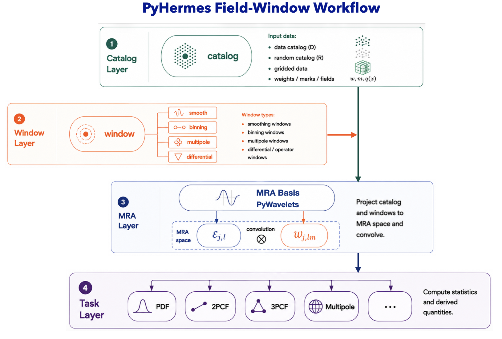

<p align="center">
  
</p>

# PyHermes

**PyHermes** is the Python implementation of **Hermes** (HypER-speed
MultirEsolution cosmic Statistics), an in situ framework for measuring cosmic
statistics with reusable multiresolution fields and window operators.

A catalogue is projected once into an `SFCField`. Smoothing, geometric binning,
multipole decomposition, differentiation, and inverse-Laplacian operations are
then expressed through `WindowFunc` objects. The same field can therefore feed
counting, 2PCF, conventional 3PCF, 3PCF multipoles, marked statistics, and
derived physical-field calculations without returning to particle-level tuple
counting for every configuration.

- **Documentation:** [pyhermes.astroslacker.com](https://pyhermes.astroslacker.com)
- **Source:** [SYSUSPA-Projects/PyHermes](https://github.com/SYSUSPA-Projects/PyHermes)
- **Tutorials:** [`examples/notebooks/`](examples/notebooks)
- **Runnable configurations:** [`examples/configs/`](examples/configs) and
  [`examples/scripts/`](examples/scripts)



## What It Covers

- catalogue-to-field projection with configurable compactly supported scaling
  functions and resolution `J`;
- built-in and user-defined smoothing, binning, multipole, and operator windows;
- one-point counting and field sampling;
- isotropic and anisotropic 2PCF measurements;
- Monte Carlo and spherical-harmonic 3PCF estimators;
- MPI/thread parallelism and CPU or CUDA contraction for 3PCF multipoles;
- weighted fields, velocity derivatives, Poisson potential, acceleration, and
  density-dependent marks.

## Installation

```bash
conda create -n pyhermes python=3.12
conda activate pyhermes
pip install -r requirements.txt
pip install -e .
```

MPI and CUDA are optional. See the
[installation guide](https://pyhermes.astroslacker.com/install.html) for
distributed and GPU setup.

## Smallest Workflow

The tracked examples use paths relative to `examples/`:

```bash
cd examples
python scripts/prepare_sfc_fields.py
```

```python
from pyhermes.base.sfc_projection import SFCProjection
from pyhermes.io import WindowFunc
from pyhermes.param.parambase import read_param

params = read_param("./configs/param_sfc_projection.yaml")
field = SFCProjection(params).run(save_result=False)

gaussian = WindowFunc(
    {"type": "gaussian", "len_args": {"R": 10.0}},
    field.sfc_info,
    threads=8,
)
smoothed_field = field @ gaussian
```

This is the core language of PyHermes: **field @ window**. Statistical tasks
build the required window families and normalizations around the same objects.

## Start With The Notebooks

The recommended route through [`examples/notebooks/`](examples/notebooks) is:

1. [`quick_start.ipynb`](examples/notebooks/quick_start.ipynb)
2. [`sfc_projection.ipynb`](examples/notebooks/sfc_projection.ipynb)
3. [`window.ipynb`](examples/notebooks/window.ipynb)
4. [`counting.ipynb`](examples/notebooks/counting.ipynb)
5. [`corr2pcf.ipynb`](examples/notebooks/corr2pcf.ipynb)
6. [`corr3pcf.ipynb`](examples/notebooks/corr3pcf.ipynb)
7. [`weighted_fields.ipynb`](examples/notebooks/weighted_fields.ipynb)

Generated catalogues and estimator products are intentionally not committed.
The notebooks state which lightweight cells run locally and which script/YAML
pairs are intended for a workstation or cluster.

## Documentation

The full guide at [pyhermes.astroslacker.com](https://pyhermes.astroslacker.com)
follows the terminology and estimator definitions of the Hermes paper. It
covers the mathematical construction, current APIs, window catalogue,
parameter mappings, numerical validation, and performance interpretation.

To build it locally:

```bash
pip install sphinx sphinx-rtd-theme sphinx-copybutton
sphinx-build -W -b html docs docs/_build/html
```
