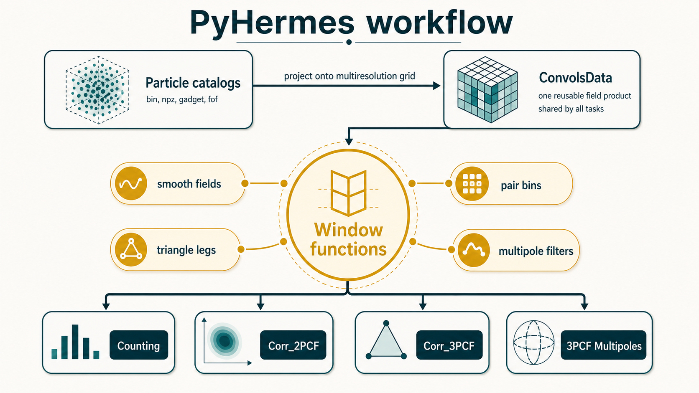

<p align="center">
  
</p>

# PyHermes

PyHermes is a Python package for large-scale-structure statistics on particle
catalogs. Its workflow is simple:

1. build a multiresolution field from particle positions with `Convols`
2. reuse that field for sampling, 2PCF, and 3PCF measurements

Project links:

- Documentation: [pyhermes.astroslacker.com](https://pyhermes.astroslacker.com)
- Source code: [github.com/PyHermes/PyHermes](https://github.com/PyHermes/PyHermes)



## Installation

Create a clean environment and install from source:

```bash
conda create -n pyhermes python=3.10
conda activate pyhermes
pip install -r requirements.txt
pip install .
```

MPI is optional. Install `mpi4py` only if you plan to run multi-process jobs:

```bash
pip install mpi4py
```

## Quick Start

The examples use paths relative to `examples/`. From a fresh clone, first open
`examples/notebooks/convols.ipynb` and run its data-preparation cells. They
download and prepare the Quijote halo catalog used by the quick start config.

After that, the core PyHermes workflow is only a few lines:

```python
from pathlib import Path
import os

import matplotlib.pyplot as plt
import numpy as np

from pyhermes.base.convols import Convols
from pyhermes.io import WindowFunc
from pyhermes.param.parambase import read_param

# Use the same base directory as the example scripts and YAML files.
os.chdir(Path("examples"))

# Build the multiresolution field from the example particle catalog.
task_params = read_param(config_path="./configs/param_convols.yaml")
D = Convols(task_params).run(save_result=False)
D.threads = 8

# Convert the normalized field into a fluctuation field.
rho = 1 / D.V
RR = rho**2
deltaD = D - rho

# Smooth the fluctuation field with a spherical top-hat window.
smooth_window = WindowFunc(
    {"type": "sphere", "len_args": {"R": 5}},
    D.convols_info,
    threads=8,
)
deltaD_w = deltaD @ smooth_window

# Estimate xi(r) with shell convolutions and a spatial average.
r_arr = np.linspace(0, 150, 26)
xi_arr = np.zeros_like(r_arr)

for i, r in enumerate(r_arr):
    shell_window = WindowFunc(
        {"type": "shell", "len_args": {"R": r}},
        D.convols_info,
        threads=8,
    )
    pair_field = deltaD_w @ shell_window * deltaD_w
    xi_arr[i] = pair_field.as_array().mean() / RR

plt.plot(r_arr, xi_arr * r_arr**2)
plt.xlabel("r [Mpc/h]")
plt.ylabel(r"$r^2 \xi(r)$")
plt.show()
```

## Start Here

The repository is organized around five notebooks in `examples/notebooks/`:

- `quick_start.ipynb`: the smallest end-to-end example
- `convols.ipynb`: build `ConvolsData` from particle catalogs
- `counting.ipynb`: sample the field at random positions
- `corr2pcf.ipynb`: isotropic and anisotropic 2PCF, including redshift-space examples
- `corr3pcf.ipynb`: standard 3PCF, low-level `Q` reconstruction, and multipoles

The recommended reading order is:

1. `quick_start.ipynb`
2. `convols.ipynb`
3. `counting.ipynb`
4. `corr2pcf.ipynb`
5. `corr3pcf.ipynb`

## Example Layout

The tracked example assets are:

- `examples/notebooks/`: tutorial notebooks
- `examples/scripts/`: runnable task drivers
- `examples/configs/`: YAML files used by those drivers

The following directories are created and filled locally:

- `examples/data/`: local example data. `convols.ipynb` shows how to download
  and prepare the Quijote halo example used by the tutorials.
- `examples/output/`: local outputs. Lightweight products are created during
  notebook runs. Heavier 2PCF and 3PCF products are not committed; the
  relevant cells in `corr2pcf.ipynb` and `corr3pcf.ipynb` point to the exact
  script and YAML file you should run on your own machine or server.

All example scripts and YAML files are written with `examples/` as the working
directory. The notebooks switch to that directory at the top so the same
relative paths work in both notebook and command-line usage.

## Running The Example Scripts

From the repository root:

```bash
cd examples
python ./scripts/run_convols.py ./configs/param_convols.yaml
python ./scripts/run_counting.py ./configs/param_counting.yaml
python ./scripts/run_2pcf.py ./configs/param_2pcf.yaml
python ./scripts/run_3pcf.py ./configs/param_3pcf_rcenter_nrot20.yaml
```

With MPI:

```bash
cd examples
mpirun -np 4 python ./scripts/run_convols.py ./configs/param_convols.yaml
mpirun -np 4 python ./scripts/run_2pcf.py ./configs/param_2pcf.yaml
mpirun -np 4 python ./scripts/run_3pcf.py ./configs/param_3pcf_pcenter_nrot20.yaml
```

For heavier production-style runs, use the script and config combinations
called out directly in `corr2pcf.ipynb` and `corr3pcf.ipynb`.

## Documentation

The full written guide lives in `docs/` and follows the same five-notebook
learning path as the examples.
