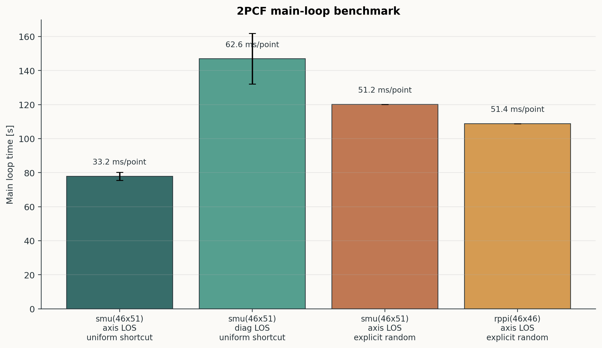
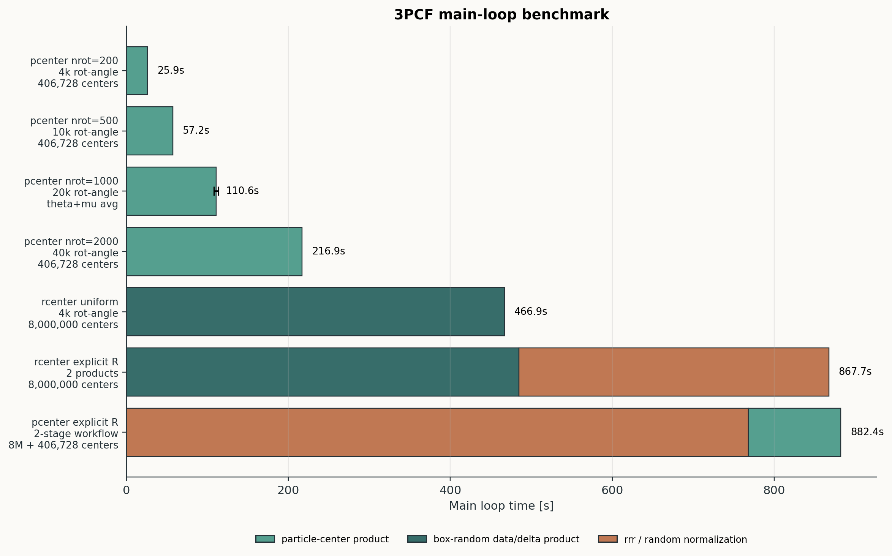
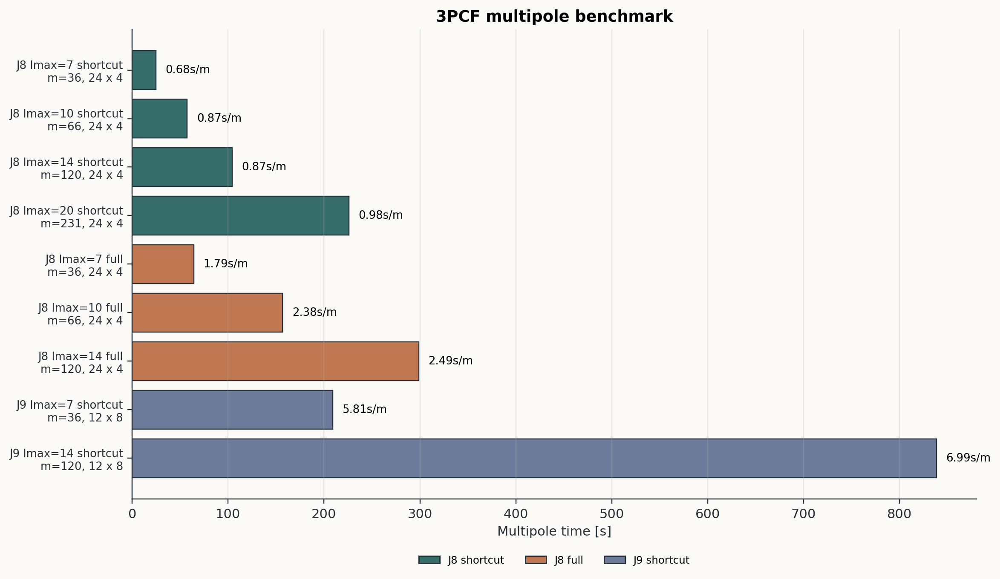

Benchmark
=========

This page summarizes the benchmark logs collected under ``examples/logs``.
The numbers are intended as practical reference timings for the example
workflows, not as hardware-independent performance claims.

Reading The Tables
------------------

All rows use the Quijote halo example unless noted otherwise:

- approximately ``4.07e5`` halos in a ``box_size = 1000`` volume
- ``wavelet_mode = db2``, ``wavelet_level = 10``, and ``phi_resolution = 1024``
- ``J = 8`` for the main examples, with extra ``J = 9`` multipole runs

The ``main`` column reports the core measurement loop exposed in the log. The
``task`` column includes setup, post-processing, and output writing. Resource
labels are written as ``MPI ranks x threads per rank``. The logs do not record
the CPU model. The multipole logs record an ``NVIDIA GeForce RTX 4090`` with
CUDA 12.4.

2PCF
----

The 2PCF examples are grouped by the choices that change the actual workload:
coordinate grid, line of sight, and random-field treatment. Real-space and
redshift-space inputs have the same loop structure here, so they are pooled
when the sampling grid, LOS, and random treatment match. Ring, cylinder, disk,
and ``sph5`` smoothing options have comparable cost in this benchmark.

Label notes: ``smu(46x51)`` means 46 radial bins times 51 ``mu`` bins, while
``rppi(46x46)`` means 46 ``rp`` bins times 46 ``pi`` bins. ``axis LOS`` uses
``(0, 0, 1)`` and ``diag LOS`` uses ``(1, 1, 1)``. ``uniform shortcut`` uses
the analytic uniform random density, while ``explicit random`` reads a saved
random ``ConvolsData`` field.

.. list-table::
   :header-rows: 1
   :widths: 30 14 14 12 14 14 18

   * - Case
     - Samples
     - Resources
     - Logs
     - Main [s]
     - Task [s]
     - Main / sample
   * - ``smu`` axis LOS, uniform shortcut
     - ``46 x 51``
     - ``16 x 8``
     - ``6``
     - ``77.91 +/- 2.36``
     - ``79.23 +/- 2.76``
     - ``33.21 ms``
   * - ``smu`` diagonal LOS, uniform shortcut
     - ``46 x 51``
     - ``16 x 8``
     - ``2``
     - ``146.89 +/- 14.87``
     - ``149.55 +/- 17.50``
     - ``62.61 ms``
   * - ``smu`` axis LOS, explicit random
     - ``46 x 51``
     - ``16 x 8``
     - ``1``
     - ``120.18``
     - ``125.41``
     - ``51.23 ms``
   * - ``rppi`` axis LOS, explicit random
     - ``46 x 46``
     - ``16 x 8``
     - ``1``
     - ``108.86``
     - ``114.10``
     - ``51.45 ms``

The diagonal LOS is much slower because the kernel can no longer exploit the
axis-aligned geometry of ``(0, 0, 1)``. For an axis LOS, many pair-window
operations reduce to simpler separations along the grid axes. For
``(1, 1, 1)``, the code must evaluate the full LOS-aware geometry, so each
sample point does more coordinate work and memory access is less direct.
Explicit random fields are also slower than the uniform shortcut because the
random density field must be read and convolved rather than represented by an
analytic constant.

Standard 3PCF
-------------

These runs correspond to the standard ``Q`` and low-level reconstruction
workflows in ``corr3pcf.ipynb``. They use ``r12 = 20``, ``r13 = 40``, sphere
smoothing with ``R = 5`` on the second and third legs, and 20 angular samples.
The ``theta`` and ``mu`` modes both have 20 angular samples, so the
``nrot=1000`` particle-center rows are pooled.

For average timings, two normalizations are useful:

- ``main / (n_rot x n_angle)`` is easy to read and tracks the time per
  angular-rotation batch.
- ``main / (n_rot x n_angle x total_centers)`` is the fairer kernel-level
  normalization across different center counts. It is reported in nanoseconds
  to avoid tiny decimal seconds.

Label notes: ``pcenter`` means particle centers and ``rcenter`` means
box-random Monte Carlo centers. ``4k rot-angle`` means
``n_rot x n_angle = 200 x 20``. ``explicit R`` uses a saved random field.
Stacked bars show staged workflows: random-center normalization products in
orange, box-random data/delta products in dark teal, and particle-center
data-minus-random products in light teal.

.. list-table::
   :header-rows: 1
   :widths: 28 16 15 14 14 18 22

   * - Case
     - ``n_rot x n_angle``
     - Centers
     - Resources
     - Main [s]
     - Main / rot-angle
     - Main / center-rot-angle
   * - ``pcenter`` ``nrot=200``
     - ``4,000``
     - ``406,728``
     - ``16 x 8``
     - ``25.94``
     - ``6.48 ms``
     - ``15.94 ns``
   * - ``pcenter`` ``nrot=500``
     - ``10,000``
     - ``406,728``
     - ``16 x 8``
     - ``57.22``
     - ``5.72 ms``
     - ``14.07 ns``
   * - ``pcenter`` ``nrot=1000``, ``theta+mu`` average
     - ``20,000``
     - ``406,728``
     - ``16 x 8``
     - ``110.57 +/- 2.80``
     - ``5.53 ms``
     - ``13.59 ns``
   * - ``pcenter`` ``nrot=2000``
     - ``40,000``
     - ``406,728``
     - ``16 x 8``
     - ``216.92``
     - ``5.42 ms``
     - ``13.33 ns``
   * - ``rcenter`` ``nrot=200``, uniform shortcut
     - ``4,000``
     - ``8,000,000``
     - ``16 x 8``
     - ``466.88``
     - ``116.72 ms``
     - ``14.59 ns``

The center-normalized values are much more stable than the raw wall times.
That is why ``main / center-rot-angle`` is the better metric for comparing
particle-center and box-random-center kernels, while raw ``main`` time is the
more useful metric for planning how long a full example will take.

The explicit-random 3PCF workflows are split into products, because their
total time combines physically different stages.

.. list-table::
   :header-rows: 1
   :widths: 24 22 16 15 14 18 22

   * - Workflow
     - Stage / product
     - ``n_rot x n_angle``
     - Centers
     - Time [s]
     - Time / rot-angle
     - Time / center-rot-angle
   * - ``pcenter`` explicit ``R``
     - ``ddd`` random-center normalization
     - ``4,000``
     - ``8,000,000``
     - ``386.11``
     - ``96.53 ms``
     - ``12.07 ns``
   * - ``pcenter`` explicit ``R``
     - ``rrr`` random-only normalization
     - ``4,000``
     - ``8,000,000``
     - ``382.24``
     - ``95.56 ms``
     - ``11.95 ns``
   * - ``pcenter`` explicit ``R``
     - ``d_delta_dd`` particle-center correction
     - ``20,000``
     - ``406,728``
     - ``114.08``
     - ``5.70 ms``
     - ``14.02 ns``
   * - ``rcenter`` explicit ``R``
     - ``delta_ddd`` box-random data-minus-random
     - ``4,000``
     - ``8,000,000``
     - ``484.61``
     - ``121.15 ms``
     - ``15.14 ns``
   * - ``rcenter`` explicit ``R``
     - ``rrr`` random-only normalization
     - ``4,000``
     - ``8,000,000``
     - ``383.09``
     - ``95.77 ms``
     - ``11.97 ns``

3PCF Multipoles
---------------

The multipole examples use ``pair_mpi`` execution and the RTX 4090 recorded in
the logs. The number of independent ``m`` tasks is
``(lmax + 1) x (lmax + 2) / 2``. The table reports
``multipole time / m`` as the compact average. For ``full`` rows this includes
the three heavy products ``ddd_l``, ``delta_ddd_l``, and ``rrr_l``; for
``shortcut`` rows the analytic uniform-random contribution is effectively
negligible, so the cost is dominated by ``delta_ddd_l``.

Label notes: ``J8`` and ``J9`` are the multiresolution grid levels. ``lmax`` is
the maximum multipole order. ``shortcut`` means the uniform random contribution
uses the analytic shortcut. ``full`` means explicit random-field products are
computed. ``24 x 4`` means 24 MPI ranks with 4 threads per rank.

.. list-table::
   :header-rows: 1
   :widths: 22 8 10 10 13 23 14 14 12

   * - Case
     - ``J``
     - ``lmax``
     - ``m``
     - Resources
     - Heavy products
     - Multipole [s]
     - Multipole / ``m``
     - Task [s]
   * - Shortcut
     - ``8``
     - ``7``
     - ``36``
     - ``24 x 4``
     - ``delta_ddd_l``
     - ``24.65``
     - ``0.68 s``
     - ``30.75``
   * - Shortcut
     - ``8``
     - ``10``
     - ``66``
     - ``24 x 4``
     - ``delta_ddd_l``
     - ``57.33``
     - ``0.87 s``
     - ``62.03``
   * - Shortcut
     - ``8``
     - ``14``
     - ``120``
     - ``24 x 4``
     - ``delta_ddd_l``
     - ``104.17``
     - ``0.87 s``
     - ``109.22``
   * - Shortcut
     - ``8``
     - ``20``
     - ``231``
     - ``24 x 4``
     - ``delta_ddd_l``
     - ``225.77``
     - ``0.98 s``
     - ``230.71``
   * - Full
     - ``8``
     - ``7``
     - ``36``
     - ``24 x 4``
     - ``ddd_l + delta_ddd_l + rrr_l``
     - ``64.30``
     - ``1.79 s``
     - ``72.38``
   * - Full
     - ``8``
     - ``10``
     - ``66``
     - ``24 x 4``
     - ``ddd_l + delta_ddd_l + rrr_l``
     - ``156.90``
     - ``2.38 s``
     - ``164.15``
   * - Full
     - ``8``
     - ``14``
     - ``120``
     - ``24 x 4``
     - ``ddd_l + delta_ddd_l + rrr_l``
     - ``298.71``
     - ``2.49 s``
     - ``304.89``
   * - Shortcut
     - ``9``
     - ``7``
     - ``36``
     - ``12 x 8``
     - ``delta_ddd_l``
     - ``209.31``
     - ``5.81 s``
     - ``221.46``
   * - Shortcut
     - ``9``
     - ``14``
     - ``120``
     - ``12 x 8``
     - ``delta_ddd_l``
     - ``838.36``
     - ``6.99 s``
     - ``848.85``
