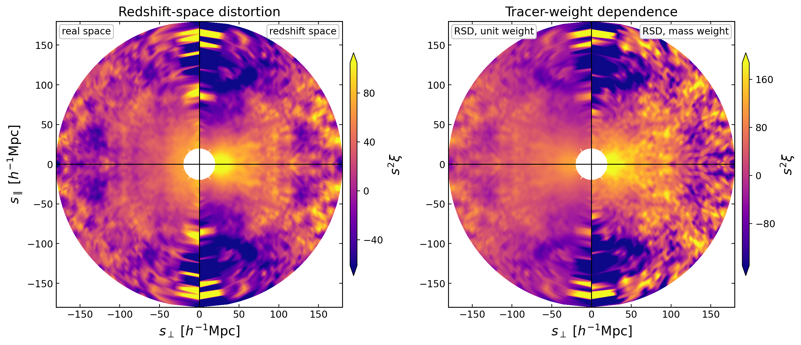
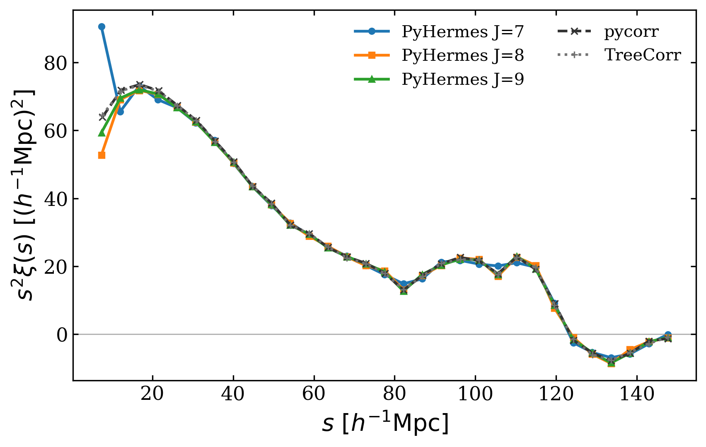
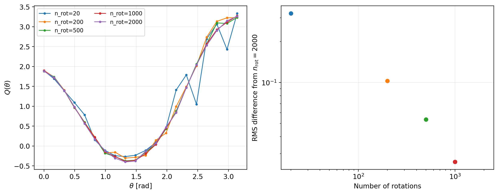
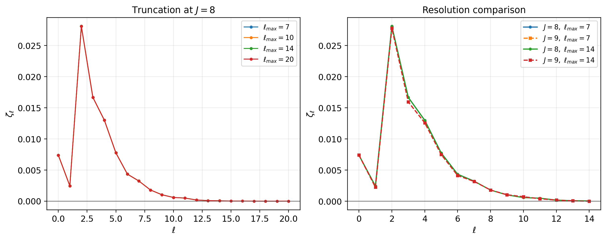
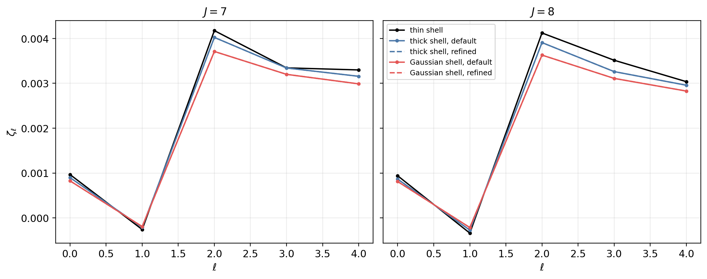
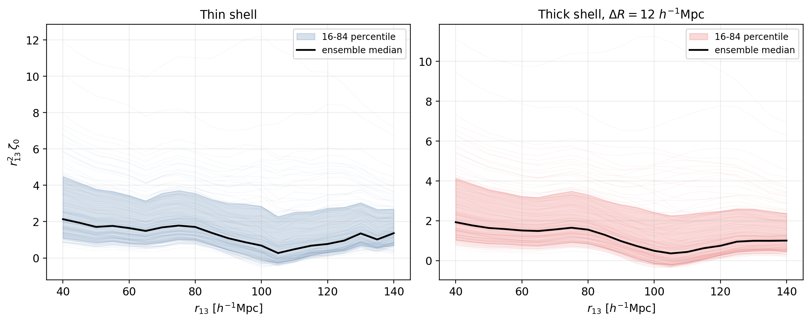
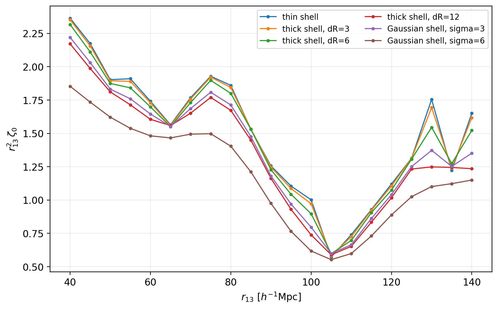
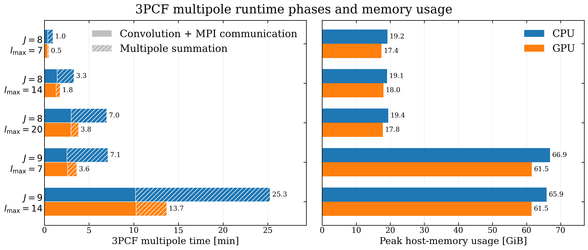

Validation and Performance
==========================

This page separates two questions that are easy to mix together:

* **Validation:** does a field--window estimator recover the expected statistic,
  and does it converge when the numerical controls are tightened?
* **Performance:** once the estimator is fixed, which part of the workflow sets
  the runtime and memory footprint?

The validation figures, timing table, and CPU/GPU memory comparison are all
generated from the current grouped jobs under ``tests/``.  They therefore form
one internally consistent benchmark set rather than mixing results from
different runs.

Reference Data
--------------

Unless stated otherwise, the validation examples use the Quijote
fiducial-cosmology halo catalogue from realisation 8000, snapshot 004
(``z = 0``):

* 406,728 FoF haloes in a periodic cube of side
  ``1000 h^-1 Mpc``;
* the ``db2`` scaling-function basis;
* ``J = 8`` for the main tests, with selected ``J = 9`` comparisons;
* the plane-parallel approximation for redshift-space measurements.

These are controlled algorithm tests, not a complete survey-analysis recipe.
Survey masks and spatially varying selection functions require an explicit
random catalogue or random ``SFCField``.

Numerical Validation
--------------------

Anisotropic 2PCF
~~~~~~~~~~~~~~~~

The same ``Corr2PCF`` task can measure real- and redshift-space fields by
changing the input ``SFCField`` while keeping the binning-window family fixed.
The plot below maps :math:`s^2\xi(s,\mu)` to the
:math:`(s_\perp,s_\parallel)` plane.  Joining two measurements at
:math:`s_\perp=0` makes the line-of-sight response immediately visible and
also provides a compact check of tracer weighting.

   Current grouped-test outputs.  Left: real space and unit-weight redshift
   space.  Right: unit- and mass-weighted redshift space.  The two halves of
   each circle share a colour normalization, while the two panels have
   separate colour bars because mass weighting has a larger dynamic range.
   The white centre excludes :math:`s<20\,h^{-1}{\rm Mpc}`.

For an independent estimator-level check, the paper compares the isotropic
Hermes result with direct periodic pair counting.  Agreement improves with
increasing ``J`` and is best interpreted only above the effective resolution
scale of the reconstructed field.

Standard 3PCF
~~~~~~~~~~~~~

The conventional ``Corr3PCF`` task estimates translational and rotational
averages by Monte Carlo sampling.  Convergence must therefore be checked in
``n_rot`` rather than inferred from one visually smooth curve.  In the current
test, the low-rotation result fluctuates visibly while the curves and their RMS
difference settle rapidly as ``n_rot`` increases.

   Left: :math:`Q(\theta)` for several rotation counts.  Right: RMS difference
   from the ``n_rot = 2000`` result.

3PCF Multipoles
~~~~~~~~~~~~~~~

Multipole measurements have two separate convergence controls.  ``lmax``
truncates the angular expansion, while ``J`` controls the MRA field resolution.
The left panel below verifies that increasing ``lmax`` appends higher orders
without changing the already computed low-order multipoles.  The right panel
compares those common modes between ``J = 8`` and ``J = 9``.

For non-shell radial profiles, PyHermes tabulates the required radial transform.
The default and refined tables should agree before a profile is used for
production measurements.  The following check covers the thin-shell analytic
path and the numerical thick- and Gaussian-shell paths.

An Ensemble-Level Check
~~~~~~~~~~~~~~~~~~~~~~~

The Kun scan provides a larger application test: ``r12 = 20 h^-1 Mpc`` is held
fixed while ``r13`` varies.  The 129 mocks used here span different cosmological
parameters.  Their spread is therefore **not** a covariance estimate for one
cosmology; it is shown to inspect the stability of the full projection and
monopole pipeline over a deliberately broad simulation ensemble.

The binning profile is part of the observable, not merely a plotting choice.
For one mock, widening a finite shell or increasing the Gaussian-shell width
averages a broader neighbourhood of triangle configurations:

   One input field and one radial scan measured with six binning profiles. The
   smooth variation between profiles is the expected finite-bin response.

Performance Model
-----------------

The catalogue is projected once onto
:math:`N_{\mathrm{MRA}}=2^{3J}` coefficients.  Subsequent measurements operate
on fields and windows, so their leading cost depends on field resolution and
the number of requested window evaluations, rather than directly on the
original catalogue size.

For ``N_w`` window applications on a matching FFT grid,

.. math::

   T_{\mathrm{conv}}
   = \mathcal{O}\!\left(N_w N_{\mathrm{MRA}}
     \log N_{\mathrm{MRA}}\right).

The task-specific multiplicities are:

* ``Corr2PCF``: ``N_s * N_mu`` or ``N_rp * N_pi`` sampled binning windows;
* ``Corr3PCF``: translation samples times random rotations;
* ``Corr3PCFMultipole``:
  :math:`N_m=(\ell_{\max}+1)(\ell_{\max}+2)/2` explicitly evaluated
  non-negative-:math:`m` fields.

Increasing ``J`` by one multiplies the number of three-dimensional field
coefficients by eight.  Since some work buffers are rank-local, a high-``J``
job often benefits from fewer MPI ranks and more threads per rank.

Current Grouped Benchmark
-------------------------

The representative end-to-end jobs below use the same Quijote field and
geometric setup as the validation examples.  ``Average time`` is normalized by
the natural sampling unit of each estimator: one :math:`(s,\mu)` binning window
for the 2PCF and one centre--rotation--angle combination for the standard 3PCF.
Memory is the Slurm batch-step ``MaxRSS`` and therefore excludes GPU device
memory.

.. list-table:: Representative 2PCF and standard-3PCF jobs
   :header-rows: 1
   :widths: 13 33 6 10 12 15 11

   * - Product
     - Representative setup
     - ``J``
     - Parallel
     - Task total
     - Average time
     - MaxRSS
   * - :math:`DD(s,\mu)`
     - Ring binning windows, ``46 x 51`` samples
     - 8
     - ``8 x 8``
     - 119.7 s
     - 51.0 ms/sample
     - 8.7 GiB
   * - :math:`DDD(\theta;r_{12},r_{13})`
     - Particle centres, ``Ncen=406728``, ``n_rot=1000``, ``n_theta=20``
     - 8
     - ``16 x 8``
     - 84.0 s
     - 10.3 ns/comb.
     - 11.3 GiB
   * - :math:`DDD(\theta;r_{12},r_{13})`
     - Box-random centres, ``Ncen=8e6``, ``n_rot=200``, ``n_theta=20``
     - 8
     - ``16 x 8``
     - 280.6 s
     - 8.77 ns/comb.
     - 21.2 GiB

The CPU measurements used two AMD EPYC 9754 processors (256 physical cores in
total).  GPU measurements used one NVIDIA GeForce RTX 4090 with CUDA 12.4.
``ranks x threads`` below describes the CPU layout; GPU jobs use the same
CPU-side convolution layout and an ``(8, 8, 8)`` CUDA block for the final
contraction.

The multipole table reports the same five configurations on both backends.
``Convolution + MPI`` is the multipole-loop residual after subtracting the final
contraction; the two contributions are kept together because their critical
paths overlap.  ``Task total`` additionally includes input, setup, and output
overhead.

.. list-table:: Current 3PCF-multipole CPU/GPU benchmark
   :header-rows: 1
   :widths: 5 8 8 9 11 13 12 12 10

   * - ``J``
     - ``lmax``
     - :math:`N_m`
     - Backend
     - Parallel
     - Convolution + MPI [s]
     - Sum [s]
     - Task total [s]
     - MaxRSS [GiB]
   * - 8
     - 7
     - 36
     - CPU
     - ``24 x 4``
     - 23.5
     - 34.4
     - 62.8
     - 19.2
   * - 8
     - 7
     - 36
     - GPU
     - ``24 x 4``
     - 21.9
     - 8.3
     - 35.3
     - 17.4
   * - 8
     - 14
     - 120
     - CPU
     - ``24 x 4``
     - 86.0
     - 113.0
     - 204.0
     - 19.1
   * - 8
     - 14
     - 120
     - GPU
     - ``24 x 4``
     - 80.3
     - 26.7
     - 112.2
     - 18.0
   * - 8
     - 20
     - 231
     - CPU
     - ``24 x 4``
     - 180.6
     - 238.7
     - 424.3
     - 19.4
   * - 8
     - 20
     - 231
     - GPU
     - ``24 x 4``
     - 178.5
     - 51.1
     - 234.6
     - 17.8
   * - 9
     - 7
     - 36
     - CPU
     - ``12 x 8``
     - 152.0
     - 274.7
     - 445.2
     - 66.9
   * - 9
     - 7
     - 36
     - GPU
     - ``12 x 8``
     - 156.5
     - 62.1
     - 234.3
     - 61.5
   * - 9
     - 14
     - 120
     - CPU
     - ``12 x 8``
     - 613.0
     - 903.6
     - 1528.4
     - 65.9
   * - 9
     - 14
     - 120
     - GPU
     - ``12 x 8``
     - 616.2
     - 206.0
     - 833.9
     - 61.5

CPU and GPU Multipole Backends
------------------------------

The backend switch applies to the final multipole-field contraction.  FFT
window convolutions and MPI communication remain CPU-side for both backends.
Consequently, the GPU strongly accelerates the contraction stage, while the
end-to-end gain is bounded by the unchanged field and communication stages.

   Current grouped benchmark using ``24 x 4`` at ``J=8`` and ``12 x 8`` at
   ``J=9``.  Left: multipole-loop wall time split into field/MPI work and the
   backend-selected contraction.  Right: Slurm ``MaxRSS`` host memory; GPU
   device memory is not included.

The CPU and GPU products agree to relative :math:`L_2` differences of
``9.5e-15--2.2e-14``.  Across the five configurations, GPU contraction is
``4.1--4.7x`` faster and complete task time is ``1.8--1.9x`` faster.  The
smaller end-to-end ratio is expected because only the contraction is offloaded.
At fixed ``J``, host memory depends only weakly on ``lmax`` because multipole
windows are generated and processed sequentially.  The GPU jobs use
``5.6--9.1%`` less host memory in these measurements, but this comparison does
not include device memory and is not a total CPU-plus-GPU footprint.  Increasing
``J`` has the much larger memory effect: it multiplies the three-dimensional
coefficient count by eight.  Using fewer MPI ranks at ``J=9`` limits the
observed host-memory increase to approximately ``3.4--3.5x``.

Reproducing the Checks
----------------------

The public ``examples/notebooks`` directory contains the user-facing workflows.
For maintainers, the current grouped outputs are analysed by five deliberately
small notebooks:

* ``tests/notebooks/docs_2pcf_results.ipynb``;
* ``tests/notebooks/docs_3pcf_results.ipynb``;
* ``tests/notebooks/docs_3pcf_multipole_results.ipynb``;
* ``tests/notebooks/docs_kun_monopole_results.ipynb``;
* ``tests/notebooks/paper_figures_performance.ipynb`` for the current timing
  and Slurm-memory table used above.

Once the grouped jobs have produced their outputs, these notebooks read the
saved products rather than rerunning expensive estimators.  The corresponding
scripts and grouped Slurm recipes live under ``tests/scripts`` and
``tests/slurm``.  Raw logs and estimator products are treated as transient test
artifacts and are intentionally not distributed with the repository.  Treat
absolute times as hardware-specific; convergence patterns, stage-level scaling,
and same-node CPU/GPU ratios are the more portable diagnostics.
