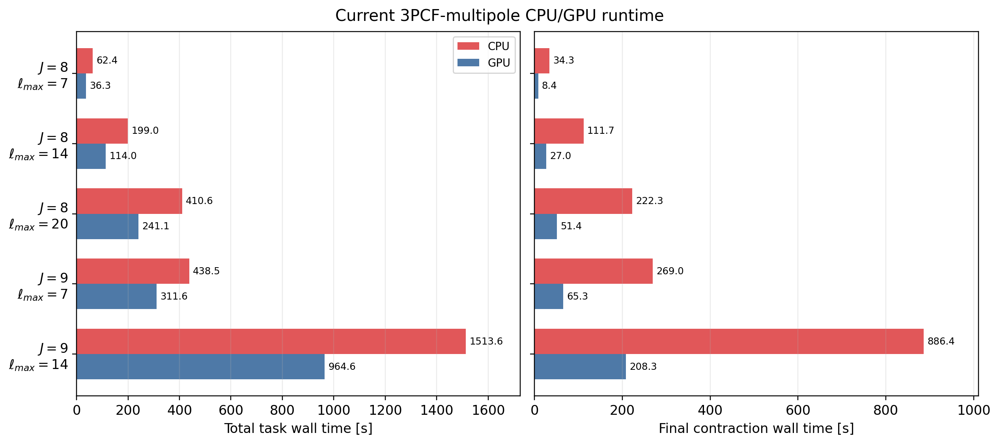
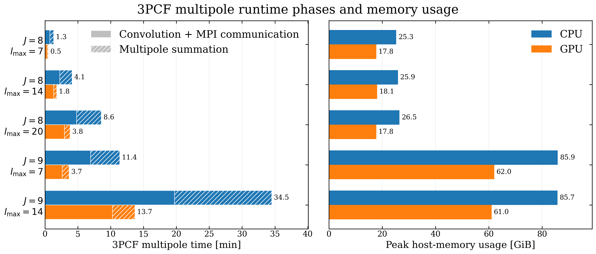

Validation and Performance
==========================

This page separates two questions that are easy to mix together:

* **Validation:** does a field--window estimator recover the expected statistic,
  and does it converge when the numerical controls are tightened?
* **Performance:** once the estimator is fixed, which part of the workflow sets
  the runtime and memory footprint?

The validation figures and the current CPU/GPU runtime comparison are generated
from the latest grouped test outputs.  The compact timing table and the
host-memory panel reproduce the reference benchmarks reported in the Hermes
paper.

Reference Data
--------------

Unless stated otherwise, the validation examples use the Quijote
fiducial-cosmology halo catalogue from realisation 8000, snapshot 004
(``z = 0``):

* 406,728 FoF haloes in a periodic cube of side
  ``1000 h^-1 Mpc``;
* the ``db2`` scaling-function basis;
* ``J = 8`` for the main tests, with selected ``J = 9`` comparisons;
* the plane-parallel approximation for redshift-space measurements.

These are controlled algorithm tests, not a complete survey-analysis recipe.
Survey masks and spatially varying selection functions require an explicit
random catalogue or random ``SFCField``.

Numerical Validation
--------------------

Anisotropic 2PCF
~~~~~~~~~~~~~~~~

The same ``Corr2PCF`` task can measure real- and redshift-space fields by
changing the input ``SFCField`` while keeping the binning-window family fixed.
The plot below maps :math:`s^2\xi(s,\mu)` to Cartesian
:math:`(s_\perp,s_\parallel)` coordinates.  The line-of-sight structure is a
useful end-to-end check of field loading, window orientation, sampling-grid
ordering, and result reshaping.

.. figure:: _static/results/docs_2pcf_real_rsd_smu.png
   :alt: Real- and redshift-space anisotropic two-point correlation functions
   :width: 100%

   Current grouped-test outputs in real and redshift space.  Both panels use a
   shared colour normalization; the white centre is outside the sampled radial
   range.

For an independent estimator-level check, the paper compares the isotropic
Hermes result with direct periodic pair counting.  Agreement improves with
increasing ``J`` and is best interpreted only above the effective resolution
scale of the reconstructed field.

.. figure:: _static/paper/benchmark_2pcf_isotropic_s2xi_curves.png
   :alt: Isotropic PyHermes and direct pair-counting comparison
   :width: 86%

Standard 3PCF
~~~~~~~~~~~~~

The conventional ``Corr3PCF`` task estimates translational and rotational
averages by Monte Carlo sampling.  Convergence must therefore be checked in
``n_rot`` rather than inferred from one visually smooth curve.  In the current
test, the low-rotation result fluctuates visibly while the curves and their RMS
difference settle rapidly as ``n_rot`` increases.

.. figure:: _static/results/docs_3pcf_rotation_convergence.png
   :alt: Standard three-point correlation rotation convergence
   :width: 100%

   Left: :math:`Q(\theta)` for several rotation counts.  Right: RMS difference
   from the ``n_rot = 2000`` result.

3PCF Multipoles
~~~~~~~~~~~~~~~

Multipole measurements have two separate convergence controls.  ``lmax``
truncates the angular expansion, while ``J`` controls the MRA field resolution.
The left panel below verifies that increasing ``lmax`` appends higher orders
without changing the already computed low-order multipoles.  The right panel
compares those common modes between ``J = 8`` and ``J = 9``.

.. figure:: _static/results/docs_3pcf_multipole_lmax_resolution.png
   :alt: Three-point multipole truncation and field-resolution comparison
   :width: 100%

For non-shell radial profiles, PyHermes tabulates the required radial transform.
The default and refined tables should agree before a profile is used for
production measurements.  The following check covers the thin-shell analytic
path and the numerical thick- and Gaussian-shell paths.

.. figure:: _static/results/docs_3pcf_radial_profile_convergence.png
   :alt: Multipole radial-profile convergence at J equals 7 and 8
   :width: 100%

An Ensemble-Level Check
~~~~~~~~~~~~~~~~~~~~~~~

The Kun scan provides a larger application test: ``r12 = 20 h^-1 Mpc`` is held
fixed while ``r13`` varies.  The 129 mocks used here span different cosmological
parameters.  Their spread is therefore **not** a covariance estimate for one
cosmology; it is shown to inspect the stability of the full projection and
monopole pipeline over a deliberately broad simulation ensemble.

.. figure:: _static/results/docs_kun_monopole_ensemble.png
   :alt: Thin- and thick-shell three-point monopoles for 129 Kun mocks
   :width: 100%

The binning profile is part of the observable, not merely a plotting choice.
For one mock, widening a finite shell or increasing the Gaussian-shell width
averages a broader neighbourhood of triangle configurations:

.. figure:: _static/results/docs_kun_mock0_binning_windows.png
   :alt: Kun mock zero monopole measured with thin, thick, and Gaussian shells
   :width: 86%

   One input field and one radial scan measured with six binning profiles. The
   smooth variation between profiles is the expected finite-bin response.

Performance Model
-----------------

The catalogue is projected once onto
:math:`N_{\mathrm{MRA}}=2^{3J}` coefficients.  Subsequent measurements operate
on fields and windows, so their leading cost depends on field resolution and
the number of requested window evaluations, rather than directly on the
original catalogue size.

For ``N_w`` window applications on a matching FFT grid,

.. math::

   T_{\mathrm{conv}}
   = \mathcal{O}\!\left(N_w N_{\mathrm{MRA}}
     \log N_{\mathrm{MRA}}\right).

The task-specific multiplicities are:

* ``Corr2PCF``: ``N_s * N_mu`` or ``N_rp * N_pi`` sampled binning windows;
* ``Corr3PCF``: translation samples times random rotations;
* ``Corr3PCFMultipole``:
  :math:`N_m=(\ell_{\max}+1)(\ell_{\max}+2)/2` explicitly evaluated
  non-negative-:math:`m` fields.

Increasing ``J`` by one multiplies the number of three-dimensional field
coefficients by eight.  Since some work buffers are rank-local, a high-``J``
job often benefits from fewer MPI ranks and more threads per rank.

Reference Benchmarks
--------------------

The CPU measurements used two AMD EPYC 9754 processors (256 physical cores in
total).  GPU measurements used one NVIDIA GeForce RTX 4090 with CUDA 12.4.
``ranks x threads`` below describes the CPU layout; the multipole GPU jobs use
the same CPU-side convolution layout and an ``(8, 8, 8)`` CUDA block for the
final contraction.

.. list-table:: Representative results reported in the Hermes paper
   :header-rows: 1
   :widths: 17 34 6 12 12 13 10

   * - Product
     - Representative setup
     - ``J``
     - Parallel
     - Total loop
     - Average
     - MaxRSS
   * - :math:`DD(s,\mu)`
     - Ring windows, ``46 x 51`` samples
     - 8
     - ``16 x 8``
     - 78 s
     - 33.21 ms/sample
     - 16.5 GB
   * - :math:`DDD(\theta)`
     - 406,728 particle centres, ``n_rot=1000``, ``n_theta=20``
     - 8
     - ``16 x 8``
     - 110 s
     - 14 ns/comb.
     - 11.5 GB
   * - :math:`DDD(\theta)`
     - 8 million box-random centres, ``n_rot=200``, ``n_theta=20``
     - 8
     - ``16 x 8``
     - 467 s
     - 14 ns/comb.
     - 15.7 GB
   * - :math:`DDD_\ell`
     - ``lmax=7`` (36 non-negative-``m`` fields)
     - 8
     - ``24 x 4``
     - 30 s
     - 0.84 s/field
     - 17.8 GB
   * - :math:`DDD_\ell`
     - ``lmax=14`` (120 non-negative-``m`` fields)
     - 8
     - ``24 x 4``
     - 108 s
     - 0.90 s/field
     - 18.1 GB
   * - :math:`DDD_\ell`
     - ``lmax=20`` (231 non-negative-``m`` fields)
     - 8
     - ``24 x 4``
     - 230 s
     - 1.00 s/field
     - 17.8 GB
   * - :math:`DDD_\ell`
     - ``lmax=7`` (36 non-negative-``m`` fields)
     - 9
     - ``12 x 8``
     - 221 s
     - 6.14 s/field
     - 62.0 GB
   * - :math:`DDD_\ell`
     - ``lmax=14`` (120 non-negative-``m`` fields)
     - 9
     - ``12 x 8``
     - 822 s
     - 6.85 s/field
     - 61.0 GB

CPU and GPU Multipole Backends
------------------------------

The backend switch applies to the final multipole-field contraction.  FFT
window convolutions and MPI communication remain CPU-side for both backends.
Consequently, the GPU strongly accelerates the contraction stage, while the
end-to-end gain is bounded by the unchanged convolution stage.

   Latest grouped rerun using ``24 x 4`` at ``J=8`` and ``12 x 8`` at ``J=9``.
   The left panel includes input, convolution, communication, contraction, and
   output; the right panel isolates the backend-selected contraction stage.

The CPU and GPU products agree to relative :math:`L_2` differences of
``9.5e-15--2.2e-14``.  Across the five configurations, the current GPU backend
accelerates the contraction by ``4.1--4.3x`` and the complete task by
``1.4--1.75x``.  The smaller end-to-end ratio is expected: the CPU contraction
has been optimized since the paper benchmark, while FFT convolution and MPI
communication remain common CPU-side costs.

Paper benchmark snapshot
~~~~~~~~~~~~~~~~~~~~~~~~

At the paper snapshot, GPU offload reduced the contraction cost by about
``4.2--4.4x`` and the complete multipole workflow by about ``2.2--3.1x``.  At
fixed ``J``, host memory is nearly independent of ``lmax`` because windows are
generated and processed sequentially.  The CPU backend uses more rank-local
contraction storage; the plotted memory is Slurm ``MaxRSS`` and excludes GPU
device memory.

Reproducing the Checks
----------------------

The public ``examples/notebooks`` directory contains the user-facing workflows.
For maintainers, the current grouped outputs are analysed by four deliberately
small notebooks:

* ``tests/notebooks/docs_2pcf_results.ipynb``;
* ``tests/notebooks/docs_3pcf_results.ipynb``;
* ``tests/notebooks/docs_3pcf_multipole_results.ipynb``;
* ``tests/notebooks/docs_kun_monopole_results.ipynb``.

They read existing products rather than rerunning expensive estimators.  The
corresponding grouped Slurm jobs live under ``tests/slurm``.  Treat absolute
times as hardware-specific; convergence patterns, stage-level scaling, and
same-node CPU/GPU ratios are the more portable diagnostics.
