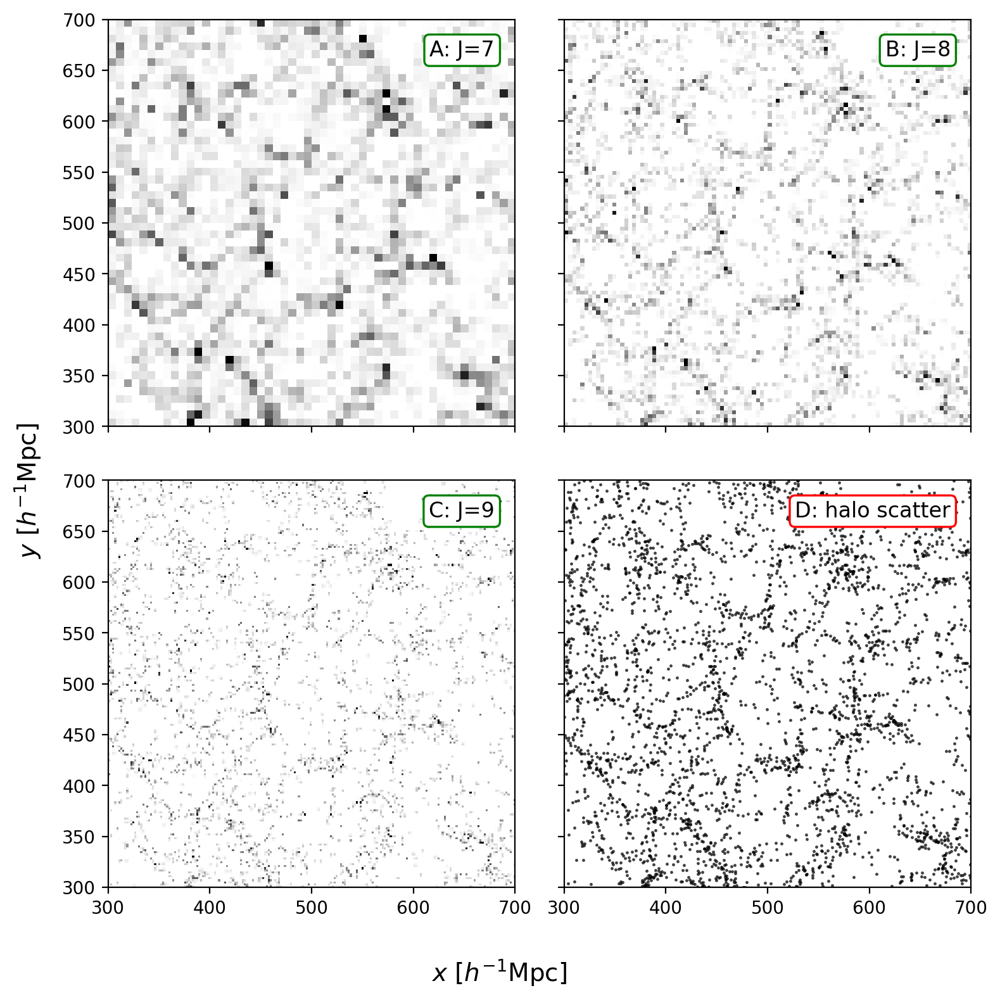

Convols
=======

``convols.ipynb`` is the upstream notebook for the whole example chain. It is
where particle catalogs become ``ConvolsData`` fields that later notebooks
reuse. If you only want to prepare those files without opening a notebook, run
``examples/scripts/prepare_convols_data.py`` from the repository root.

What this notebook covers
-------------------------

The notebook is organized in five steps:

1. read particle data through different reader paths
2. build ``ConvolsData`` through the standard driver, config-driven API, and
   task-object overrides
3. construct a matching random field
4. reload data and random fields from disk
5. visualize how the field resolution changes the represented halo field

It also includes a redshift-space preparation section, so this is the right
place to understand how the real-space and redshift-space example fields are
created.

Why this notebook matters
-------------------------

Every later notebook assumes that one or more field files already exist. In the
tracked example workflow, ``convols.ipynb`` shows the construction step by
step, while ``examples/scripts/prepare_convols_data.py`` provides the direct
command-line route.

Tracked inputs and local products
---------------------------------

Tracked in the repository:

- ``examples/notebooks/convols.ipynb``
- ``examples/scripts/prepare_convols_data.py``
- ``examples/scripts/run_convols.py``
- ``examples/configs/param_convols.yaml``
- ``examples/data/.gitkeep``

Generated locally while following the notebook:

- the downloaded and unpacked example halo catalog under ``examples/data/``
- the compact FoF-derived binary table documented by
  ``examples/data/quijote_halos/quijote_halo_bin_schema.yaml``
- the main field products in ``examples/output_new/``, such as:

  - ``quijote8000_snap004_sfc.pkl``
  - ``quijote8000_snap004_rsd_sfc.pkl``
  - ``quijote8000_snap004_rsd_diag_sfc.pkl``
  - ``random_sfc.pkl``

``ConvolsData`` files produced before the current ``weight_normalization``
metadata was introduced must be regenerated with the current ``Convols`` task
before use.

Minimal YAML Shape
------------------

The standard field-construction config starts from an input catalog, defines the
multiresolution grid, and writes a reusable ``ConvolsData`` object:

.. code-block:: yaml

   Convols:
      fin:
         path: "./data/quijote_halos/8000"
         format: "fof"
         reader_params:
            snapnum: 4
      box_size: 1000
      J: 8
      wavelet_mode: "db2"
      wavelet_level: 10
      phi_resolution: 1024
      threads: 2
      save_particle_data: True
      particle_data_path: "./data/quijote_halos/8000/groups_004/group_tab_004.pos.npz"
      fout_path: "./output_new/quijote8000_snap004_sfc.pkl"

The notebook shows this shape before the command-line run so that the YAML file
and driver script can be read together.

Minimal Python task object
--------------------------

The same construction can be driven from Python by filling the task object
directly. This is useful in notebooks when the input catalog has already been
loaded or when only one or two parameters need to be changed interactively:

.. code-block:: python

   from pyhermes.theory import Convols

   task = Convols()
   task.fin = {
       "path": "./data/quijote_halos/8000",
       "format": "fof",
       "reader_params": {"snapnum": 4},
   }
   task.box_size = 1000.0
   task.J = 8
   D = task.run()

The returned ``D`` is a ``ConvolsData`` object. Its ``epsilon`` array stores
the scaling-function coefficients of the represented field, while
``D.convols_info`` carries the grid and wavelet metadata needed by compatible
``WindowFunc`` objects in later notebooks.

Recommended usage modes
-----------------------

Use the notebook when you want to:

- inspect supported particle readers
- prepare the tracked example data for the first time
- compare real-space and redshift-space field construction
- work interactively with manual particle arrays

Use the driver script when you want a clean batch run:

.. code-block:: bash

   cd examples
   python ./scripts/run_convols.py ./configs/param_convols.yaml

The notebook shows the same task through the config-driven API and through
manual object setup, so it doubles as both a tutorial and a reference for
interactive usage.

Key idea
--------

``Convols`` builds a weighted multiresolution field and stores it in a reusable
format. Once that field exists, downstream tasks no longer need to reread and
repartition the original particle catalog. PyHermes separates catalogue
weights, such as completeness weights, from per-object field values, such as
mass or velocity. Most tutorials use unit values for both, while the later
:doc:`../weighted_fields/weighted_fields` notebook uses this directly.

Mathematical idea
-----------------

The input catalog carries a catalogue weight :math:`w_{g,i}` and an optional
physical field value :math:`x_i`,

.. math::

   F_x(\mathbf{x}) =
   \sum_i {w_{g,i}x_i\over Z}\,\delta_{\rm D}^{(3)}(\mathbf{x}-\mathbf{x}_i),
   \qquad
   Z\in\left\{1,\ S_g,\ S_x\right\},
   \quad S_g=\sum_iw_{g,i},\quad S_x=\sum_iw_{g,i}x_i.

The denominator is controlled by ``weight_normalization``. ``catalog`` uses
:math:`Z=S_g` and is the default for ordinary catalogue statistics; ``field``
uses :math:`Z=S_x` for positive marked fields; ``raw`` keeps the raw
weighted amplitude. PyHermes stores :math:`S_g`,
:math:`\sum_iw_{g,i}^2`, and :math:`S_x` as metadata so a catalog field can
be switched between these three normalizations without re-projecting. For a
mass-valued or velocity-weighted field, :math:`x_i` is mass or a velocity
component while :math:`w_g` remains the observational weight.
Ordinary field arithmetic, scalar arithmetic, and window convolution produce
derived fields: they keep the resulting grid values but intentionally drop
the original catalogue metadata and particle list. Their
``weight_normalization`` is ``None`` and their ``field_integral`` is the direct
sum of the derived ``epsilon`` grid.

``Convols`` projects it onto scaling-function coefficients,

.. math::

   F_{x,j}(\mathbf{x}) =
   \sum_\ell \epsilon_{j\ell}\phi_{j\ell}(\mathbf{x}),
   \qquad
   \epsilon_{j\ell} =
   \sum_i {w_{g,i}x_i\over Z}\phi_{j\ell}(\mathbf{x}_i).

These coefficients are standard :math:`L^2` projection coefficients. The
scaling functions are orthonormal under
:math:`\int\phi_{j\ell}\phi_{jm}\,d^3x=\delta_{\ell m}`, so no extra
:math:`1/V` factor is included in :math:`\epsilon_{j\ell}`. In physical
coordinates both :math:`\phi_{j\ell}` and :math:`\epsilon_{j\ell}` carry
:math:`V^{-1/2}` dimensions, and their product reconstructs a number-density
field.

The saved ``ConvolsData`` object stores these coefficients together with
``catalog_weight_sum``, ``catalog_weight_sq_sum``,
``raw_field_weighted_sum``, ``weight_normalization`` and ``field_integral``.
For a catalog field ``field_integral`` is :math:`S_x/Z`; for derived fields it
is recomputed as ``sum(epsilon)`` while ``weight_normalization`` is set to
``None`` because catalogue-level normalization no longer applies. Correlation
drivers also accept ``weight_normalization`` and switch catalog fields to the
requested convention before applying any additional windows. Derived fields are
used as given and are reported as such in the task log.
``Counting`` continues to sample the physical weighted field itself. The
redshift-space cells first map
positions along a chosen line of sight,

.. math::

   \mathbf{s}
   =
   \mathbf{x}
   +
   {(\mathbf{v}\cdot\widehat{\mathbf{n}})(1+z)\over H(z)}
   \widehat{\mathbf{n}},

with periodic wrapping in the simulation box, and then build the same
coefficient field from :math:`\mathbf{s}`.

For computation, the physical box is mapped to dimensionless grid coordinates
:math:`\mathbf{u}=(L/L_{\rm box})\mathbf{x}`, with :math:`L=2^J`. This is why
downstream pair products use a mean over the ``epsilon`` grid: it represents
the continuum prefactor :math:`1/V` in grid coordinates, where
:math:`V_{\rm grid}=L^3`.

Resolution intuition
--------------------

The multiresolution level ``J`` controls the spatial scale of the represented
field. It is useful to distinguish the scaling-function basis from the field
reconstructed with that basis: the figure below is not a plot of the wavelet or
scaling function alone. Instead, it sketches the same point field after
projection to several values of ``J``. At lower resolution, each point is spread
over a broader support and the field appears smoother. At higher resolution,
the support becomes narrower, so the same particles are represented by sharper
and more localized peaks.

.. figure:: ../../_static/convols/hmFig0_delta.png
   :alt: Reconstructed point field at different multiresolution levels
   :align: center
   :width: 95%

   Schematic reconstruction of the same point field at ``J=5``, ``J=6``, and
   ``J=8``. Increasing ``J`` moves the representation from a coarse-grained
   density field toward a more localized particle-like field.

Example outputs
---------------

The notebook also includes a direct visual diagnostic using the Quijote halo
catalog. It projects a central slab of the stored ``epsilon`` field at several
resolutions and compares those maps with the halo positions in the same slab.
This is a practical check that the multiresolution field preserves the
large-scale structure while sharpening the tracer distribution as ``J``
increases.

   Projected ``epsilon`` slices for ``J=7``, ``J=8``, and ``J=9``, compared
   with the halo scatter plot in the same spatial cut. Higher ``J`` resolves
   thinner and more localized structures, while the lower-resolution field
   gives a smoother view of the same halo distribution.
