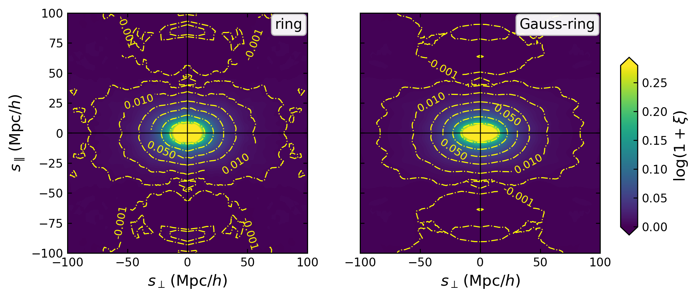

Two-point correlation functions
===============================

``Corr_2PCF`` evaluates products of filtered data and random fields over a
sampled family of separation-binning windows. The same estimator handles
isotropic, anisotropic, auto-, and cross-correlations.

Isotropic 2PCF
--------------

The smallest configuration uses thin spherical shells:

.. code-block:: yaml

   Corr_2PCF:
      sfc_field: ./output/quijote8000_snap004_sfc.pkl
      random: uniform
      binning_window: shell
      sampling:
         s: {min: 0.0, max: 150.0, n: 31}
      products: [dd, dr, rd, xi]
      threads: 2
      fout_path: ./output/quijote8000_snap004_2pcf.pkl

``random: uniform`` uses the analytic constant reference density. Supply an
``SFCField`` or path instead when the random catalogue is spatially varying.

Run and load:

.. code-block:: bash

   cd examples
   python scripts/run_2pcf.py configs/param_2pcf.yaml

.. code-block:: python

   from pyhermes.io import Corr2PCFData

   corr = Corr2PCFData(
       data_path="./output/quijote8000_snap004_2pcf.pkl"
   )
   print(corr.sampling_names)  # ('s',)
   print(corr.s, corr.xi)

Redshift-space anisotropy
-------------------------

A ``ring`` bin maps each :math:`(s,\mu)` sample to transverse radius
:math:`R=s\sqrt{1-\mu^2}` and line-of-sight offset :math:`H=s\mu`:

.. code-block:: yaml

   Corr_2PCF:
      sfc_field: ./output/quijote8000_snap004_rsd_sfc.pkl
      random: uniform
      binning_window: ring
      sampling:
         s: {min: 0.0, max: 180.0, n: 46}
         mu: {min: 0.0, max: 1.0, n: 51}
      products: xi
      threads: 8
      fout_path: ./output/quijote8000_snap004_rsd_2pcf_smu.pkl

The result has ``xi.shape == (len(s), len(mu))``. The plotting helper converts
it to the :math:`(s_\perp,s_\parallel)` plane:

.. code-block:: python

   from pyhermes.io import Corr2PCFData
   from pyhermes.utils.plot import plot_corr2pcf_2d

   corr_smu = Corr2PCFData(
       data_path="./output/quijote8000_snap004_rsd_2pcf_smu.pkl"
   )
   plot_corr2pcf_2d(corr_smu)

   The same redshift-space estimator with a thin ring and a transversely
   Gaussian-blurred ring. The window changes; the field product does not.

Smoothing and binning are separate
----------------------------------

Use ``window`` to smooth both vertices, or ``window1`` and ``window2`` for
independent filters. Use ``binning_window`` for the pair separation:

.. code-block:: yaml

   Corr_2PCF:
      sfc_field: ./output/quijote8000_snap004_sfc.pkl
      random: uniform
      window:
         type: gaussian
         len_args: {R: 5.0}
      binning_window:
         type: thick_shell
         len_args:
            R: null
            delta_R: 6.0
         other_args: {}
         mapping: s_to_R
      sampling:
         s: {min: 10.0, max: 150.0, n: 29}
      products: xi

The named mapping fills ``R`` from ``s`` and preserves the fixed
``delta_R``. For a non-standard parameter mapping, provide a Python callable;
2PCF mappings are either one of the named mappings or a callable, not a YAML
dictionary. See :doc:`../../windows` for all built-in geometries.

Result products
---------------

``products`` may request:

``dd``
   Data--data field product.

``dr`` and ``rd``
   Ordered data--random cross-products.

``delta_dd``
   Product of :math:`\Delta=D-R` fields.

``rr``
   Random--random normalisation.

``xi``
   ``delta_dd / rr``. Dependencies are computed automatically.

Only requested products and their dependencies are retained in the result.

Cross-correlations
------------------

Use independent vertices for a cross-correlation:

.. code-block:: python

   from pyhermes.theory.corr2pcf import Corr_2PCF

   task = Corr_2PCF()
   task.sfc_field1 = halo_field
   task.sfc_field2 = mass_field
   task.random1 = "uniform"
   task.random2 = "uniform"
   task.window1 = {"type": "gaussian", "len_args": {"R": 5.0}}
   task.window2 = {"type": "gaussian", "len_args": {"R": 10.0}}
   task.binning_window = {
       "type": "shell",
       "len_args": {"R": None},
       "other_args": {},
       "mapping": "s_to_R",
   }
   task.sampling = {"s": [20.0, 40.0, 60.0, 80.0]}
   task.products = ["xi"]
   cross = task.run(save_result=False)

All field vertices must share the same MRA geometry and basis. Task-level
``weight_normalization`` converts compatible catalogue fields to one common
normalisation before products are formed.

Python overrides
----------------

.. code-block:: python

   import numpy as np
   import copy

   from pyhermes.param.parambase import read_param
   from pyhermes.theory.corr2pcf import Corr_2PCF

   params = read_param(config_path="./configs/param_2pcf.yaml")

   def s_to_gaussian_shell(sample, template):
       mapped = copy.deepcopy(template)
       mapped["len_args"]["R_shell"] = sample["s"]
       return mapped

   task = Corr_2PCF(params)
   task.sampling = {"s": np.linspace(0.0, 180.0, 46)}
   task.binning_window = {
       "type": "gaussian_shell",
       "len_args": {"R_smooth": 5.0},
       "mapping": s_to_gaussian_shell,
   }
   task.products = ["xi"]
   result = task.run(save_result=False)

Resolution and bin width
------------------------

The smallest trustworthy scale is controlled jointly by field resolution and
the binning window. A narrow bin does not recover structure unresolved by
``J``; a broad bin can intentionally average small-scale variation.

The direct periodic pair-counting comparison and its :math:`J` convergence are
shown on :doc:`../../benchmark`.  Residual differences are concentrated where
the separation approaches the field resolution.

Performance controls
--------------------

Sampling points are distributed across MPI ranks. The dominant cost is one
window construction and convolution per sampled bin and required product.

``memory_strategy: speed`` keeps reusable fields in memory. ``memory`` reloads
or rebuilds more aggressively to reduce peak storage. ``binning_window_cache``
can persist expensive kernels across repeated runs; set an explicit
``binning_window_cache_dir`` for production jobs.

Public tutorial
---------------

``examples/notebooks/corr2pcf.ipynb`` contains high- and low-level isotropic
reconstruction, anisotropic window composition, saved RSD results, and custom
ring tests. ``examples/scripts/run_2pcf.py`` is the production entry point.
