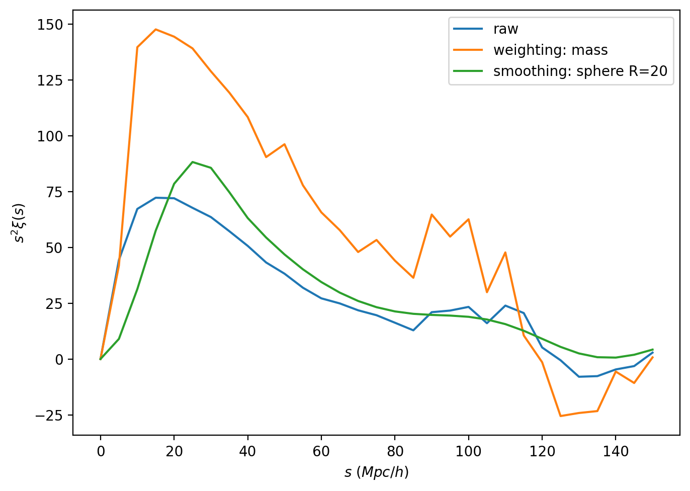
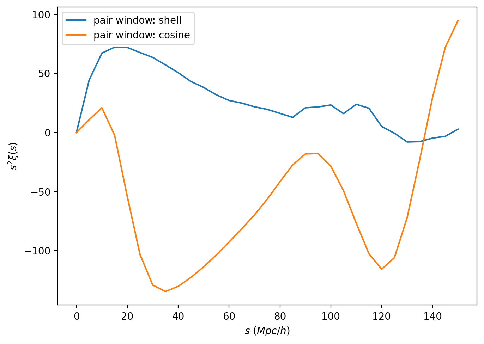
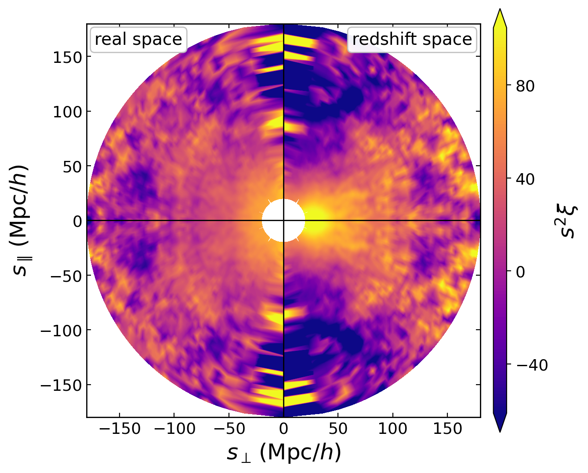

Corr_2PCF
=========

``corr2pcf.ipynb`` covers both the standard isotropic two-point correlation
function ``xi(s)`` and the anisotropic redshift-space views ``(s, mu)`` and
``(rp, pi)``.

What this notebook covers
-------------------------

The notebook has two main halves:

1. isotropic 2PCF on a one-dimensional separation grid
2. anisotropic 2PCF in redshift space, including line-of-sight changes,
   smoothing choices, and alternative pair-window families

It also contains lower-level sections for custom pair windows and direct
estimator comparisons. Those sections are useful when you want to understand
what the task wrapper is doing under the hood.

Minimal YAML Shapes
-------------------

The current ``Corr_2PCF`` interface separates the sampled coordinates from the
pair-window geometry. ``sampling`` names the output grid, while ``pair_window``
describes how each sampled point becomes a Fourier-space bin window.

For real-space ``xi(s)``, the minimal shape is a shell pair window sampled by
``s``:

.. code-block:: yaml

   Corr_2PCF:
      convols_data: "./output_new/quijote8000_snap004_sfc.pkl"
      random: "uniform"
      pair_window: "shell"
      sampling:
         s:
            min: 0.0
            max: 150.0
            n: 31
      products: "xi"
      threads: 2
      fout_path: "./output_new/quijote8000_snap004_2pcf.pkl"

For redshift-space ``xi(s, mu)``, use a line-of-sight pair window such as
``ring``. Built-in string windows fill their own length arguments and default to
the z-axis line of sight:

.. code-block:: yaml

   Corr_2PCF:
      convols_data: "./output_new/quijote8000_snap004_rsd_sfc.pkl"
      random: "uniform"
      pair_window: "ring"
      sampling:
         s:
            min: 0.0
            max: 180.0
            n: 46
         mu:
            min: 0.0
            max: 1.0
            n: 51
      products: "xi"
      threads: 8
      fout_path: "./output_new/quijote8000_snap004_rsd_2pcf_smu.pkl"

For ``xi(rp, pi)``, make the mapping explicit because the sampled coordinates
are already the transverse and line-of-sight separations:

.. code-block:: yaml

   Corr_2PCF:
      convols_data: "./output_new/quijote8000_snap004_rsd_sfc.pkl"
      random: "./output_new/random_sfc.pkl"
      window:
         type: "sphere"
         len_args:
            R: 5
      pair_window:
         type: "ring"
         mapping: "rppi_to_RH"
      sampling:
         rp:
            min: 0.0
            max: 180.0
            n: 46
         pi:
            min: 0.0
            max: 180.0
            n: 46
      products: "xi"
      threads: 8
      fout_path: "./output_new/quijote8000_snap004_rsd_2pcf_rppi_sph5_with_random.pkl"

What is lightweight and what is not
-----------------------------------

Small smoke-test runs and direct API examples are meant to be executed inside
the notebook.

The production-style outputs compared later in the notebook are heavier and are
not committed to the repository. At each relevant point, the notebook tells you
which script and YAML file to run. Those jobs are intended for your own laptop,
workstation, or cluster.

Tracked files
-------------

- ``examples/notebooks/corr2pcf.ipynb``
- ``examples/scripts/run_2pcf.py``
- ``examples/configs/param_2pcf.yaml``
- the additional anisotropic configs in ``examples/configs/param_2pcf_*.yaml``

Typical command-line runs look like:

.. code-block:: bash

   cd examples
   python ./scripts/run_2pcf.py ./configs/param_2pcf.yaml
   mpirun -np 4 python ./scripts/run_2pcf.py ./configs/param_2pcf_smu_test.yaml

Conceptual focus
----------------

This is the notebook where PyHermes' pair-window abstraction becomes important.
Instead of hard-coding one estimator shape, the task combines:

- a prepared field
- optional smoothing windows
- a pair window
- a sampling grid

That is why the same task can cover ``xi(s)``, ``xi(s, mu)``, and
``xi(rp, pi)`` in one interface. The notebook also uses custom Python pair
windows to build a finite-thickness shell and a cylinder-surface pair window
from existing Fourier kernels.

The field formulation also makes the Landy-Szalay structure more direct.
``ConvolsData`` stores the catalogue and field-weight sums needed to switch
catalog fields between ``weight_normalization: catalog``, ``raw`` and
``field`` before the estimator runs. ``catalog`` is the default for ordinary
tracer statistics and gives an ordinary unit-value field unit integral.
``field`` is useful for positive marked fields such as halo mass. Signed
physical fields such as velocity components should generally use ``raw`` and
be interpreted as physical weighted-field products rather than an ordinary
density contrast. For an analytic uniform random shortcut PyHermes uses the
prepared field's ``field_mean_density(value_unit="grid")`` internally. The raw
``DD``/``DR``/``RR``-type products stored in the output are converted back to
physical density units; dimensionless ratios such as ``xi`` are unchanged by
this conversion.
PyHermes then builds ``Delta = d - r`` and evaluates the pair-window product

.. math::

   \xi_P =
   { \left\langle
      \Delta(\mathbf{x})
      (W_P\circ\Delta)(\mathbf{x})
     \right\rangle
   \over
     \left\langle
      r(\mathbf{x})
      (W_P\circ r)(\mathbf{x})
     \right\rangle }.

For symmetric pair windows the numerator is the usual
``DD - DR - RD + RR`` combination. The important implementation difference is
that PyHermes does not need four independent catalogue pair loops; the
subtraction is done at the field level and the pair window defines the
separation geometry.

Changing the pair window changes the statistic itself. ``shell`` gives the
usual isotropic ``xi(s)``, while replacing its Fourier response by a cosine
kernel gives a generalized two-point statistic with a different phase weighting
of Fourier modes. In redshift space, ``ring`` gives the familiar
``xi(s,mu)`` or ``xi(rp,pi)`` geometry, whereas ``disk``, ``cylshell``, and
custom combinations such as ``cylsurf`` average over different transverse and
line-of-sight surfaces. The resulting maps are therefore responses to different
estimator geometries, not just different plotting styles.

Example outputs
---------------

The isotropic examples show how weighting and ordinary smoothing affect the
real-space two-point statistic.

   Isotropic :math:`s^2\xi(s)` for the tracer field, a mass-weighted field, and a
   spherically smoothed field.

Changing the pair-window family changes the bin geometry used by the estimator.
The one-dimensional shell and cosine examples are a compact check of that
choice.

   Isotropic :math:`s^2\xi(s)` measured with shell and cosine pair windows.
   The two curves use the same field product, but the cosine transfer has a
   different Fourier phase from the shell transfer and therefore probes a
   different generalized two-point statistic.

For redshift-space analyses, the notebook compares real-space and redshift-space
``xi(s, mu)`` views directly.

   Real-space and redshift-space anisotropic 2PCF comparison in ``(s, mu)``.

The final diagnostic keeps the redshift-space field fixed and changes the
line-of-sight-aware pair-window family.

.. figure:: ../../_static/corr2pcf/corr2pcf_rsd_pair_windows_2d.png
   :alt: Redshift-space 2PCF comparison across pair-window families
   :align: center
   :width: 95%

   Redshift-space 2PCF morphology for several pair-window families. Ring,
   disk, cylindrical-shell, and cylindrical-surface windows average over
   different regions of the transverse/line-of-sight plane, so they respond
   differently to redshift-space distortions.

What to carry forward
---------------------

If you mainly care about real-space 2PCF, the first half is enough.

If you care about redshift-space distortions, the second half is the more
important reference because it shows how line-of-sight choice, smoothing, and
window family affect the result.

The same pair-window viewpoint also suggests a future direct route to 2PCF
multipoles: instead of first sampling ``xi(s, mu)`` and then projecting over
``mu``, one can absorb the Legendre projection into a specialized pair window.
That planned extension is discussed in :doc:`../../windows`.

Mathematical idea
-----------------

PyHermes treats a 2PCF bin as a windowed copy of the same fluctuation field:

.. math::

   \xi_P =
   \left\langle
   \delta(\mathbf{x})\,
   (W_P\circ\delta)(\mathbf{x})
   \right\rangle.

For real-space ``xi(s)``, :math:`W_P` is a spherical shell. In the thin-shell
limit,

.. math::

   W_{\rm shell}(r;R)
   =
   {1\over 4\pi R^2}\delta_{\rm D}(r-R),
   \qquad
   \widehat W_{\rm shell}(k;R)
   =
   {\sin(2\pi kR)\over 2\pi kR}.

For redshift-space ``(s, mu)`` and ``(rp, pi)`` measurements, the same
estimator uses line-of-sight-aware windows. A thin ring window has the
Fourier-space form

.. math::

   \widehat W_{\rm ring}(k_\perp,k_\parallel)
   =
   J_0(2\pi k_\perp r_\perp)\,
   \cos(2\pi k_\parallel r_\parallel),

with finite-bin and real-valued variants implemented by the built-in ring,
disk, cylinder, and ``cylshell`` windows. Random fields provide the ``RR``
normalization and the data-minus-random correction used in the estimator.
