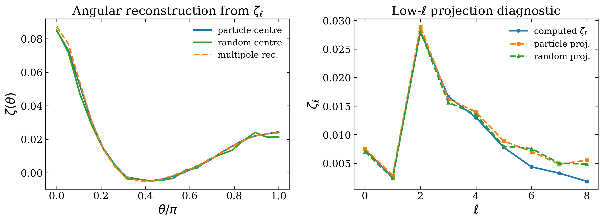

Standard 3PCF
=============

``Corr_3PCF`` measures the angular three-point correlation function for a
triangle with fixed sides :math:`r_{12}` and :math:`r_{13}`. It evaluates the
two displaced vertices as window-filtered fields, samples their product around a
set of primary vertices, and averages over random rotations. This is the
direct-angular counterpart of the harmonic estimator described in
:doc:`../corr_3pcf_multipole/corr_3pcf_multipole`.

The public tutorial is ``examples/notebooks/corr3pcf.ipynb``. Its standard
3PCF sections compare the two centre strategies and show how the saved
count-level products assemble into :math:`\zeta` and the reduced statistic
:math:`Q`.

Triangle convention
-------------------

The primary vertex is labelled 1. The two fixed sides are
:math:`r_{12}=|\mathbf{x}_2-\mathbf{x}_1|` and
:math:`r_{13}=|\mathbf{x}_3-\mathbf{x}_1|`; the angular coordinate is either
:math:`\theta` or :math:`\mu=\cos\theta`. The third side follows from

.. math::

   r_{23}^2=r_{12}^2+r_{13}^2-2r_{12}r_{13}\mu.

For every angular sample, PyHermes rotates this triangle ``n_rot`` times. The
rotation average is Monte Carlo: increasing ``n_rot`` reduces orientation
noise but increases runtime approximately linearly.

A minimal run
-------------

The example configuration below uses halo positions as primary vertices and
applies a :math:`5\,h^{-1}\mathrm{Mpc}` spherical window to the displaced
vertices:

.. code-block:: yaml

   Corr_3PCF:
      sfc_field: "./output/quijote8000_snap004_sfc.pkl"
      random: "uniform"
      window:
         type: "sphere"
         len_args:
            R: 5.0
      r12: 20.0
      r13: 40.0
      angle_param: "theta"
      theta:
         n_theta: 20
      n_rot: 20
      center: "particle"
      products: ["ddd", "Q"]
      base_seed: 42
      threads: 2
      fout_path: "./output/quijote8000_snap004_3pcf_pcenter_nrot20.pkl"

Run the tracked example from ``examples/``:

.. code-block:: bash

   python scripts/run_3pcf.py configs/param_3pcf_pcenter_nrot20.yaml

or construct the task directly:

.. code-block:: python

   from pyhermes.param.parambase import read_param
   from pyhermes.theory import Corr_3PCF

   params = read_param(config_path="./configs/param_3pcf_pcenter_nrot20.yaml")
   result = Corr_3PCF(params).run()

Choosing primary vertices
-------------------------

``center: particle``
   The first vertex is sampled at catalogue positions. This is efficient for
   sparse tracer catalogues and gives a dual-window estimator: ``window2`` and
   ``window3`` act on the two displaced vertices, while ``window1`` has no effect
   on the naked particle centre. The input ``SFCField`` must retain companion
   particle data, or ``particle_pos1`` and ``particle_weight1`` must be passed
   together.

``center: box_random``
   ``n_box_centers`` positions are drawn uniformly in the periodic box. All
   three vertices are evaluated as fields, so ``window1``, ``window2``, and
   ``window3`` can all be active. This mode is useful for dense particle
   samples or whenever the primary field itself must be filtered.

The shared ``window`` is copied to every vertex that does not define an explicit
``window1``, ``window2``, or ``window3``. In particle-centre mode this still
does not filter the first vertex. Use explicit vertex windows when that distinction
should be visible in the configuration.

For box-random centres, change only the centre section:

.. code-block:: yaml

   center: "box_random"
   n_box_centers: 1000000
   window2:
      type: "sphere"
      len_args: {R: 5.0}
   window3:
      type: "sphere"
      len_args: {R: 5.0}

Data, randoms, and products
---------------------------

``sfc_field`` supplies a shared data field; ``sfc_field1`` through
``sfc_field3`` override individual vertices. The random inputs follow the same
pattern. ``random: uniform`` uses the analytic constant-density shortcut,
whereas a path or ``SFCField`` represents an explicit random catalogue.

Requesting a final statistic automatically expands its dependencies:

.. list-table:: Main standard-3PCF products
   :header-rows: 1
   :widths: 20 80

   * - Product
     - Meaning
   * - ``ddd``, ``rrr``
     - Raw data and random triplet products.
   * - ``delta_ddd``
     - Connected data-minus-random triplet combination.
   * - ``xi12``, ``xi13``, ``xi23``
     - Two-point terms on the three triangle sides.
   * - ``zeta``
     - Connected three-point correlation function.
   * - ``zeta_H``
     - Hierarchical denominator
       :math:`\xi_{12}\xi_{13}+\xi_{12}\xi_{23}+\xi_{13}\xi_{23}`.
   * - ``Q``
     - Reduced 3PCF, :math:`Q=\zeta/\zeta_H`.

The particle-centre mode additionally exposes ``d_delta_dd`` and
``r_delta_dd``, the two centre-weighted contributions used to form
``delta_ddd``. Product availability is validated against the selected centre
mode; unsupported combinations fail early rather than silently changing the
estimator.

Angle sampling
--------------

Set ``angle_param`` to ``theta`` or ``mu`` and configure the matching section:

.. code-block:: yaml

   angle_param: "mu"
   mu:
      mu_min: -1.0
      mu_max: 1.0
      n_mu: 20

Explicit one-dimensional arrays are also accepted from Python. The output
stores both ``theta`` and ``mu`` together with ``r23``, so downstream plotting
does not need to reconstruct the triangle geometry.

Reading a result
----------------

.. code-block:: python

   from pyhermes.io import Corr3PCFData

   data = Corr3PCFData(
       data_path="./output/quijote8000_snap004_3pcf_pcenter_nrot20.pkl"
   )
   theta, Q = data.theta, data.Q

The arrays requested through ``products`` are available as attributes such as
``data.ddd``, ``data.zeta``, and ``data.Q``. Configuration and field metadata
are retained in ``data.corr3pcf_info`` and ``data.sfc_info1`` through
``data.sfc_info3``.

Connection to multipoles
------------------------

   Direct angular estimates and the 3PCF multipole representation describe the
   same rotationally averaged signal. Residual differences arise from finite
   angular sampling, random rotations, centre sampling, and multipole
   truncation.

Use this task when the angular curve itself is the desired product. Use
``Corr_3PCF_Multipole`` when many angular configurations, high angular order,
or radial-window scans are more naturally represented through
:math:`\zeta_\ell`.
