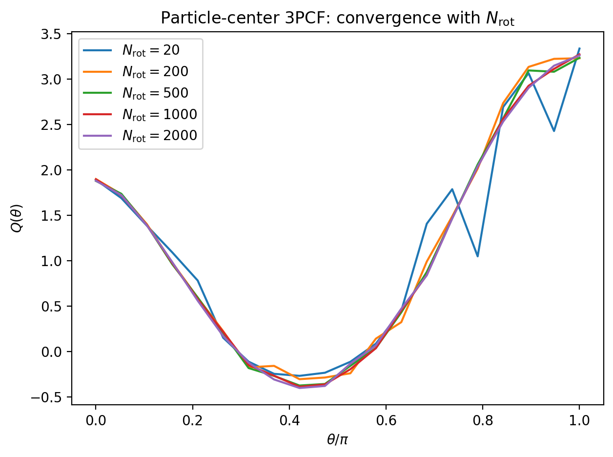
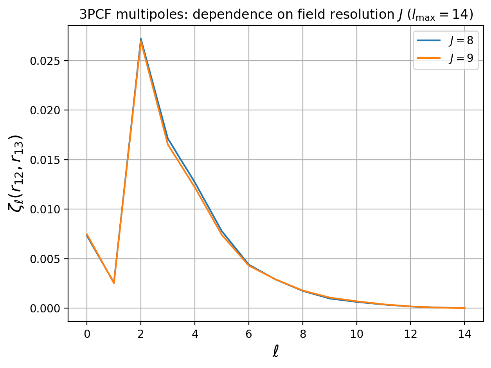

Corr_3PCF
=========

``corr3pcf.ipynb`` is the most advanced tutorial notebook in the repository.
It combines three related topics in one place:

1. standard reduced 3PCF measurements
2. low-level reconstruction of ``Q`` from saved components
3. 3PCF multipole examples

Notebook structure
------------------

The advanced multipole material is the last section of ``corr3pcf.ipynb``
because it builds naturally on the same prepared fields and triangle
configuration ideas as the standard 3PCF sections.

What this notebook covers
-------------------------

The main progression is:

1. run the standard task with particle centers and box-random centers
2. compare saved outputs and task-level API variants
3. reconstruct ``Q`` from lower-level ingredients to make the estimator more
   transparent
4. inspect multipole truncation choices and field-resolution effects

This is the notebook to read when you want both the practical workflow and the
estimator logic.

Minimal YAML Shapes
-------------------

For the standard reduced 3PCF, the minimal shape fixes the field inputs,
triangle side lengths, angular sampling, center strategy, and products:

.. code-block:: yaml

   Corr_3PCF:
      convols_data: "./output/quijote8000_snap004_sfc.pkl"
      random: "uniform"
      window:
         type: "sphere"
         len_args:
            R: 5
      r12: 20.0
      r13: 40.0
      theta:
         n_theta: 20
      n_rot: 20
      center: "particle"
      products: ["ddd", "Q"]
      threads: 2
      fout_path: "./output/quijote8000_snap004_3pcf_pcenter_nrot20.pkl"

For random box centers, switch the center strategy and provide the number of
box centers:

.. code-block:: yaml

   Corr_3PCF:
      center: "box_random"
      n_box_centers: 1000000

Choosing The Center Mode
------------------------

PyHermes provides two standard 3PCF center modes.

``center: "particle"`` uses the input particles themselves as the first
triangle vertex. This is usually the right choice for sparse tracer samples,
such as halo or galaxy catalogs with particle counts below roughly a million.
It is efficient because the number of centers is modest and the estimator
samples physically occupied positions directly. The important limitation is
that the first leg is a discrete center catalog, so ``window1`` cannot be
applied to the center leg. Window convolutions only apply to the second and
third legs in this mode.

``center: "box_random"`` samples Monte Carlo centers uniformly in the periodic
box. This is usually better for dense simulation fields, especially dark
matter particle samples with counts at the ten-million level or above, where
using every particle as a center would dominate the runtime. Because all three
legs are evaluated as continuous convolved fields at the sampled box centers,
this mode also allows the first leg to be window-convolved. Use
``n_box_centers`` to control the Monte Carlo center count.

In short: use particle centers for sparse halo/galaxy tracers, and box-random
centers for very dense particle fields or whenever the center leg must carry a
window convolution.

Heavy outputs and external runs
-------------------------------

Many of the comparison figures in this notebook rely on heavier saved products.
Those outputs are not committed to the repository. Instead, the notebook marks
the exact script and YAML file needed to generate them locally.

Tracked files involved here include:

- ``examples/notebooks/corr3pcf.ipynb``
- ``examples/scripts/run_3pcf.py``
- ``examples/scripts/run_3pcf_multipole.py``
- the ``param_3pcf_*.yaml`` and ``param_3pcf_multipole_*.yaml`` files under
  ``examples/configs/``

Typical commands look like:

.. code-block:: bash

   cd examples
   mpirun -np 4 python ./scripts/run_3pcf.py ./configs/param_3pcf_pcenter_nrot20.yaml
   mpirun -np 4 python ./scripts/run_3pcf.py ./configs/param_3pcf_rcenter_nrot20.yaml
   mpirun -np 4 python ./scripts/run_3pcf_multipole.py ./configs/param_3pcf_multipole_lmax7.yaml

Advanced topic: 3PCF multipoles
-------------------------------

The final section switches from direct angular curves to a multipole
representation. The cells below do not rerun the estimator from scratch;
instead, they load saved multipole outputs and compare how the result changes
with the truncation order ``l_max`` and the field resolution parameter ``J``.

The saved multipole outputs used below can be produced from a config with this
shape:

.. code-block:: yaml

   Corr_3PCF_Multipole:
      convols_data: "./output/quijote8000_snap004_sfc.pkl"
      random: "uniform"
      window:
         type: "sphere"
         len_args:
            R: 5
      r12: 20.0
      r13: 40.0
      l_max: 7
      execution_mode: "pair_mpi"
      products: "zeta_l"
      threads: 4
      fout_path: "./output/quijote8000_snap004_3pcf_multipole_lmax7.pkl"

Example outputs
---------------

The standard 3PCF diagnostics first check convergence with the number of random
triangle rotations.

   Particle-center reduced 3PCF curves for several values of ``n_rot``.

The center-mode comparison separates the particle-center estimator from the
box-random-center estimator and also shows the effect of using an explicit
random field.

.. figure:: ../../_static/corr3pcf/corr3pcf_center_estimators.png
   :alt: Reduced 3PCF comparison between particle-center and box-random-center estimators
   :align: center
   :width: 90%

   Reduced 3PCF curves for different center strategies and random-field
   treatments.

The multipole examples then show how truncation order and field resolution
affect the recovered angular spectrum.

.. figure:: ../../_static/corr3pcf/corr3pcf_multipole_lmax.png
   :alt: 3PCF multipoles for different lmax values
   :align: center
   :width: 90%

   Multipole spectra for several choices of ``l_max`` at fixed field
   resolution.

   Multipole spectra at fixed ``l_max`` for two field resolutions.

How to read the notebook
------------------------

If you are new to PyHermes 3PCF, focus first on the standard workflow and the
diagnostic plots.

Then read the low-level ``Q`` reconstruction section. That part explains why
the saved components are enough to rebuild the reduced statistic and is the
best place to connect the code to the estimator formula.

Finally, treat the multipole section as an advanced extension. It is still part
of the same notebook, but it is more computationally demanding and more useful
once the standard 3PCF workflow is already familiar.

Mathematical idea
-----------------

The standard 3PCF section estimates products of three fields arranged in a
triangle. For a center :math:`\mathbf{x}` and two triangle legs,

.. math::

   DDD =
   \left\langle
   n(\mathbf{x})\,
   \widetilde n_{R_1}(\mathbf{x})\,
   \widetilde n_{R_2,\theta}(\mathbf{x})
   \right\rangle.

After the matching random normalization, PyHermes stores the connected
statistic :math:`\zeta`, the hierarchical denominator

.. math::

   \zeta_H =
   \xi_{12}\xi_{13}
   +
   \xi_{12}\xi_{23}
   +
   \xi_{13}\xi_{23},

and the reduced statistic

.. math::

   Q = {\zeta\over\zeta_H}.

The low-level reconstruction section is therefore not a separate estimator; it
rebuilds :math:`Q` from the same saved ingredients. The multipole section
replaces shell-averaged legs with spherical-harmonic-filtered legs
:math:`n_{\ell m}(\mathbf{x};R)`, then couples them into rotationally invariant
3PCF components up to the requested ``lmax``.
