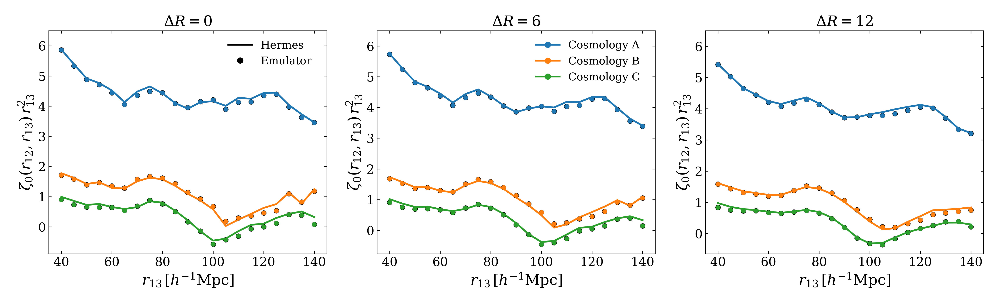
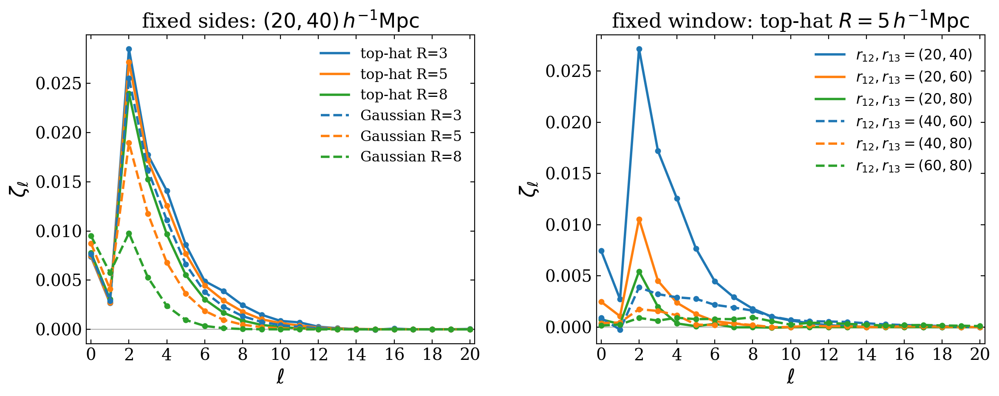

3PCF multipoles
===============

``Corr_3PCF_Multipole`` measures rotationally invariant Legendre multipoles of
the three-point correlation function. It replaces explicit orientation
sampling by multipole-filtered fields, then contracts those fields into
:math:`\zeta_\ell`. The estimator uses the same ``SFCField`` and
``WindowFunc`` infrastructure as the rest of PyHermes; only the radial and
angular window roles change.

From shell windows to radial profiles
-------------------------------------

For an infinitesimally thin shell of radius :math:`R`, the Fourier-space
harmonic window has the form

.. math::

   \widehat W_R^{\ell m}(\mathbf{k})
   =4\pi i^\ell j_\ell(2\pi kR)Y_\ell^m(\widehat{\mathbf{k}}),

where PyHermes uses Fourier phases :math:`e^{2\pi i\mathbf{k}\cdot\mathbf{x}}`.
For a general normalized isotropic radial profile :math:`w_R(r)`, the spherical
Bessel factor is replaced by

.. math::

   U_\ell(k)=4\pi\int_0^\infty r^2 w_R(r)
   j_\ell(2\pi kr)\,dr,
   \qquad
   \widehat W_R^{\ell m}\propto U_\ell(k)Y_\ell^m(\widehat{\mathbf{k}}).

This ``radial profile x spherical harmonic`` factorisation lets the same
multipole task use thin shells, finite-width shells, Gaussian shells, or other
isotropic binning profiles without changing the angular contraction.

.. list-table:: Radial profiles available to the multipole task
   :header-rows: 1
   :widths: 22 32 46

   * - Type
     - Length arguments
     - Numerical path
   * - ``shell``
     - ``R``
     - Analytic :math:`j_\ell(2\pi kR)` for every :math:`\ell`.
   * - ``thick_shell``
     - ``R``, ``delta_R``
     - Exact monopole transfer; higher orders from its analytic real-space
       profile and a one-dimensional Hankel table.
   * - ``sphere``
     - ``R``
     - Exact monopole transfer; higher orders from the top-hat real-space
       profile.
   * - ``gaussian``
     - ``R``
     - Exact monopole transfer; higher orders from the Gaussian real-space
       profile.
   * - ``gaussian_shell``
     - ``R_shell``, ``R_smooth``
     - Exact monopole transfer and a general inverse-Hankel route for higher
       orders.
   * - ``custom_real``, ``custom_kspace``
     - User-defined profile arguments
     - Tabulated real-space Hankel or inverse-Hankel route; see
       :doc:`../../windows`.

The task records radial-profile diagnostics and can warn when the tabulated
profile does not reproduce its monopole transfer within the configured
tolerance.

A fixed triangle
----------------

Radii are not top-level task parameters. They are sampled values mapped into
the two edge windows:

.. code-block:: yaml

   Corr_3PCF_Multipole:
      sfc_field: "./output/quijote8000_snap004_sfc.pkl"
      random: "uniform"
      window2:
         type: "sphere"
         len_args: {R: 5.0}
      window3:
         type: "sphere"
         len_args: {R: 5.0}
      binning_window12:
         type: "shell"
         len_args: {}
         other_args: {}
         mapping:
            R: "r12"
      binning_window13:
         type: "shell"
         len_args: {}
         other_args: {}
         mapping:
            R: "r13"
      sampling:
         r12: 20.0
         r13: 40.0
      l_min: 0
      l_max: 14
      execution_mode: "pair_mpi"
      summation_backend: "gpu"
      products: "zeta_l"
      threads: 4
      fout_path: "./output/quijote8000_snap004_3pcf_multipole_lmax14.pkl"

``mapping`` assigns each sampled name to a ``len_args`` key. A target can also
be written explicitly as ``len_args.R`` or ``other_args.some_name``. Fixed
values remain in the template, so only parameters that actually vary need to
appear in ``sampling``.

Scanning radial configurations
------------------------------

``sampling.mode: grid`` forms the Cartesian product of all sampled arrays.
``paired`` zips arrays of the same length and broadcasts scalar entries. For
example, this scans :math:`r_{13}` while holding :math:`r_{12}` and both shell
widths fixed:

.. code-block:: yaml

   binning_window12:
      type: "thick_shell"
      len_args: {}
      mapping:
         R: "r12"
         delta_R: "delta_r12"
   binning_window13:
      type: "thick_shell"
      len_args: {}
      mapping:
         R: "r13"
         delta_R: "delta_r13"
   sampling:
      mode: "grid"
      r12: 20.0
      delta_r12: 6.0
      r13:
         start: 40.0
         stop: 140.0
         step: 5.0
      delta_r13: 6.0
   l_min: 0
   l_max: 0

The result has one row per expanded sample and one column per multipole order.
The original sampled values are stored in ``sample_params`` so rows remain
self-describing.

   A broader radial bin averages neighbouring triangle configurations and
   suppresses small-scale fluctuations without changing the task structure.

Parallel execution
------------------

The task separates two kinds of parallel work:

``serial``
   One rank evaluates all samples and multipole modes. Use this for a small
   local check.

``pair_mpi``
   MPI-rank pairs share the :math:`(\ell,m)` convolution work for one sample.
   It requires an even number of ranks and is well suited to one or a few
   configurations with many multipoles.

``sample_mpi``
   Samples are assigned to ranks by static round robin. It is the natural mode
   for a long monopole or radial-window scan. The current implementation uses
   ``sample_mpi.ranks_per_sample: 1``; choose approximately one rank per
   simultaneous sample, then use ``threads`` for the local FFT and kernel work.

In ``sample_mpi``, rank 0 reads each file-backed ``SFCField`` once and
broadcasts it. This avoids every rank independently stressing shared storage.

CPU and GPU backends
--------------------

``summation_backend`` controls the final contraction and grid sum:

- ``cpu`` uses the multithreaded CPU kernel.
- ``gpu`` transfers the filtered fields to the selected CUDA device and uses
  ``gpu_threads_per_block`` for the final contraction.

The preceding FFT convolution stage remains CPU/MPI work in both cases. Thus a
GPU changes the contraction backend, not the estimator, radial windows, or
input fields. At high :math:`\ell_{\max}` the GPU path is usually most useful;
for a short monopole scan, sample-level CPU parallelism may be simpler and
competitive.

The current CPU/GPU timing, numerical-agreement, and host-memory comparison is
kept in one place on :doc:`../../benchmark`.  The saved multipoles agree to
relative :math:`L_2` differences below ``2.3e-14``; only the contraction
backend changes.

Products and output
-------------------

Available products are ``ddd_l``, ``rrr_l``, ``delta_ddd_l``, and ``zeta_l``.
Requesting ``zeta_l`` expands the connected-data and random dependencies
automatically. A fully uniform random field uses an analytic monopole-only
``rrr_l`` shortcut.

.. code-block:: python

   from pyhermes.io import Corr3PCFMultipoleData

   data = Corr3PCFMultipoleData(data_path="./output/threepcf_multipoles.pkl")
   print(data.sample_params)  # sampled names -> one-dimensional arrays
   print(data.l)              # [l_min, ..., l_max]
   print(data.zeta_l.shape)   # (n_samples, n_l)

``zeta_condition`` records the conditioning of the random-multipole solve.
Inspect unusually large values before interpreting a noisy high-order result.

   Current ``J=8``, ``lmax=20`` grouped results.  Left: fixed
   :math:`(r_{12},r_{13})=(20,40)\,h^{-1}\mathrm{Mpc}` with top-hat and
   Gaussian vertex smoothing at matched radii.  Right: fixed top-hat
   :math:`R=5\,h^{-1}\mathrm{Mpc}` with six triangle side-length pairs.
   Multipoles compactly expose how smoothing and triangle geometry redistribute
   angular information.
