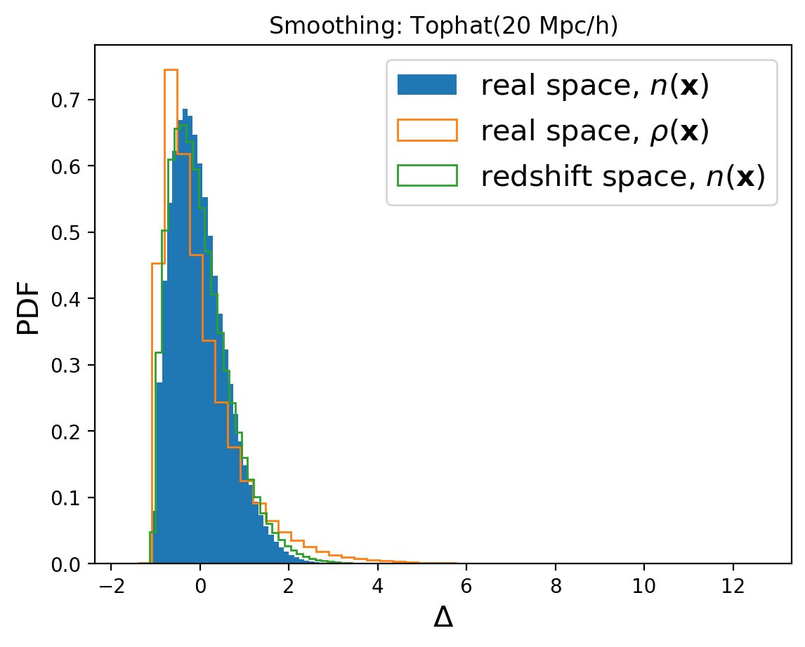

Counting
========

``counting.ipynb`` is the one-point companion to ``convols.ipynb``. It starts
from a saved ``ConvolsData`` field, optionally smooths it, evaluates it at
many random positions, and studies the resulting distribution.

What this notebook covers
-------------------------

The notebook walks through:

1. the standard ``Counting`` driver
2. the config-driven Python API
3. task-object overrides
4. manual preparation of ``ConvolsData`` and ``WindowFunc``
5. direct low-level sampling of the smoothed field

The last section is useful because it makes the estimator interpretation
explicit: ``Counting`` is fundamentally a random-position probe of a field.

Minimal YAML Shape
------------------

``Counting`` reads a saved ``ConvolsData`` field, optionally applies an ordinary
smoothing window, and samples the resulting field at random positions:

.. code-block:: yaml

   Counting:
      convols_data: "./output/quijote8000_snap004_sfc.pkl"
      random_count: 10000000
      window:
         type: "sphere"
         len_args:
            R: 20
      threads: 8
      fout_path: "./output/quijote8000_snap004_counting_sph20.pkl"

Omit ``window`` if you want to sample the raw field. When ``window`` is present,
it is a normal smoothing ``WindowFunc``, not a 2PCF pair window.

Inputs and outputs
------------------

Inputs are produced by ``convols.ipynb`` or
``examples/scripts/prepare_convols_data.py`` and live locally in
``examples/output/``. The main tracked files involved in this stage are:

- ``examples/notebooks/counting.ipynb``
- ``examples/scripts/run_counting.py``
- ``examples/configs/param_counting.yaml``

The counting result itself is lightweight and is expected to be generated
locally during notebook execution or by the driver script:

.. code-block:: bash

   cd examples
   python ./scripts/run_counting.py ./configs/param_counting.yaml

What you should learn here
--------------------------

This notebook is where the field representation starts to feel concrete. It
shows how smoothing radius changes the sampled distribution and how the saved
``CountingData`` result relates to direct field evaluation.

In other words, if ``Convols`` explains how PyHermes stores the field,
``Counting`` explains how PyHermes reads values back out of it.

The examples also make the role of particle weights explicit. With unit
weights the sampled field is the halo number-density field. With mass weights
the sampled field is a halo mass-density field. This is the simplest version of
the broader weighted-field idea developed later in
:doc:`../weighted_fields/weighted_fields`.

Example outputs
---------------

The first diagnostic compares the one-point PDFs obtained from the same halo
catalog under different field choices: the real-space number-density field, the
mass-density field, and the redshift-space number-density field.

   Count-in-cell PDFs for number-density, mass-density, and redshift-space
   fields using the same spherical smoothing scale.

The second diagnostic keeps the input field fixed and varies the spherical
smoothing radius. This is the simplest way to see how the window scale changes
the sampled one-point distribution.

.. figure:: ../../_static/counting/counting_smoothing_radius_pdf.png
   :alt: Counting PDFs for different spherical smoothing radii
   :align: center
   :width: 90%

   One-point PDFs after applying several top-hat smoothing radii.

Mathematical idea
-----------------

Counting is direct evaluation of a windowed field at sampled centers:

.. math::

   c_a =
   (W\circ n)(\mathbf{y}_a)
   =
   \int W(\mathbf{y}_a-\mathbf{x})n(\mathbf{x})\,d^3x.

The sampled values :math:`\{c_a\}` estimate the count-in-cell distribution, or
the distribution of a smoothed fluctuation field when the input is
:math:`\delta=(n-\bar n)/\bar n`. This is why changing the smoothing window in
the notebook changes the measured one-point PDF.
