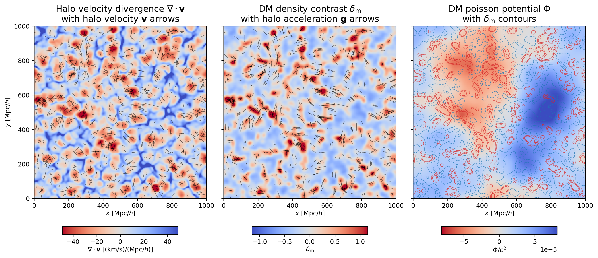
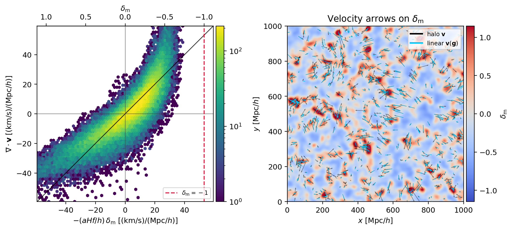
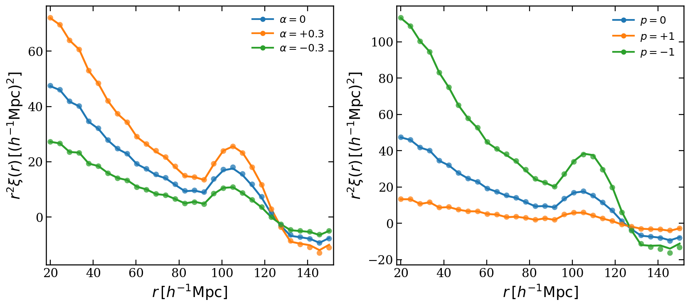

Physical fields from field--window operations
=============================================

The field--window language is not limited to tracer counts. Catalogue weights
and particle-carried values change *what field is represented*; windows change
*what operation is applied to that field*. The same ``SFCProjection`` and
``WindowFunc`` objects can therefore construct velocity and momentum fields,
differential operators, the Newtonian potential, acceleration, and marked
density fields.

The :doc:`executable Physical Fields notebook </notebooks/physical_fields>`
follows :doc:`../sfc_projection/sfc_projection` and
:doc:`../window/window`: projection defines the physical field, while windows
apply smoothing and differential operators. The notebook keeps these
calculations compact and spends most of its length on slice selection and
publication-quality visualisation.

Catalogue weight versus field value
-----------------------------------

For particle positions :math:`\mathbf{x}_i`, PyHermes projects

.. math::

   F_q(\mathbf{x})=
   \sum_i {w_i^{\rm cat}q_i\over Z}
   \delta_{\rm D}^{(3)}(\mathbf{x}-\mathbf{x}_i).

``catalog_weight`` holds completeness, selection, or other catalogue weights.
``field_value`` holds the quantity carried by each object: a mark, mass, or one
velocity component. Keeping these roles separate prevents a signed physical
quantity from being mistaken for a normalization weight.

``weight_normalization`` chooses :math:`Z`:

- ``catalog`` divides by :math:`\sum_i w_i^{\rm cat}` and is the default for
  normalized clustering fields.
- ``raw`` uses :math:`Z=1`; choose it when the absolute physical amplitude is
  required.
- ``field`` divides by :math:`\sum_i w_i^{\rm cat}q_i` and is appropriate only
  when that field sum is meaningful and non-zero.

One small helper can build a family of fields on identical MRA metadata:

.. code-block:: python

   import numpy as np
   from pyhermes.base.sfc_projection import SFCProjection

   base = {
       "box_size": 1000.0,
       "J": 8,
       "wavelet_mode": "db2",
       "wavelet_level": 10,
       "phi_resolution": 1024,
       "threads": 8,
   }

   def project(pos, value=None, normalization="catalog"):
       params = dict(base, particle_pos=np.asarray(pos),
                     field_value=None if value is None else np.asarray(value),
                     weight_normalization=normalization)
       return SFCProjection({"SFCProjection": params}).run(save_result=False)

   count = project(pos)
   vx_weighted = project(pos, velocity[:, 0])

Velocity as a ratio of fields
-----------------------------

A velocity-weighted field is not yet a volume-weighted velocity. After applying
the same smoothing window to numerator and denominator,

.. math::

   v_i(\mathbf{x})={n_{v_i}(\mathbf{x})\over n(\mathbf{x})}.

The derivative must obey the quotient rule:

.. math::

   \partial_j v_i=
   {\partial_j n_{v_i}\over n}
   -{n_{v_i}\,\partial_j n\over n^2}.

This distinction matters in sparse regions. Mask points where the smoothed
count field is too small instead of allowing a tiny denominator to manufacture
large velocities.

Differential windows
--------------------

With the package Fourier convention, a directional derivative along the unit
vector :math:`\widehat{\mathbf n}` is the multiplier

.. math::

   \widehat W_{\partial_{\widehat n}}(\mathbf{k})
   =2\pi i(\mathbf{k}\cdot\widehat{\mathbf n}).

Three such windows give gradients; component combinations give divergence and
curl. The Laplacian window applies :math:`-(2\pi k)^2`.

.. code-block:: python

   from pyhermes.io import WindowFunc

   smooth = WindowFunc(
       {"type": "gaussian", "len_args": {"R": 10.0}},
       count.sfc_info,
       threads=8,
   )
   dx = WindowFunc(
       {
           "type": "directional_derivative",
           "los_args": {"nx": 1.0, "ny": 0.0, "nz": 0.0},
       },
       count.sfc_info,
       threads=8,
   )

   dcount_dx = count @ smooth @ dx

Window derivatives are formed in grid coordinates. Multiply sampled values by
``field.scale_factor`` when converting one derivative to inverse physical-box
units. This is why the tutorial keeps coordinate conversion adjacent to the
sampling code rather than hiding it inside the mathematical window.

Potential from the inverse Laplacian
------------------------------------

The built-in ``inverse_laplacian`` is deliberately a pure mathematical
operator:

.. math::

   \widehat W_{\nabla^{-2}}(\mathbf{k})=
   -{1\over(2\pi k)^2},\qquad \widehat W_{\nabla^{-2}}(0)=0.

Removing the zero mode fixes the arbitrary additive constant of the potential;
it does not discard a measurable force. For the matter contrast
:math:`\delta_{\rm m}` in comoving coordinates,

.. math::

   {\Phi\over c^2}
   ={3\Omega_{\rm m0}H_0^2\over2ac^2}
   \nabla^{-2}\delta_{\rm m}.

Keeping the cosmological prefactor outside ``WindowFunc`` makes units and
coordinate conventions explicit. If the box coordinates are in
:math:`h^{-1}\mathrm{Mpc}`, use
:math:`H_0=100\,\mathrm{km\,s^{-1}}/(h^{-1}\mathrm{Mpc})`; the numerical
:math:`h` is already carried by the coordinate unit. The notebook also
multiplies the grid-space inverse Laplacian by the squared cell size.

.. code-block:: python

   inv_lap = WindowFunc(
       {"type": "inverse_laplacian"}, delta_m.sfc_info, threads=8
   )
   inv_lap_delta = delta_m @ inv_lap

   c_light = 299792.458             # km/s
   H0 = 100.0                       # km/s/(Mpc/h)
   cell_size = delta_m.box_size / delta_m.L
   poisson_scale = (
       1.5 * omega_m0 * (H0 / c_light) ** 2 / a * cell_size**2
   )
   phi_over_c2 = inv_lap_delta * poisson_scale

The resulting :math:`\Phi/c^2` is dimensionless and mean-zero. Its broad,
smooth appearance is physical: the :math:`k^{-2}` response strongly emphasizes
large scales.

Acceleration and linear flow
----------------------------

Directional derivatives of the potential give the peculiar acceleration,

.. math::

   \mathbf{g}=-{c^2\over a}\nabla_x(\Phi/c^2).

In linear theory the matter contrast, velocity divergence, potential, and
acceleration are linked by the continuity and Poisson equations. After matching
units and smoothing scales, their large-scale patterns should correlate; exact
point-by-point equality is not expected for halo velocities because of bias,
nonlinear motions, sparse sampling, and reconstruction error.

   Halo velocity divergence, smoothed matter contrast, and the Newtonian
   potential on a common slice. Velocity and acceleration arrows expose the
   large-scale flow rather than merely the scalar amplitudes.

   Linear-theory checks are most informative after using the same smoothing
   scale and evaluating both fields at matched positions.

Marked 2PCFs
------------

A mark is simply another ``field_value``. A common choice derives it from a
local smoothed density, for example

.. math::

   m_{\rm power}=(\rho_R+\epsilon)^\alpha,
   \qquad
   m_{\rm inverse}=\left({\rho_*+1\over\rho_*+\rho_R}\right)^p.

Evaluate :math:`\rho_R` at catalogue positions, normalize the marks by their
catalogue-weighted mean, project the marked catalogue, and pass that
``SFCField`` to the unchanged ``Corr_2PCF`` task. No marked-pair estimator is
needed: the mark changes the field, not the binning operation.

This is a direct extension of the same projection pattern rather than a cell
in :doc:`physical_fields.ipynb </notebooks/physical_fields>`. The companion
notebook concentrates on velocity, momentum, potential, and acceleration;
continue with
:doc:`../corr_2pcf/corr_2pcf` when applying a projected mark to the 2PCF.

   Power-law and inverse-density marks emphasize different environments while
   reusing the same 2PCF field--window estimator.

Scope and interpretation
------------------------

These operator windows make many derived fields concise, but they do not make
all of them automatically physical. Always state the catalogue normalization,
coordinate units, smoothing scale, zero-mode convention, and whether the field
is tracer- or matter-based. The algebra is short; the assumptions still deserve
their full names.
