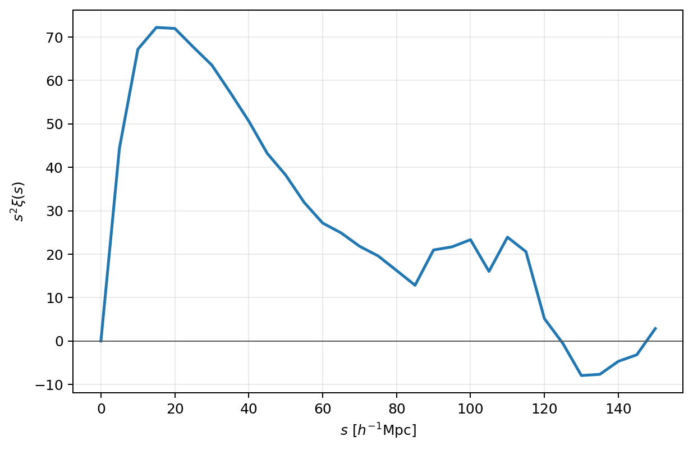

Quick start
===========

This is the canonical first PyHermes calculation. Starting with no local
catalogue, it downloads one original Quijote FoF ``group_tab`` file,
constructs a reusable ``SFCField``, measures an isotropic 2PCF, saves both
products, and plots the result. The matching notebook is
:doc:`available directly in the documentation </notebooks/quick_start>`; it
reads the same YAML files and writes the same outputs shown here.

Run from ``examples/``
----------------------

The paths in the public configurations are relative to that directory:

When working from a repository clone, install that checkout once so the
commands and notebook import the code beside them rather than another
PyHermes installation:

.. code-block:: bash

   python -m pip install -e ".[plot]"

.. code-block:: bash

   cd examples

Project the catalogue
---------------------

``configs/param_sfc_projection.yaml`` contains the remote input and its local
cache policy:

.. code-block:: yaml

   SFCProjection:
      fin:
         path: https://pyhermes.astroslacker.com/downloads/group_tab_004.0
         format: fof
         download:
            cache_path: ./data/quijote_halos/8000/groups_004/group_tab_004.0
            sha256: 4a1c6ca4f6747a70e9e552685226ecf5d678c6c97551e2caa7cc3883502eac85
         catalog_weight_key: null
         field_value_key: null
      box_size: 1000.0
      J: 8
      wavelet_mode: db2
      wavelet_level: 10
      phi_resolution: 1024
      weight_normalization: catalog
      threads: 2
      save_particle_data: true
      particle_data_path: ./output/quijote8000_snap004_particles.npz
      fout_path: ./output/quijote8000_snap004_sfc.pkl

Run the standard driver:

.. code-block:: bash

   python scripts/run_sfc_projection.py configs/param_sfc_projection.yaml

On the first run PyHermes downloads about 33 MB, verifies its SHA256 digest,
and caches it at
``data/quijote_halos/8000/groups_004/group_tab_004.0``. Later runs use that
file directly. The file header reports ``Nfiles = 1``, so no additional FoF
pieces are required. ``SFCProjection`` writes the reusable field and a
compact particle companion for particle-centred tasks.

Measure the 2PCF
----------------

The second configuration consumes exactly that field:

.. code-block:: yaml

   Corr_2PCF:
      sfc_field: ./output/quijote8000_snap004_sfc.pkl
      random: uniform
      binning_window: shell
      sampling:
         s: {min: 0.0, max: 150.0, n: 31}
      products: [dd, dr, rd, xi]
      threads: 2
      fout_path: ./output/quijote8000_snap004_2pcf.pkl

.. code-block:: bash

   python scripts/run_2pcf.py configs/param_2pcf.yaml

``random: uniform`` is an analytic constant reference field, so this basic
run has no stochastic random catalogue or hidden random seed. The vertices
receive no additional smoothing; ``shell`` supplies only the sampled radial
binning operator.

Load and plot
-------------

Task outputs are read through their public data classes:

.. code-block:: python

   import matplotlib.pyplot as plt
   from pyhermes.io import Corr2PCFData

   corr = Corr2PCFData(
       data_path="./output/quijote8000_snap004_2pcf.pkl"
   )

   fig, ax = plt.subplots(figsize=(7.0, 4.6))
   ax.plot(corr.s, corr.s**2 * corr.xi, color="#1f77b4", lw=2.0)
   ax.axhline(0.0, color="0.35", lw=0.8)
   ax.set(
       xlabel=r"$s\ [h^{-1}\mathrm{Mpc}]$",
       ylabel=r"$s^2\xi(s)$",
   )
   ax.grid(alpha=0.25)
   fig.tight_layout()
   plt.show()

   The isotropic 2PCF produced by the Quick Start YAML and notebook.

The notebook executes these same three stages through the Python task API.
There is deliberately no second set of separations, smoothing parameters, or
output names to reconcile.

Where next?
-----------

The Quick Start is the shortest complete workflow. The next three notebooks
explain its reusable layers:

1. :doc:`particle_io` is the optional input-data branch. It starts from the
   same FoF catalogue and shows how equivalent NPZ and raw BIN catalogues can
   be constructed and read.
2. :doc:`sfc_projection/sfc_projection` develops the catalogue-to-``SFCField``
   step: weights, normalisation, resolution, redshift space, and reusable
   products.
3. :doc:`window/window` develops the ``SFCField @ WindowFunc`` language:
   smoothing, custom kernels, and field algebra.

After that common foundation, choose the scientific branch that matches the
question:

* :doc:`physical_fields/physical_fields` applies differential and
  inverse-Laplacian windows to velocity, momentum, potential, and
  acceleration fields.
* :doc:`counting/counting` samples fields for one-point distributions.
* :doc:`corr_2pcf/corr_2pcf` extends the first 2PCF to smoothing, alternative
  bins, cross-correlations, and redshift-space anisotropy.
* :doc:`corr_3pcf/corr_3pcf` and
  :doc:`corr_3pcf_multipole/corr_3pcf_multipole` continue the statistics path
  to angular and multipole three-point measurements.

For a first top-to-bottom reading, the recommended linear order is
``quick_start`` -> ``particle_io`` -> ``sfc_projection`` -> ``window`` ->
``physical_fields`` -> ``counting`` -> ``corr2pcf`` -> ``corr3pcf``.
``particle_io`` may be skipped when the public example catalogue is enough;
the application notebooks after ``window`` are independent branches rather
than strict prerequisites for one another.

The projection tutorial generates its own J=9, mass-weighted,
redshift-space, and sampled-random fields. A dense dark-matter snapshot is the
only advanced external product used by
:doc:`physical_fields.ipynb </notebooks/physical_fields>`; that notebook
identifies the script and Slurm job that build it.
