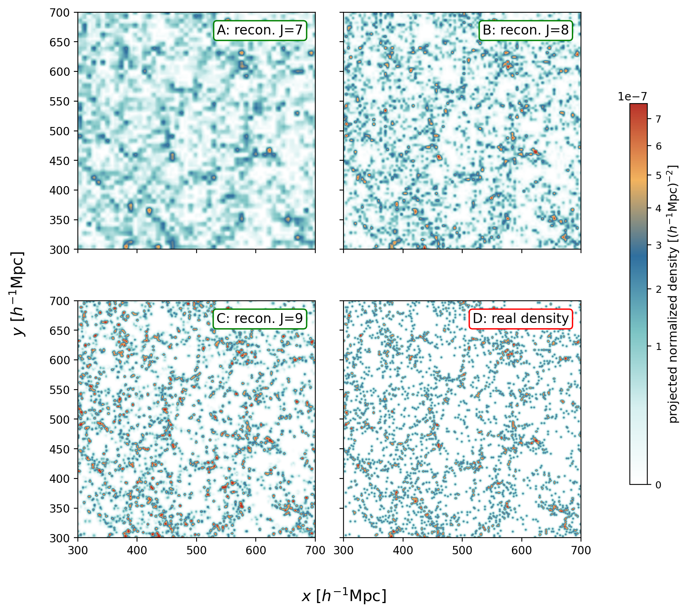

Build an SFCField
=================

``SFCProjection`` is the reusable first stage of every PyHermes workflow. It
projects particle positions and optional per-particle amplitudes onto the
scaling-function basis and returns an ``SFCField``.

Minimal YAML
------------

The public example uses a single-file Quijote halo catalogue. A fresh run
downloads and caches it automatically:

.. code-block:: yaml

   SFCProjection:
      fin:
         path: https://pyhermes.astroslacker.com/downloads/quijote_halos_8000_snap004.npz
         format: npz
         download:
            cache_path: ./data/quijote_halos_8000_snap004.npz
            sha256: b2b4b8c2fb91fa857e21b43d943cc32a2c423ee7cf5d7f13dede608264b08ef6
         catalog_weight_key: null
         field_value_key: null
      box_size: 1000
      J: 8
      wavelet_mode: db2
      wavelet_level: 10
      phi_resolution: 1024
      weight_normalization: catalog
      threads: 8
      save_particle_data: true
      particle_data_path: ./output/quijote8000_snap004_particles.npz
      fout_path: ./output/quijote8000_snap004_sfc.pkl

Run it from ``examples/``:

.. code-block:: bash

   python scripts/run_sfc_projection.py configs/param_sfc_projection.yaml

or from Python:

.. code-block:: python

   from pyhermes.base.sfc_projection import SFCProjection
   from pyhermes.param.parambase import read_param

   params = read_param(config_path="./configs/param_sfc_projection.yaml")
   field = SFCProjection(params).run()

In-memory catalogues
--------------------

File readers are optional. The same task accepts arrays directly:

.. code-block:: python

   task = SFCProjection()
   task.particle_pos = positions       # shape (N, 3)
   task.catalog_weight = completeness # shape (N,), optional
   task.field_value = mass            # shape (N,), optional
   task.box_size = 1000.0
   task.J = 8
   task.weight_normalization = "catalog"
   task.threads = 8
   task.fout_path = "./output/mass_sfc.pkl"
   mass_field = task.run()

Scalar weights and values are broadcast to all particles. Arrays must be
finite and have one entry per position.

Catalogue weights and field values
----------------------------------

The projected amplitude is the product
``catalog_weight * field_value``. The two inputs have different meanings:

``catalog_weight``
   Selection, completeness, optimal, or other catalogue weight.

``field_value``
   The physical or statistical value carried by a particle, such as mass, a
   velocity component, or a mark.

For file readers, ``fin.catalog_weight_key`` and ``fin.field_value_key`` select
named or indexed arrays exposed by the reader. With no keys, both factors are
one.

Normalisation
-------------

``weight_normalization`` controls the projection denominator:

.. list-table::
   :header-rows: 1
   :widths: 19 38 43

   * - Mode
     - Denominator
     - Typical use
   * - ``raw``
     - 1
     - Raw counts or extensive physical fields
   * - ``catalog``
     - ``sum(catalog_weight)``
     - Number fields and weighted means; task default
   * - ``field``
     - ``sum(catalog_weight * field_value)``
     - Unit-integral marked or physical field

The output metadata records the raw sums, the selected normalisation, and the
resulting ``field_integral``. A catalogue field may later be converted without
reprojecting particles:

.. code-block:: python

   raw_field = field.switch_weight_normalization("raw")
   unit_field = field.to_unit_weight()

Choose J from the resolved scale
--------------------------------

For a box of side ``box_size``, the nominal MRA spacing is
``box_size / 2**J``. In a :math:`1000\,h^{-1}\mathrm{Mpc}` box:

.. list-table::
   :header-rows: 1
   :widths: 20 30 50

   * - ``J``
     - Nominal spacing
     - Practical interpretation
   * - 7
     - 7.8125 Mpc/h
     - Large-scale or inexpensive diagnostic field
   * - 8
     - 3.90625 Mpc/h
     - Default scale for the paper's main examples
   * - 9
     - 1.953125 Mpc/h
     - Finer small-scale recovery at substantially higher memory cost

Use at least two resolutions for a statistic near the grid scale. More
coefficients are useful only if the catalogue sampling can support them.

   The reconstructed density converges toward finer structure as ``J``
   increases. The comparison is a resolution diagnostic, not a colour-map
   contest.

Load and inspect a field
------------------------

.. code-block:: python

   from pyhermes.io import SFCField

   D = SFCField(
       data_path="./output/quijote8000_snap004_sfc.pkl",
       threads=8,
   )
   print(D.epsilon.shape)
   print(D.J, D.box_size, D.wavelet_mode)
   print(D.field_integral, D.weight_normalization)

Evaluate the reconstructed continuous field at arbitrary positions:

.. code-block:: python

   density = D.field_density_at_pos(
       sample_positions,
       value_unit="physical",
   )

``value_unit="physical"`` reports density per physical box volume;
``"grid"`` reports density per MRA-grid volume. ``"auto"`` selects physical
units for catalogue fields and grid units for derived fields.

Particle data for particle-centred tasks
----------------------------------------

``Corr_3PCF(center="particle")`` needs the primary particle positions and
weights. ``save_particle_data: true`` writes a companion NPZ containing
``pos``, ``catalog_weight``, and ``field_value``. The SFC metadata stores its
path so ``get_particle_data()`` can recover the catalogue later.

If the original reader path remains accessible, PyHermes can reread it instead.
Saving the compact companion file is usually more portable for server runs.

MPI behaviour
-------------

In a distributed projection, rank 0 reads the catalogue, partitions particles
into x slabs, sends each slab to one rank, and gathers the projected slabs.
The current projection implementation requires the MPI rank count to be a
power of two. ``threads`` applies within every rank.

Public tutorial
---------------

``examples/notebooks/sfc_projection.ipynb`` begins after the Quick Start and
keeps the projection layer in view: configuration-driven and in-memory input,
number and mass fields, a shared-plane J=7/J=8 comparison, redshift-space
coordinates, and the compact companion particle dataset. It runs entirely
from the public catalogue used by the Quick Start.

Catalogue formats and conversion are covered separately in
``examples/notebooks/particle_io.ipynb`` and :doc:`../particle_io`. Larger
precomputed J=9, weighted, redshift-space, and random products can still be
prepared with ``examples/scripts/prepare_sfc_fields.py`` when an advanced
example needs them; they are not prerequisites for this notebook.
