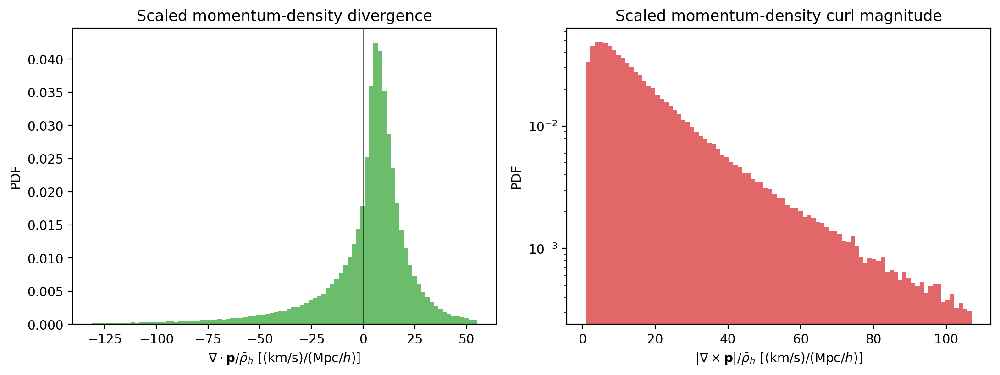

Weighted Fields
===============

``weighted_fields.ipynb`` is an additional application notebook to read after
the main counting, 2PCF, and 3PCF workflow. PyHermes accepts particle weights
when constructing a field, so the same Hermes representation is not limited to
the halo number-density field. With different weights it can reconstruct a
mass-density field and even component-wise vector fields, such as velocity and
momentum density.

The most useful prerequisites are ``convols.ipynb`` and ``window.ipynb``:
``Convols`` explains how the weighted fields are built, and ``WindowFunc``
explains how those fields are filtered or differentiated.

The second ingredient is the field-derivative window. Since derivatives are
simple Fourier-space multipliers, PyHermes can compute derivatives through the
same convolution machinery used for ordinary windows. Combining weighted fields
with derivative windows gives a compact way to measure velocity and
momentum-density divergence and curl, which are useful quantities in
large-scale-structure analyses and in observables related to line-of-sight
momentum, such as the kinetic Sunyaev-Zel'dovich effect.

The derivative-window method does not require choosing a finite-difference
spacing ``dx`` or evaluating the field only on a regular grid. It can evaluate
the derivative at arbitrary positions, with the accuracy controlled by the
underlying PyHermes field resolution, especially ``J``, and by any smoothing
window that is applied. The notebook therefore uses derivative windows as the
main estimator and includes a finite-difference calculation only as a
consistency check.

What this notebook covers
-------------------------

The notebook demonstrates how the weighted point-process view,

.. math::

   n(\mathbf{x}) =
   \sum_i w_i\,\delta_{\rm D}^{(3)}(\mathbf{x}-\mathbf{x}_i),

can be reused for several related fields:

- unit weights produce the halo number-density field
- velocity weights produce velocity-weighted fields, which are divided by the
  number-density field to estimate the velocity field
- mass and mass-times-velocity weights produce halo mass-density and
  momentum-density fields

It then visualizes the velocity field on a two-dimensional slice, computes
velocity and momentum-density derivatives with directional-derivative windows,
and uses a finite-difference grid only as a reference check.

Derivatives of weighted fields
------------------------------

For a scalar field :math:`f`, the gradient can be built from three
directional-derivative windows:

.. math::

   \nabla f =
   \left(
   \partial_x f,\,
   \partial_y f,\,
   \partial_z f
   \right).

For a vector field whose components are constructed directly as weighted
fields, such as the momentum-density field
:math:`\mathbf{p}=(p_x,p_y,p_z)`, the divergence and curl follow from the
usual component combinations:

.. math::

   \nabla\cdot\mathbf{p}
   =
   \partial_x p_x+\partial_y p_y+\partial_z p_z,
   \qquad
   \nabla\times\mathbf{p}
   =
   \begin{pmatrix}
   \partial_y p_z-\partial_z p_y\\
   \partial_z p_x-\partial_x p_z\\
   \partial_x p_y-\partial_y p_x
   \end{pmatrix}.

For nonlinear derived fields, apply the chain rule. The velocity field is the
main example here. If

.. math::

   v_i(\mathbf{x})
   =
   {n_{v_i}(\mathbf{x})\over n(\mathbf{x})},

then

.. math::

   \partial_j v_i
   =
   {\partial_j n_{v_i}\over n}
   -
   {n_{v_i}\,\partial_j n\over n^2}.

The notebook evaluates these derivative-window expressions directly at the
random points used for the velocity slice, and later repeats the calculation on
a subset of regular-grid positions to compare with periodic finite
differences.

Example outputs
---------------

The first slice combines two pieces of information. The arrows show the
transverse velocity estimated at random points, while the colored background
shows the velocity divergence computed with derivative windows on the same
``z`` slice.

.. figure:: ../../_static/weighted_fields/weighted_fields_velocity_divergence_slice.png
   :alt: Velocity divergence slice with transverse velocity arrows
   :align: center
   :width: 95%

   Velocity-divergence slice with transverse velocity arrows. This plot gives a
   spatial check of the reconstructed velocity field and its large-scale
   compression or expansion pattern.

The velocity derivatives are then measured directly from the weighted
``ConvolsData`` objects by applying directional-derivative windows. This avoids
requiring a regular evaluation grid for the main derivative estimate.

.. figure:: ../../_static/weighted_fields/weighted_fields_velocity_derivatives_pdf.png
   :alt: Velocity divergence and curl magnitude PDFs
   :align: center
   :width: 95%

   PDFs of the velocity divergence and curl magnitude from the
   derivative-window method.

The same derivative-window machinery applies to the momentum-density field
built from mass-times-velocity weights. The divergence and curl are normalized
by the mean halo mass density so their units match the velocity-gradient scale.

   PDFs of the scaled momentum-density divergence and curl magnitude.

Finally, the notebook samples a subset of the finite-difference grid and
evaluates the derivative-window result at the same positions. The comparison is
not the primary estimator; it is a consistency check showing how the
spectral-window derivative agrees with the grid-based finite-difference
reference when the same smoothing and density mask are used.

.. figure:: ../../_static/weighted_fields/weighted_fields_derivative_window_comparison.png
   :alt: Derivative-window and finite-difference divergence comparison
   :align: center
   :width: 95%

   Derivative-window divergence estimates compared with finite-difference
   estimates at matched grid positions for both velocity and scaled
   momentum-density fields.

Why it comes last
-----------------

The earlier notebooks are the core PyHermes tutorial path: prepare a field,
apply windows, count samples, and measure two- and three-point statistics.
``weighted_fields.ipynb`` is a "what else can this machinery do?" example. It
shows that the same coefficient construction can be useful for physical field
estimation, including quantities closely related to velocity-potential analyses
and line-of-sight momentum observables such as the kinetic Sunyaev-Zel'dovich
effect.

Files
-----

Tracked in the repository:

- ``examples/notebooks/weighted_fields.ipynb``

Expected local inputs:

- the Quijote halo example catalog under ``examples/data/quijote_halos/``

The notebook builds its weighted fields interactively from the catalog, so it
does not require the heavier 2PCF or 3PCF products.
