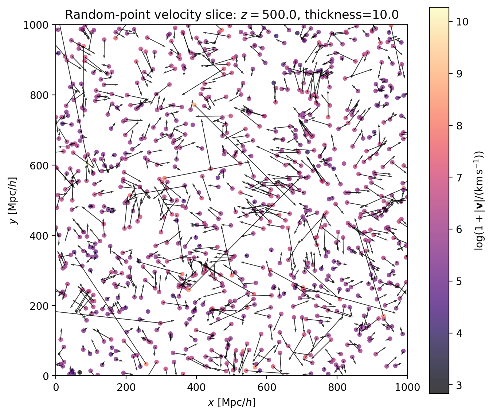
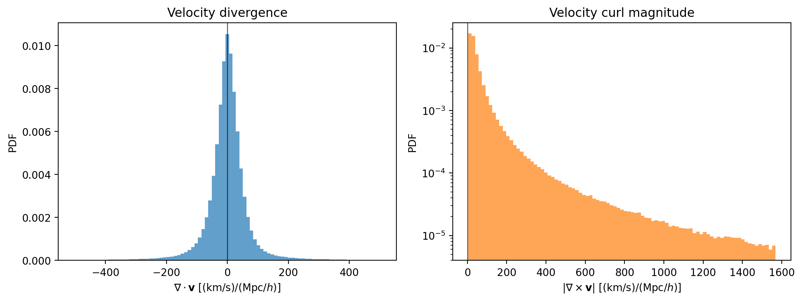
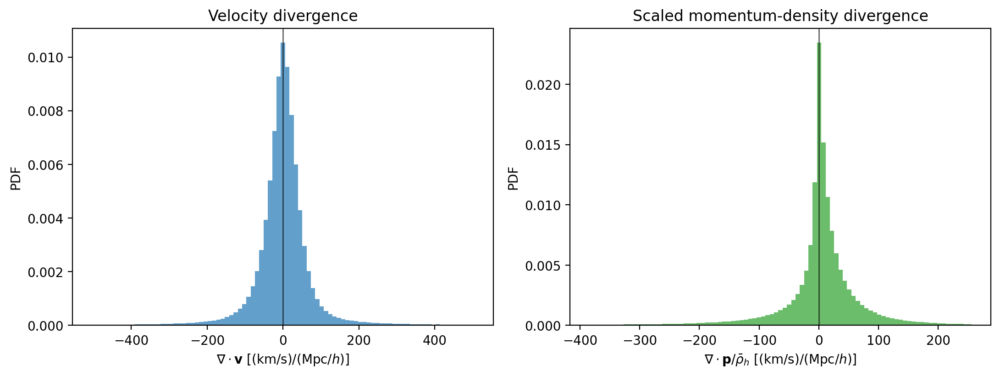

Weighted Fields
===============

``weighted_fields.ipynb`` is an additional application notebook to read after
the main counting, 2PCF, and 3PCF workflow. It uses the same ``Convols`` field
construction introduced earlier, but changes particle weights to represent
physical fields beyond the standard multipoint-statistics examples.

What this notebook covers
-------------------------

The notebook demonstrates how the weighted point-process view,

.. math::

   n(\mathbf{x}) =
   \sum_i w_i\,\delta_{\rm D}^{(3)}(\mathbf{x}-\mathbf{x}_i),

can be reused for several related fields:

- unit weights produce the halo number-density field
- velocity weights produce velocity-weighted fields, which are divided by the
  number-density field to estimate the velocity field
- mass and mass-times-velocity weights produce halo mass-density and
  momentum-density fields

It then visualizes a random-point velocity slice, samples the velocity field on
an independent regular grid, computes velocity divergence and curl, and compares
the velocity-divergence distribution with the normalized momentum-density
divergence.

Example outputs
---------------

The random-point slice gives a direct visual check of the interpolated velocity
field before taking derivatives.

   Random-point velocity slice. Point colors show velocity magnitude and arrows
   show the transverse velocity direction.

Sampling the velocity field on an independent regular grid makes it possible to
estimate divergence and curl with periodic finite differences.

   PDFs of the velocity divergence and curl magnitude measured from the regular
   evaluation grid.

Finally, the notebook compares the velocity divergence to the momentum-density
divergence after normalizing the latter by the mean halo mass density.

   Velocity-divergence PDF compared with the scaled momentum-density divergence.

Why it comes last
-----------------

The earlier notebooks are the core PyHermes tutorial path: prepare a field,
apply windows, count samples, and measure two- and three-point statistics.
``weighted_fields.ipynb`` is a "what else can this machinery do?" example. It
shows that the same coefficient construction can be useful for physical field
estimation, including quantities closely related to velocity-potential analyses
and line-of-sight momentum observables such as the kinetic Sunyaev-Zel'dovich
effect.

Files
-----

Tracked in the repository:

- ``examples/notebooks/weighted_fields.ipynb``

Expected local inputs:

- the Quijote halo example catalog under ``examples/data/quijote_halos/``

The notebook builds its weighted fields interactively from the catalog, so it
does not require the heavier 2PCF or 3PCF products.
