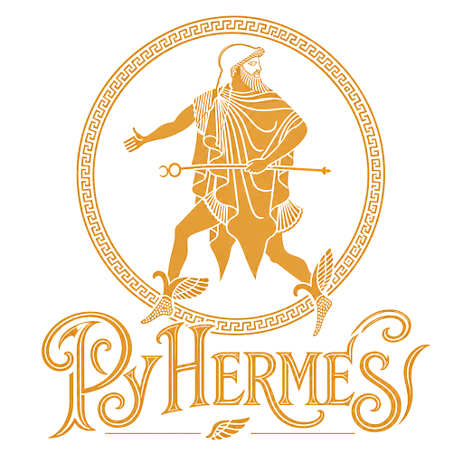

PyHermes
========

**PyHermes** is the Python implementation of **Hermes**, an in situ
multiresolution framework for cosmic statistics. A particle catalogue is
projected once into a reusable scaling-function-coefficient field
(``SFCField``). Smoothing, binning, multipole projection, and differential
operations are then expressed as windows acting on that field.

This field--window language supports count-in-cell statistics, isotropic and
anisotropic 2PCFs, standard and multipole 3PCFs, marked and weighted
statistics, and derived physical fields such as velocity divergence,
Newtonian potential, and acceleration.

.. figure:: _static/paper/PyHermes-Workflow.png
   :width: 96%
   :align: center
   :alt: Catalogue, window, MRA field, and task layers in PyHermes

   The four-layer PyHermes workflow used in the Hermes paper. Catalogue data
   and window operators meet in the MRA layer; task objects assemble the
   resulting filtered fields into statistics or physical diagnostics.

The shortest route through the documentation is:

1. :doc:`intro` for the algorithm and its scope.
2. :doc:`install` and :doc:`get_start/quick_start` for a first run.
3. :doc:`get_start/sfc_projection/sfc_projection` and
   :doc:`get_start/window/window` for the two reusable core objects.
4. Choose a task guide: Counting, 2PCF, standard 3PCF, 3PCF multipoles, or
   weighted and derived fields.

The public `examples directory
<https://github.com/SYSUSPA-Projects/PyHermes/tree/main/examples>`_ is the
executable companion to this guide. Its notebooks are tutorials; its scripts
and YAML files are production-shaped starting points.

.. toctree::
   :maxdepth: 2
   :caption: Start here

   intro
   install
   get_start/quick_start
   get_start/get_start

.. toctree::
   :maxdepth: 2
   :caption: Field--window concepts

   math
   get_start/sfc_projection/sfc_projection
   get_start/window/window
   windows

.. toctree::
   :maxdepth: 2
   :caption: Statistics and physical fields

   get_start/counting/counting
   get_start/corr_2pcf/corr_2pcf
   get_start/corr_3pcf/corr_3pcf
   get_start/corr_3pcf_multipole/corr_3pcf_multipole
   get_start/weighted_fields/weighted_fields

.. toctree::
   :maxdepth: 2
   :caption: Reference and validation

   param/param
   benchmark
   citing
