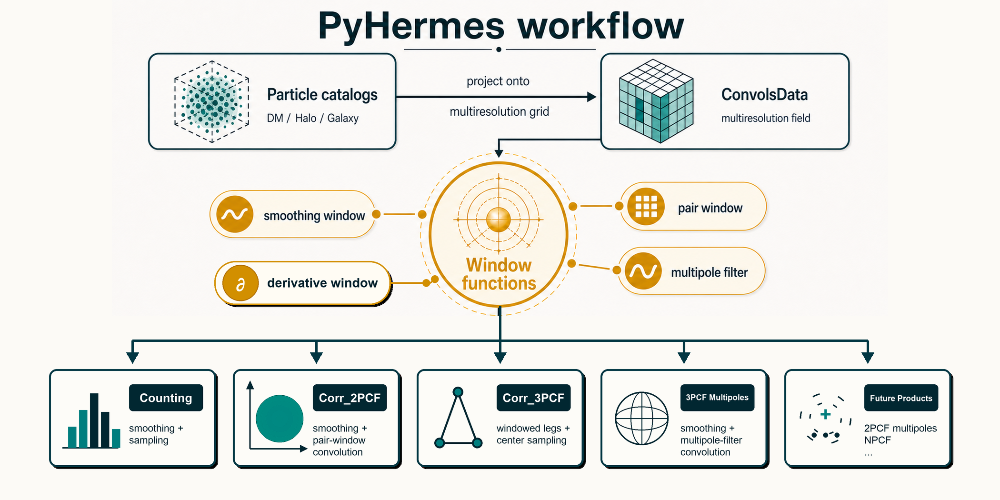

Introduction
============

What Is Hermes?
---------------

``Hermes`` stands for **HypER-speed MultiResolution cosmic Statistics**. The
name captures the main design goal: a unified, high-performance framework for
cosmic clustering statistics built around multiresolution fields and window
convolutions.

``PyHermes`` is the Python implementation of this idea. It is designed as an
open-source, massively parallel toolkit for particle-based cosmic statistics,
with GPU acceleration available for the multipole workflow. Instead of
recounting pairs or triplets directly for every requested configuration,
PyHermes projects the catalog onto a grid and evaluates many statistics through
field operations. The core convolution work is organized around an
:math:`N_g\log N_g` style algorithm, where :math:`N_g` is the grid size, so
the expensive field operations are controlled primarily by the grid
representation rather than by the number of requested sampling points.

The result is a common scheme for many variants of clustering statistics:
one-point counts, two-point correlations, three-point correlations, and
multipoles all share the same field-and-window language.

PyHermes is built around one reusable intermediate object: ``SFCField``.
You start from a particle catalog, project it onto a multiresolution grid, and
then reuse that field for downstream measurements instead of rereading the raw
catalog for every task.

   PyHermes rewrites particle counting as a sequence of reusable field
   operations: construct a multiresolution field once, apply smoothing,
   pair, multipole, or derivative windows to encode the requested operation,
   and form sampled values or field products for the target statistic. The
   same structure also leaves room for future 2PCF multipole, NPCF, and
   user-defined products.

The Core Abstractions
---------------------

Most of the package can be read as four layers:

1. **Catalog layer**: particle positions and optional weights define a weighted
   point process.
2. **Field layer**: ``SFCProjection`` turns that point process into a reusable
   ``SFCField`` multiresolution field.
3. **Window layer**: ``WindowFunc`` objects smooth, select separations, encode
   angular filters, or apply field derivatives through convolution.
4. **Task layer**: ``Counting``, ``Corr_2PCF``, ``Corr_3PCF``, and the
   weighted-field examples combine those fields and windows into the requested
   measurements.

This is the main organizing principle of the documentation. The ordinary
statistics notebooks follow the classic counting, 2PCF, and 3PCF path. The
weighted-field notebook shows what else the same field/window algebra can do:
with different physical field values and derivative windows, PyHermes can also
construct velocity, mass-valued, and momentum-valued fields and measure their
divergence or curl.

Hermes vs. Traditional Counting
-------------------------------

Traditional cosmological estimators usually start from the discrete catalog and
count geometric configurations directly:

.. code-block:: text

   particle catalog -> pair/triplet counting -> DD, DR, RR, DDD, ... -> xi, zeta, Q

Hermes rewrites the same statistical goals as operations on a multiresolution
field:

.. code-block:: text

   particle catalog -> multiresolution field -> window convolution -> field products -> xi, zeta, Q, multipoles

For example, a two-point statistic can be written as a product of a field and
a windowed copy of itself,

.. math::

   \xi_P =
   \left\langle
   \delta(\mathbf{x})\,
   (W_P\circ\delta)(\mathbf{x})
   \right\rangle.

The window :math:`W_P` defines the geometry of the measurement: a real-space
shell, a redshift-space ring, a cylinder, or another supported window. The same
idea extends to 3PCF, where the triangle legs are windowed fields, and to 3PCF
multipoles, where angular filters build the multipole components.

This field-and-window viewpoint gives PyHermes several practical advantages:

- intermediate ``SFCField`` fields can be reused across Counting, 2PCF,
  3PCF, and multipole workflows;
- smoothing, pair bins, triangle legs, and multipole filters are expressed in
  one consistent window-function language;
- complex redshift-space geometries and line-of-sight choices fit naturally
  into the same framework;
- 2PCF multipoles can be viewed as Legendre-weighted binning windows, so the
  angular projection can be folded into the convolution rather than performed
  after sampling a dense :math:`(s,\mu)` grid; this is a natural planned
  extension of the current binning-window framework;
- 3PCF multipoles are built from angular window filters on the field itself,
  avoiding direct triplet enumeration for every angular basis component;
- field derivatives can be computed with derivative windows, so gradients,
  divergence, and curl are obtained by Fourier-space convolution without
  choosing a finite-difference grid spacing;
- high-order statistics avoid returning to raw catalog triplet counting for
  every requested configuration;
- dense particle samples can be handled with field evaluations and box-random
  centers instead of using every particle as a center.

The tradeoff is that users should think carefully about the field resolution
and window definition. Parameters such as ``J``, ``wavelet_level``,
``phi_resolution``, and the selected window are part of the numerical
definition of the measurement. For the compact mathematical formulation, see
:doc:`math`; for practical window choices, see :doc:`windows`.

Core workflow
-------------

The standard PyHermes workflow is:

1. read or prepare a particle catalog
2. build a field with ``SFCProjection``
3. use ``SFCField`` and ``WindowFunc`` operations to define derived fields or
   smoothing filters
4. optionally construct a matching random field
5. run ``Counting``, ``Corr_2PCF``, or ``Corr_3PCF`` on top of the saved field

This structure is why the notebooks are split the way they are. The field
construction notebook comes first, the window notebook explains the reusable
field/window operations, and every measurement notebook assumes that stage
already exists.

Learn through the notebooks
---------------------------

The main tutorial path follows these notebooks in order:

- ``quick_start.ipynb`` for the smallest possible end-to-end example
- ``sfc_projection.ipynb`` for interactive data preparation and field construction
- ``window.ipynb`` for field/window algebra and ordinary smoothing windows
- ``counting.ipynb`` for one-point sampling and smoothing
- ``corr2pcf.ipynb`` for isotropic and anisotropic 2PCF
- ``corr3pcf.ipynb`` for standard 3PCF, low-level ``Q`` reconstruction, and
  multipoles

After that main path, the "Beyond Multipoint Statistics" section introduces
``weighted_fields.ipynb``: by changing particle weights, the same ``SFCProjection``
construction can represent velocity and momentum-density fields rather than
only the fields used by the traditional counting, 2PCF, and 3PCF examples.

For the task-oriented reading order, see :doc:`get_start/get_start`.

If you only need the local example catalog and saved ``SFCField`` products,
you can run the non-MPI helper script instead of opening the notebook:

.. code-block:: bash

   python examples/scripts/prepare_sfc_fields.py

What is tracked in the repository
---------------------------------

PyHermes deliberately keeps the committed example tree lightweight.

Tracked:

- ``examples/notebooks/``
- ``examples/scripts/``
- ``examples/configs/``

Generated locally:

- ``examples/data/``
- ``examples/output/``

In practice this means:

- ``sfc_projection.ipynb`` or ``examples/scripts/prepare_sfc_fields.py`` prepares
  the main example data and reusable ``SFCField`` files
- small outputs are produced as you execute notebook cells
- heavier outputs, especially in ``corr2pcf.ipynb`` and ``corr3pcf.ipynb``,
  are meant to be generated by running the indicated script and YAML file on
  your own workstation or cluster

Supported input formats
-----------------------

PyHermes currently supports these particle input formats:

- ``bin``
- ``npz``
- ``gadget``
- ``gadget-fof``
- ``fof``

For parameter details, see :doc:`param/param`.

For the compact mathematical formulation behind these examples, see
:doc:`math`.
