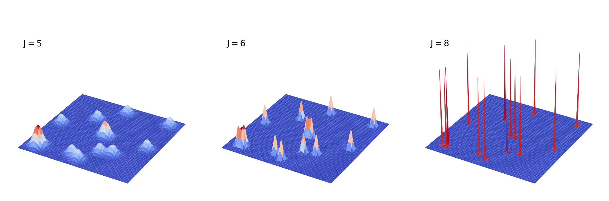
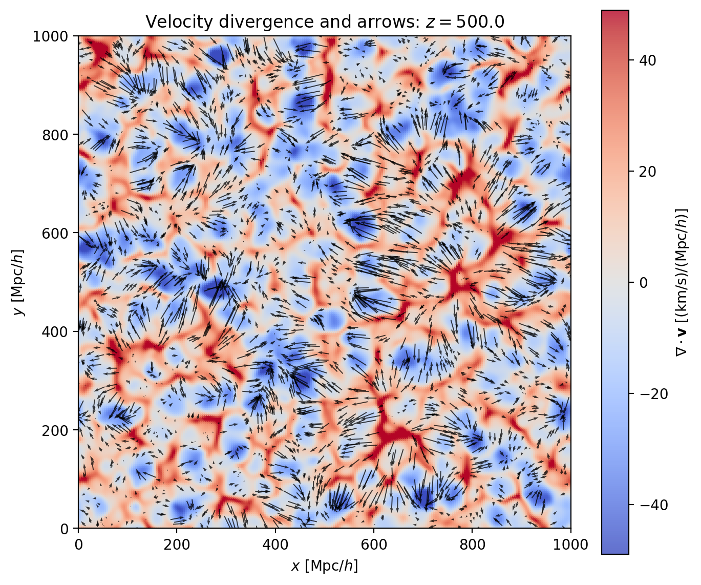
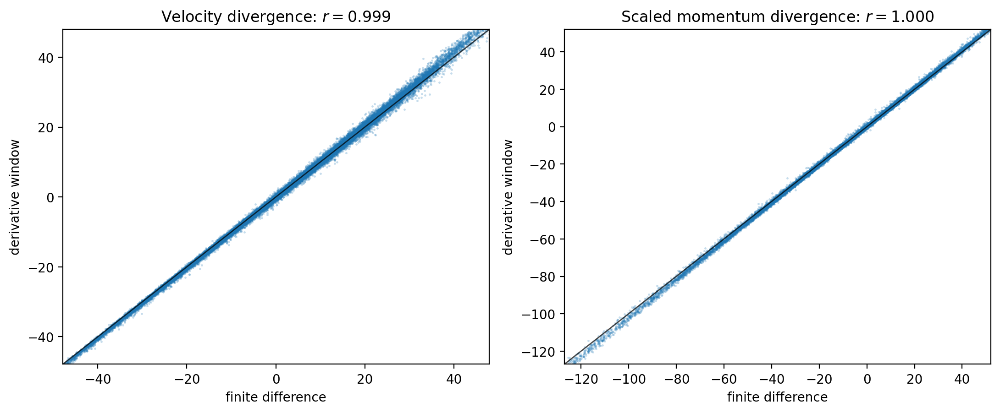
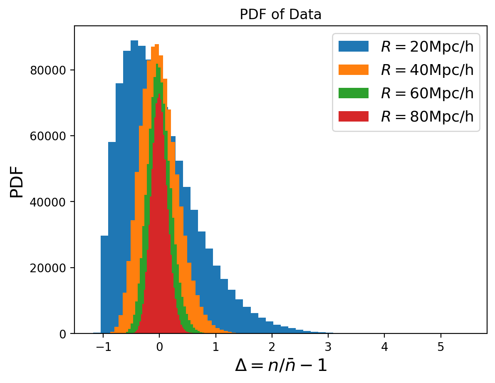
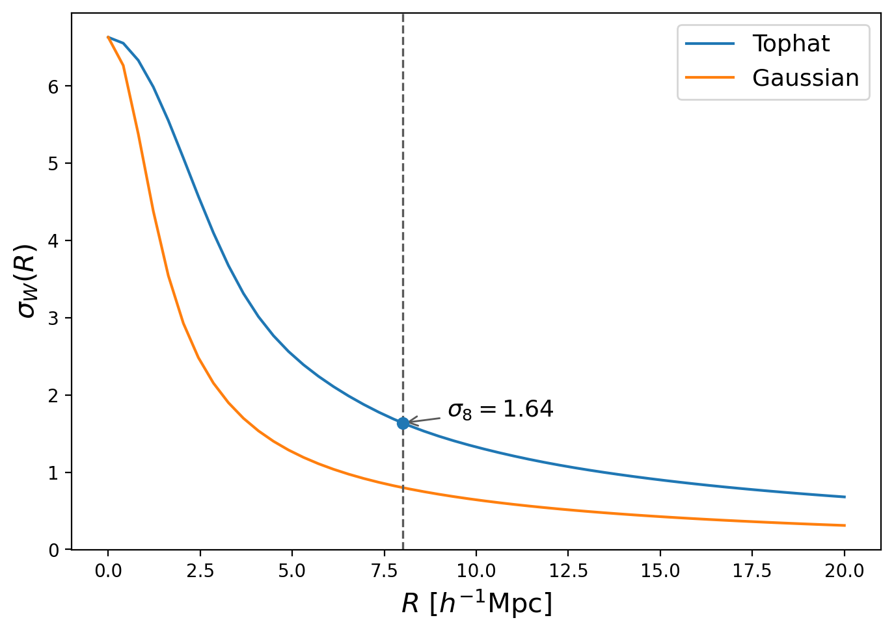
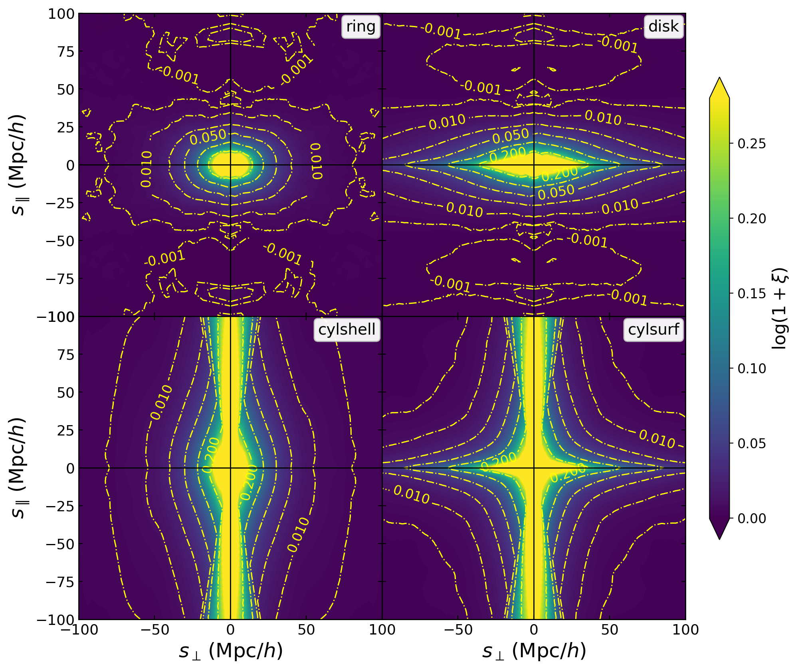
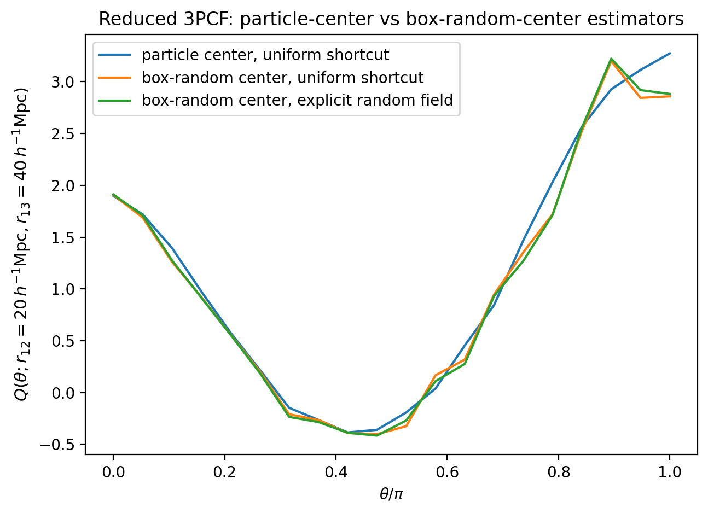
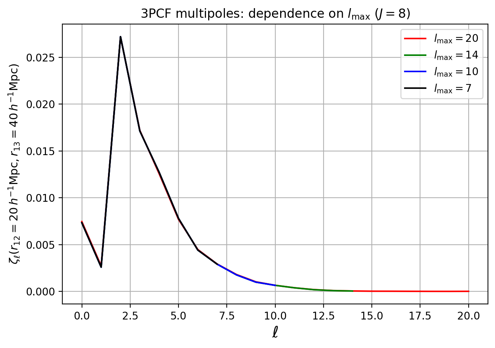

Mathematical Background
=======================

This page summarizes the Hermes formulation behind PyHermes. The same
mathematical object appears throughout the package: a weighted point catalog is
turned into a continuous multiresolution field, window functions are applied as
convolutions, and statistics are read out as field averages or sampled products.
For a task-oriented reference to the built-in windows and their YAML/Python
definitions, see :doc:`windows`.

The order below follows the practical PyHermes workflow: construct a
multiresolution field, choose windows, form one-point and correlation
statistics, and then reuse the same field/window algebra for multipoles and
weighted-field derivatives.

Fourier conventions follow the rest of the documentation:

.. math::

   \widehat f(\mathbf{k})
   =
   \int d^3x\,f(\mathbf{x})\,
   e^{-2\pi i\mathbf{k}\cdot\mathbf{x}},
   \qquad
   f(\mathbf{x})
   =
   \int d^3k\,\widehat f(\mathbf{k})\,
   e^{2\pi i\mathbf{k}\cdot\mathbf{x}}.

Point Catalogs And Window Counts
--------------------------------

A particle or halo catalog is treated as a weighted spatial point process. We
separate an observational/catalogue weight :math:`w_{g,i}` from the
per-object value :math:`x_i` carried by the physical field,

.. math::

   S_g=\sum_iw_{g,i},\qquad
   \bar w_{g,i}={w_{g,i}\over S_g},\qquad
   F_x(\mathbf{x}) =
   \sum_{i=1}^{N} \bar w_{g,i}x_i\,
   \delta_{\rm D}^{(3)}(\mathbf{x}-\mathbf{x}_i).

Here :math:`w_g` contains completeness, selection, or other catalogue
corrections and is treated as a relative weight: multiplying all
:math:`w_g` by one constant does not change the represented field.
:math:`x=1` produces a unit-integral tracer-density field, :math:`x=m`
produces a mass-valued field, and :math:`x=v_\alpha` produces a signed
velocity-weighted field. A ``ConvolsData`` object stores this weighted field
with an explicit ``weight_normalization`` convention while retaining the input
sums

.. math::

   S_g=\sum_i w_{g,i},
   \qquad
   S_x=\sum_iw_{g,i}x_i,
   \qquad
   I_x={S_x\over Z}=\int F_x(\mathbf{x})\,d^3x,
   \qquad
   Z\in\{1,S_g,S_x\}.

``catalog`` uses :math:`Z=S_g` and is the default for ordinary tracer
statistics. ``raw`` uses :math:`Z=1` and keeps the raw physical amplitude.
``field`` uses :math:`Z=S_x` and is only well-conditioned for positive marked
fields; during catalog-field construction, ``unit`` is accepted as an alias for
``field``. Field algebra operates on already constructed field intensities:
ordinary arithmetic and window convolution return derived fields whose grid
values are retained, while catalogue sums and particle lists are cleared.
For these derived fields ``weight_normalization`` is ``None`` and
``field_integral`` is the direct sum of the resulting coefficient grid. The
task-level ``weight_normalization: unit`` mode is the exception: it can rescale
either catalog or derived fields by this field integral. Particle-centred
estimators therefore require explicit centers and weights when their input is a
derived field.

Counting in any geometric volume is written as a convolution with a normalized
window function,

.. math::

   F_{x,W}(\mathbf{x})
   =
   (W \circ F_x)(\mathbf{x})
   =
   \int W(\mathbf{x}-\mathbf{x}') F_x(\mathbf{x}')\,d^3x'
   =
   \sum_i \bar w_{g,i}x_i W(\mathbf{x}-\mathbf{x}_i),
   \qquad
   \int W(\mathbf{x})\,d^3x = 1.

Changing the window changes the statistic: a sphere gives count-in-cell values,
a shell gives pair counts, and redshift-space windows describe cylindrical or
ring-like pair geometries. The practical window families are summarized in
:doc:`windows`.

Multiresolution Field Reconstruction
------------------------------------

``Convols`` replaces the singular Dirac-delta catalog by scaling-function
coefficients on a compact multiresolution basis,

.. math::

   F_{x,j}(\mathbf{x}) =
   \sum_{\ell} \epsilon_{j\ell}\,\phi_{j\ell}(\mathbf{x}),
   \qquad
   \epsilon_{j\ell}
   =
   \int F_x(\mathbf{x})\phi_{j\ell}(\mathbf{x})\,d^3x
   =
   \sum_i \bar w_{g,i}x_i \phi_{j\ell}(\mathbf{x}_i).

The scaling functions are assumed to be orthonormal under the ordinary
:math:`L^2` inner product,

.. math::

   \int d^3x\,
   \phi_{j\ell}(\mathbf{x})\phi_{jm}(\mathbf{x})
   =
   \delta_{\ell m}.

With this convention, the basis functions carry dimensions of
:math:`V^{-1/2}` in physical coordinates. The coefficients
:math:`\epsilon_{j\ell}` therefore also carry dimensions of
:math:`V^{-1/2}`, and the product
:math:`\epsilon_{j\ell}\phi_{j\ell}` has the dimensions of a number density.
No extra :math:`1/V` factor is included in the projection coefficient.

Applying a window to the field becomes a linear operation on those
coefficients,

.. math::

   \widetilde{\epsilon}_{j\ell}
   =
   \sum_m W^j_{\ell m}\epsilon_{jm}.

For homogeneous windows, :math:`W^j_{\ell m}` has convolution structure, so the
operation can be evaluated efficiently with FFTs. This is the reason downstream
tasks can reuse a saved ``ConvolsData`` object instead of returning to the raw
catalog.

With the default ``catalog`` convention, the stored coefficients use
catalogue-normalized weights. For ordinary tracer density, :math:`x=1`
therefore gives

.. math::

   \int d(\mathbf{x})\,d^3x
   =
   \int r(\mathbf{x})\,d^3x=1,
   \qquad
   r_{\rm uniform}={1\over V}.

For a positive marked-density contrast, a correlation task can set
``weight_normalization: field`` and divide the marked field by :math:`S_x`.
Signed fields such as velocity components retain their amplitude with
``weight_normalization: raw``. An explicit random catalogue
does not need to contain the same number of points as the data catalogue:
each ordinary random field is already normalized by its own
:math:`S_{g,R}`.

Internally, PyHermes evaluates these expressions in dimensionless grid
coordinates :math:`\mathbf{u}=(L/L_{\rm box})\mathbf{x}`, where
:math:`L=2^J`. In that coordinate system the represented volume is
:math:`V_{\rm grid}=L^3`. Thus a coefficient product that appears in continuum
notation as :math:`V^{-1}\sum_\ell \epsilon_\ell\widetilde\epsilon_\ell` is
implemented as a mean over the stored grid. The physical-coordinate and
grid-coordinate forms differ only by the coordinate scaling convention, and
the common factors cancel in normalized statistics such as :math:`\xi` and
:math:`Q`.

   The multiresolution level ``J`` controls the effective support of the
   reconstructed field. Lower ``J`` values give a smoother coarse-grained
   representation, while higher ``J`` values retain sharper particle-scale
   structure.

Weighted Fields And Derivatives
-------------------------------

The value :math:`x_i` is not restricted to a unit count. Choosing
:math:`x_i=m_i` gives a mass-valued tracer field, while choosing one component
of a mark, such as :math:`x_i=v_{x,i}` or :math:`x_i=m_i v_{x,i}`, gives one
component of a velocity-weighted or momentum-valued field without altering
the observational weight :math:`w_{g,i}`. Component fields
can then be combined after evaluation. For example, the halo velocity field can
be estimated as

.. math::

   v_\alpha(\mathbf{x})
   =
   {n_{v_\alpha}(\mathbf{x})\over n(\mathbf{x})},
   \qquad
   n_{v_\alpha}(\mathbf{x})
   =
   \sum_i \bar w_{g,i}v_{\alpha,i}\,
   \delta_{\rm D}^{(3)}(\mathbf{x}-\mathbf{x}_i).

Field derivatives also fit into the same convolution language. With the Fourier
convention above,

.. math::

   \widehat{\partial_\alpha f}(\mathbf{k})
   =
   2\pi i k_\alpha\,\widehat f(\mathbf{k}),
   \qquad
   \widehat{\nabla^2 f}(\mathbf{k})
   =
   -(2\pi)^2|\mathbf{k}|^2\,\widehat f(\mathbf{k}).

Therefore a derivative can be represented as a special Fourier-space window.
This is useful for gradients of scalar fields and for divergence or curl of
vector fields constructed from weighted ``ConvolsData`` objects. The
field-derivative windows are documented in :doc:`windows`, and the full
velocity and momentum-density example is in
:doc:`get_start/weighted_fields/weighted_fields`.

   Weighted fields turn particle marks into spatial fields before any
   derivative is taken. In this example, transverse velocity arrows are shown
   together with the velocity-divergence field on a two-dimensional slice,
   illustrating how the same field representation can support both vector-field
   reconstruction and derivative-window measurements.

   Derivative windows implement the Fourier-space multipliers directly on the
   represented field. The close agreement with finite-difference estimates
   provides a practical check that gradients and divergences are being computed
   on the same reconstructed field.

Counting
--------

``Counting`` evaluates a smoothed field at random centers
:math:`\{\mathbf{y}_a\}`. For a count-in-cell window this is simply

.. math::

   c_a = n_W(\mathbf{y}_a),
   \qquad
   p(c)\simeq {1\over N_{\rm sample}}
   \sum_a \mathbf{1}\!\left[c_a \in {\rm bin}(c)\right].

For fluctuation fields, with
:math:`\delta=(n-\bar n)/\bar n`, the same operation probes
:math:`\delta_W = W\circ\delta`. Moments of these samples estimate quantities
such as

.. math::

   \sigma_W^2
   =
   \langle \delta_W, \delta_W\rangle.

   The full one-point PDF responds to the smoothing scale. Smaller windows
   retain sharper high-density tails and stronger discreteness effects, while
   larger windows average over more structure and move the distribution toward
   a narrower, more Gaussian-like form.

   The one-point moment :math:`\sigma_W(R)` depends on the smoothing window.
   Compact top-hat and Gaussian low-pass windows keep similar large-scale
   information but weight the transition to smaller scales differently.

Two-Point Correlations
----------------------

The in-situ view of the two-point correlation function writes a pair statistic
as a local product between the field and a windowed copy of itself,

.. math::

   \xi_P =
   \left\langle
   \delta(\mathbf{x})\,
   (W_P\circ\delta)(\mathbf{x})
   \right\rangle.

For the usual isotropic real-space 2PCF, :math:`P` is a shell radius. A thin
spherical shell has

.. math::

   W_{\rm shell}(r;R)
   =
   {1\over 4\pi R^2}\delta_{\rm D}(r-R),
   \qquad
   \widehat{W}_{\rm shell}(k;R)
   =
   {\sin(2\pi kR)\over 2\pi kR}.

The finite-bin version is a normalized spherical shell between
:math:`R_{\rm in}` and :math:`R_{\rm out}`. In Fourier space it is the
corresponding difference of two spherical top-hat windows.

In redshift space the line of sight introduces axial symmetry. With transverse
separation :math:`r_\perp` and line-of-sight offset :math:`r_\parallel`, the
real even-in-line-of-sight thin ring window used by PyHermes is

.. math::

   W_{r_\perp,r_\parallel}(\rho,z)
   =
   {1\over 2\pi r_\perp}
   \delta_{\rm D}(\rho-r_\perp)
   {\delta_{\rm D}(|z|-r_\parallel)\over2},

and its Fourier-space form contains the Bessel factor

.. math::

   \widehat{W}_{r_\perp,r_\parallel}(k_\perp,k_\parallel)
   =
   J_0(2\pi k_\perp r_\perp)
   \cos(2\pi k_\parallel r_\parallel).

In practice PyHermes can use shell, ring, disk, cylinder, or cylindrical-shell
pair windows, all with the same coefficient-level machinery. Replacing the
window changes the estimator geometry: a shell gives the usual isotropic
``xi(s)``, a cosine transfer gives a generalized phase-weighted 2PCF, and the
line-of-sight windows probe different averages over the
:math:`(s_\perp,s_\parallel)` plane.

   Redshift-space windows make the axial geometry explicit. Ring-like windows
   isolate localized transverse and line-of-sight separations, while disk and
   cylindrical windows integrate over extended regions of the same
   :math:`(s_\perp,s_\parallel)` plane.

Field Form Of Landy-Szalay
~~~~~~~~~~~~~~~~~~~~~~~~~~

Random fields encode the survey volume or selection function and provide the
normalization for correlation measurements. In ordinary pair-counting language,
the Landy-Szalay estimator is

.. math::

   \widehat{\xi}_{\rm LS}
   =
   {DD - 2DR + RR\over RR}.

In the Hermes field formulation this expression has a more compact
implementation. The stored fields are already built with normalized
catalogue weights by default, so ordinary density statistics use :math:`d=D`
and :math:`r=R` directly. Positive marked-density statistics, such as a
mass-valued contrast, can additionally use ``weight_normalization: field``;
signed quantities such as velocity components usually retain their amplitude
with ``weight_normalization: raw``. For an ordinary uniform random shortcut,
PyHermes uses the prepared field's grid density. It then forms
:math:`\Delta=d-r` directly at the coefficient level. The numerator is a
single volume-averaged windowed-field product,

.. math::

   \left\langle
   \Delta(\mathbf{x})\,
   (W_P\circ \Delta)(\mathbf{x})
   \right\rangle
   =
   DD - DR - RD + RR,

which reduces to the usual Landy-Szalay numerator for symmetric pair windows.
Thus the two-point estimator can be read schematically as

.. math::

   \widehat{\xi}_P
   =
   {
   \left\langle
   (d-r)(\mathbf{x})\,
   \bigl(W_P\circ(d-r)\bigr)(\mathbf{x})
   \right\rangle
   \over
   \left\langle
   r(\mathbf{x})\,
   (W_P\circ r)(\mathbf{x})
   \right\rangle
   }.

This is one of the main advantages of the framework: the code does not need to
repeat four separate pair-counting passes for ``DD``, ``DR``, ``RD``, and
``RR``. It constructs the field-level difference once, lets the pair window
define the separation bin or redshift-space geometry, and evaluates the
required product in the represented field. The symbols ``DD``, ``DR``, and
``RR`` therefore denote volume-averaged field products in this documentation,
not unnormalized raw pair counts. PyHermes performs the internal products in
grid coordinates and converts stored ``DD``/``DR``/``RR``-type outputs to
physical density units; ratios such as :math:`\xi` are unchanged.

Three-Point Correlations
------------------------

For a triangle with two sides measured from a chosen center, the monopole
triplet count combines one center leg with two displaced legs. PyHermes
supports two center choices, and the distinction matters because it determines
whether the first leg is a discrete catalog sample or a convolved field.
In the task configuration these two side lengths are named ``r12`` and ``r13``.
In the formulae below, ``R_2`` and ``R_3`` denote the radii of the corresponding
second- and third-leg windows; for standard shell legs, ``R_2 = r12`` and
``R_3 = r13``.

The same random-field logic extends to higher orders through the
Szapudi-Szalay form,

.. math::

   \widehat{\xi}_N
   =
   {\prod_{i=1}^N (D_i-R_i)\over \prod_{i=1}^N R_i}.

PyHermes implements this idea by forming data, random, and difference fields at
the coefficient level, then evaluating the requested products with the triangle
windows and center strategy described below.

Particle Centers
~~~~~~~~~~~~~~~~

With ``center="particle"``, the first leg is the input catalog itself. A
schematic triplet product is

.. math::

   DDD_{\rm pcenter}(\theta; r_{12}, r_{13})
   =
   \rho_1
   {1\over W_1}
   \sum_{i\in D_1} q_i\,
   \widetilde n_{2,R_2}(\mathbf{x}_i)\,
   \widetilde n_{3,R_3,\theta}(\mathbf{x}_i),
   \qquad
   W_1=\sum_{i\in D_1}q_i,
   \qquad
   \rho_1={W_1\over V},
   \qquad
   q_i={w_{g,i}x_i\over Z},

with the same ``weight_normalization`` convention as the projected field. For
the ordinary tracer-density case :math:`x_i=1` in ``catalog`` mode, this
reduces to :math:`W_1=1` and :math:`\rho_1=1/V`. If users provide
``particle_pos1`` explicitly, they must also provide ``particle_weight1``;
the pair is then used as given for the center leg rather than mixed with
particle metadata recovered from ``convols_data1``.

The center positions :math:`\mathbf{x}_i` are real particles, halos, or
galaxies. The second and third legs are windowed fields evaluated at those
positions after averaging over the requested rotations. Since the first leg is
not evaluated as a continuous field, this mode cannot apply a window
convolution to leg 1. It is therefore best suited to sparse tracer catalogs,
for example halo or galaxy samples with up to roughly a million objects.

Box-Random Centers
~~~~~~~~~~~~~~~~~~

With ``center="box_random"``, PyHermes draws Monte Carlo centers
:math:`\{\mathbf{y}_a\}` uniformly in the periodic box and evaluates all three
legs as fields at those centers:

.. math::

   DDD_{\rm rcenter}(\theta; r_{12}, r_{13})
   \simeq
   {1\over N_{\rm c}}
   \sum_{a=1}^{N_{\rm c}}
   \widetilde n_{1,R_1}(\mathbf{y}_a)\,
   \widetilde n_{2,R_2}(\mathbf{y}_a)\,
   \widetilde n_{3,R_3,\theta}(\mathbf{y}_a).

Equivalently, this is a Monte Carlo estimate of the volume average of the
product of three convolved fields. Because leg 1 is also a field in this mode,
``window1`` can be applied to the center leg. This is the natural mode for very
dense simulation catalogs, such as dark matter particle samples with
ten-million-scale particle counts, where using every particle as a center would
be unnecessarily expensive.

Reduced Statistic
~~~~~~~~~~~~~~~~~

After random normalization, both center modes feed the same connected
three-point statistic :math:`\zeta` and reduced statistic

.. math::

   Q(\theta; r_{12}, r_{13}) =
   {\zeta(\theta; r_{12}, r_{13})\over \zeta_H},
   \qquad
   \zeta_H
   =
   \xi_{12}\xi_{13}
   +
   \xi_{12}\xi_{23}
   +
   \xi_{13}\xi_{23}.

The low-level ``Q`` reconstruction in ``corr3pcf.ipynb`` follows exactly this
dependency chain: triplet products give :math:`\zeta`, pair products give
:math:`\zeta_H`, and their ratio gives :math:`Q`.

   The particle-center and box-random-center formulations evaluate different
   Monte Carlo versions of the same windowed-field products. Agreement between
   the resulting :math:`Q(\theta; r_{12}, r_{13})` curves is a useful consistency
   check of the estimator normalization and center treatment; the example uses
   :math:`(r_{12},r_{13})=(20,40)\ h^{-1}{\rm Mpc}`.

Multipoles
----------

The multipole extension projects the angular dependence of the triangle onto
spherical-harmonic basis functions. For one leg,

.. math::

   n_{\ell m}(\mathbf{x};r)
   =
   (W_{\ell m}(r)\circ n)(\mathbf{x}),

with a Fourier-space window of the schematic form

.. math::

   \widehat W_{\ell m}(\mathbf{k};r)
   \propto
   \widehat\Pi_j(\mathbf{k})\,
   j_\ell(2\pi kr)\,
   Y_{\ell m}(\widehat{\mathbf{k}}).

Here :math:`\widehat\Pi_j` denotes the multiresolution basis response included
by ``WindowFunc``. Products of these filtered legs are coupled into
rotationally invariant multipole components, schematically

.. math::

   DDD_\ell(r_{12},r_{13})
   =
   4\pi(-1)^\ell
   \sum_{m=-\ell}^{\ell}(-1)^m
   \left\langle
   n(\mathbf{x})
   n_{\ell m}(\mathbf{x};R_2)
   n_{\ell,-m}(\mathbf{x};R_3)
   \right\rangle.

For the standard shell-leg measurements, the window radii are
:math:`R_2=r_{12}` and :math:`R_3=r_{13}`.
As for the two-point products, PyHermes converts stored
``DDD``-type multipoles to physical density-cubed units, while
:math:`\zeta_\ell` is a dimensionless ratio.

The implementation streams only non-negative ``m`` fields explicitly and uses
the conjugation symmetry of spherical harmonics for the negative-``m`` terms.
Truncating at ``lmax`` keeps a finite angular basis; the ``corr3pcf.ipynb``
multipole section shows how changing ``lmax`` and field resolution changes the
recovered spectrum.

   A fixed-resolution ``J=8`` multipole example with
   :math:`(r_{12},r_{13})=(20,40)\ h^{-1}{\rm Mpc}`. Varying ``lmax`` changes
   the angular basis retained in the triangle expansion, so convergence of the
   curves indicates that the chosen truncation captures the dominant angular
   structure.
