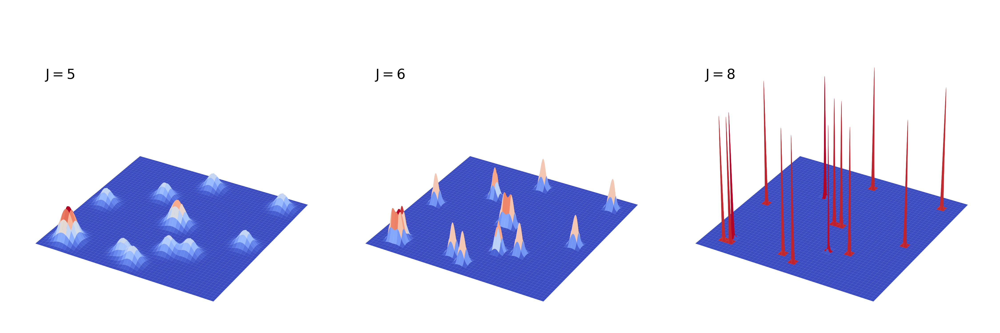

Hermes concepts and equations
=============================

This page is the compact mathematical map behind the task guides. It follows
the notation of the Hermes paper while naming the corresponding PyHermes
objects explicitly.

From a catalogue to a continuous field
--------------------------------------

For particle positions :math:`\mathbf{x}_i`, catalogue weights
:math:`w_i`, and optional particle-carried values :math:`q_i`, define

.. math::

   F(\mathbf{x}) = \sum_i w_i q_i\,
   \delta_{\mathrm D}^{3}(\mathbf{x}-\mathbf{x}_i).

``catalog_weight`` supplies :math:`w_i`; ``field_value`` supplies
:math:`q_i`. Unit values produce an ordinary number-density field. Mass,
velocity components, marks, or other scalar values produce weighted fields
without changing the projection algorithm.

At multiresolution level :math:`J`, PyHermes projects the catalogue onto a
tensor-product scaling-function basis,

.. math::

   F_J(\mathbf{x}) = \sum_{\mathbf{l}}
   \epsilon_{J\mathbf{l}}\,\phi_{J\mathbf{l}}(\mathbf{x}),
   \qquad
   \epsilon_{J\mathbf{l}} = \int F(\mathbf{x})
   \phi_{J\mathbf{l}}(\mathbf{x})\,d^3x.

The array of :math:`\epsilon_{J\mathbf{l}}` is ``SFCField.epsilon``.
``SFCProjection`` computes it directly from particle positions using the
compact support of the scaling function.

   Multiresolution field reconstruction in the Hermes paper: a discrete
   catalogue is represented by compact scaling-function coefficients and may
   then be evaluated as a continuous field.

Resolution and the role of J
~~~~~~~~~~~~~~~~~~~~~~~~~~~~

The MRA grid has

.. math::

   L = 2^J, \qquad N_{\mathrm{MRA}} = L^3 = 2^{3J},
   \qquad \Delta x = \frac{L_{\mathrm{box}}}{2^J}.

Increasing ``J`` by one halves the nominal cell size and multiplies the number
of three-dimensional coefficients by eight. The scaling functions are not
nearest-grid-point cells, but :math:`\Delta x` remains the useful first check:
measurements at separations or bin widths comparable to it require a
convergence test.

.. figure:: _static/paper/sfc_field_reconstructed_density_j7_j8_j9_halo_binned.png
   :width: 72%
   :align: center

   Reconstructed halo density at :math:`J=7,8,9` compared with a directly
   binned halo field. Higher ``J`` resolves progressively finer structure.

Normalisation carried by SFCField
~~~~~~~~~~~~~~~~~~~~~~~~~~~~~~~~~

Projection weights are divided according to ``weight_normalization``:

``raw``
   No division. The field integral is :math:`\sum_i w_i q_i`.

``catalog``
   Divide by :math:`\sum_i w_i`. For an unweighted number field the field
   integral is one. This is the default for catalogue statistics.

``field``
   Divide by :math:`\sum_i w_i q_i`, giving a unit-integral weighted field.

``unit`` is accepted by high-level tasks as a request to convert each input
field to unit integral. On an ``SFCField`` itself, use
``to_unit_weight()`` or ``with_normalization("unit")``.

``field_mean_density(value_unit="grid")`` divides the field integral by
``L**3``. ``value_unit="physical"`` divides by ``box_size**3``. The same
choice is available when evaluating the continuous field with
``field_density_at_pos``.

Window projection and convolution
---------------------------------

Let :math:`W(\mathbf{x})` be a translation-invariant window and
:math:`\widehat W(\mathbf{k})` its Fourier transform. Projection onto the
same scaling-function space introduces the autocorrelation factor
:math:`\widehat\Phi`, so the stored discrete kernel is schematically

.. math::

   K_W(\mathbf{k}) = \widehat W(\mathbf{k})\widehat\Phi(\mathbf{k}).

Applying a window is then

.. math::

   \epsilon_W = \operatorname{iFT}
   \left[\operatorname{FT}(\epsilon)K_W\right].

In Python this is simply:

.. code-block:: python

   filtered = field @ window

The output is another ``SFCField``. Field addition and subtraction combine
coefficient arrays; field multiplication forms a coefficient-space product:

.. code-block:: python

   delta = data - random
   local_product = (delta @ bin_window) * delta
   spatial_average = local_product.as_array().mean()

The scaling-function connection relations make these coefficient-space
products the MRA representation of the spatial products used by Hermes
estimators.

One-point statistics
--------------------

A smoothing window :math:`W_R` gives a local field
:math:`F_R = F * W_R`. ``Counting`` samples this continuous filtered field at
uniform random positions. Histograms, moments, and one-point PDFs are ordinary
post-processing of the returned samples.

The one-field second moment can also be written as

.. math::

   \sigma_W^2(R) = \left\langle \delta_W^2(\mathbf{x})\right\rangle,
   \qquad \delta_W = \delta * W_R.

Changing the window changes the statistic: ``sphere`` and ``gaussian`` are
low-pass filters; ``cw``, ``cws``, and ``gdw`` are localised high-pass or
band-pass filters.

Two-point statistics
--------------------

Let :math:`D` and :math:`R` denote consistently normalised data and random
fields, and :math:`\Delta = D-R`. For a separation-binning window
:math:`W_b`, PyHermes evaluates

.. math::

   \Delta DD[W_b] =
   \left\langle (\Delta_1 * W_b)\,\Delta_2\right\rangle,
   \qquad
   RR[W_b] =
   \left\langle (R_1 * W_b)\,R_2\right\rangle,

and returns

.. math::

   \xi[W_b] = \frac{\Delta DD[W_b]}{RR[W_b]}.

This is the field form of the Landy--Szalay combination. The task may also
return ``dd``, ``dr``, ``rd``, ``delta_dd``, and ``rr`` separately.

The geometry resides in :math:`W_b`:

- ``shell`` gives an isotropic separation;
- ``thick_shell`` and ``gaussian_shell`` average over a finite radial range;
- ``ring`` maps :math:`(s,\mu)` into transverse and line-of-sight offsets;
- ``disk``, ``cylshell``, and ``cylinder`` define alternative anisotropic
  averages.

Additional ``window1`` and ``window2`` filters act on the two input legs before
the binning window is applied.

Standard three-point statistics
-------------------------------

``Corr_3PCF`` performs a Monte Carlo translational and rotational average for
a triangle with fixed :math:`r_{12}`, :math:`r_{13}`, and sampled included
angle. Its three input legs may have independent smoothing windows.

``center="particle"`` uses catalogue objects as primary vertices. This is the
dual-sphere construction in the paper. ``center="box_random"`` samples
primary vertices uniformly in the volume, corresponding to the triplet-sphere
construction. ``n_rot`` controls the random rotational average around each
centre.

The connected three-point statistic is assembled from data and random field
products. ``zeta`` is the connected 3PCF and ``Q`` is the reduced 3PCF,

.. math::

   Q = \frac{\zeta}
   {\xi_{12}\xi_{13}+\xi_{12}\xi_{23}+\xi_{13}\xi_{23}}.

3PCF multipoles
----------------

The angular dependence of the 3PCF can be expanded as

.. math::

   \zeta(r_{12},r_{13},\mu)
   = \sum_{\ell}(2\ell+1)\,
   \zeta_\ell(r_{12},r_{13})P_\ell(\mu).

For a thin shell, the Fourier-space multipole window has the form

.. math::

   W_{r}^{\ell m}(\mathbf{k}) =
   4\pi i^\ell j_\ell(2\pi kr)Y_\ell^m(\widehat{\mathbf{k}}).

``Corr_3PCF_Multipole`` constructs the required window-filtered
:math:`(\ell,m)` fields and contracts their local products. Only
:math:`m\geq0` fields are built explicitly; negative modes follow from
spherical-harmonic conjugation symmetry.

The two radial supports are supplied by ``binning_window12`` and
``binning_window13``. Thin shells use the analytic spherical-Bessel response.
General radial profiles use :math:`U_\ell(k)Y_\ell^m` kernels, with numerical
spherical-Hankel tabulation when no direct analytic higher-order response is
available.

Weighted and derived physical fields
------------------------------------

Weights modify the field before projection; windows modify it afterwards.
This separation makes marked and physical-field statistics natural:

.. math::

   F_q(\mathbf{x}) = \sum_i
   w_i^{\mathrm c}w_i^{\mathrm{opt}}m_iq_i
   \delta_{\mathrm D}^{3}(\mathbf{x}-\mathbf{x}_i).

Factorisable catalogue weights belong in ``catalog_weight`` or
``field_value``. A separation-dependent factor may belong in a window.
General non-separable pair weights do not preserve one translation-invariant
convolution and require a decomposition or explicit correction.

Operator windows use the Fourier identities

.. math::

   \widehat{\partial_{\hat n}f}=i(\mathbf{k}\cdot\hat{\mathbf n})\hat f,
   \qquad
   \widehat{\nabla^2 f}=-k^2\hat f,
   \qquad
   \widehat{\nabla^{-2}f}=-\frac{1}{k^2}\hat f.

The inverse-Laplacian zero mode is set to zero, fixing the arbitrary additive
constant of the potential. Cosmological prefactors are intentionally applied
outside that mathematical operator, where coordinate and unit conventions are
explicit.

Projection and repeated windows
-------------------------------

The finite scaling-function projection matters when operations are composed.
A ``WindowFunc`` stores :math:`K_W`, not a bare
:math:`\widehat W`. Therefore:

- ``field @ W1 @ W2`` applies two projected kernels;
- ``W1 * W2`` multiplies two already projected kernels point by point;
- neither expression is, in general, identical to projecting the continuous
  product :math:`\widehat W_1\widehat W_2` exactly once.

For a production composite window, the cleanest current route is to define the
complete Fourier expression in one built-in or custom window and apply it
once. ``W1 * W2`` remains useful for exploratory projected-kernel composition
and for testing separable constructions, provided this distinction is kept in
mind. See :doc:`windows` for code and kernel-mode details.
