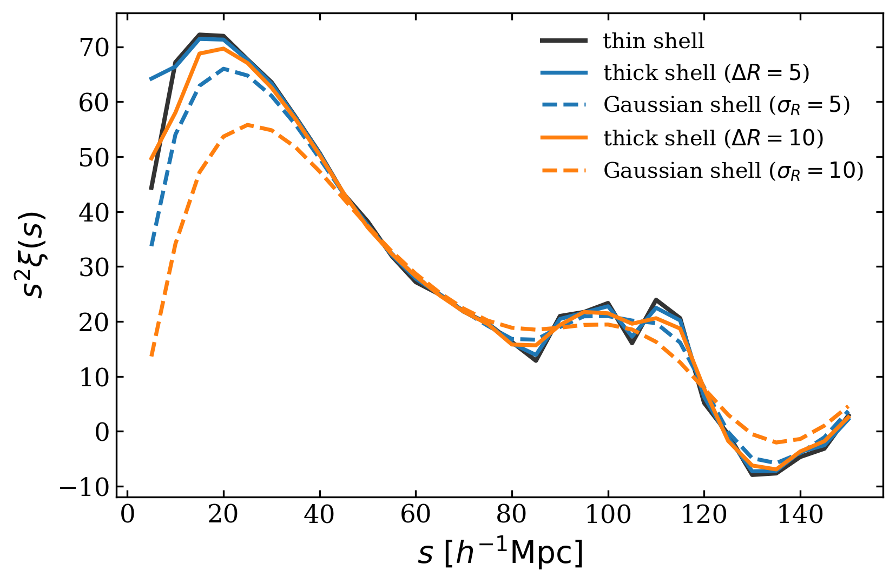

Window reference
================

``WindowFunc`` is the common operator interface in PyHermes. A window may
smooth a field, define a separation bin, select a multipole, or apply a
mathematical operator. Its scientific role is determined by where the task
uses it, not by a separate class hierarchy.

Basic construction
------------------

Every window must be constructed with metadata from a compatible
``SFCField``:

.. code-block:: python

   from pyhermes.io import SFCField, WindowFunc

   D = SFCField(data_path="./output/quijote8000_snap004_sfc.pkl", threads=8)
   W = WindowFunc(
       {"type": "gaussian", "len_args": {"R": 10.0}},
       D.sfc_info,
       threads=8,
   )
   D_smoothed = D @ W

The parameter dictionary has four main sections:

``type``
   Name of a built-in window.

``len_args``
   Physical length parameters in the same units as ``box_size``. PyHermes
   rescales them to MRA-grid coordinates internally.

``los_args``
   A line-of-sight direction ``nx``, ``ny``, ``nz``. The default is the
   positive z axis.

``other_args``
   Dimensionless or profile-specific controls.

Built-in ordinary windows
-------------------------

The Fourier expressions below use angular wavenumber :math:`k`. Built-in
functions are evaluated internally in cycle-frequency grid coordinates, where
the required factors of :math:`2\pi` are included by the implementation.
Unit-integral smoothing and binning windows satisfy
:math:`\widehat W(0)=1`.

.. list-table::
   :header-rows: 1
   :widths: 19 20 25 36

   * - Type
     - Role
     - Length arguments
     - Fourier response
   * - ``sphere``
     - Spherical top-hat
     - ``R``
     - :math:`3[\sin(kR)-kR\cos(kR)]/(kR)^3`
   * - ``gaussian``
     - Isotropic low-pass filter
     - ``R``
     - :math:`\exp[-k^2R^2/2]`
   * - ``shell``
     - Infinitesimal spherical bin
     - ``R``
     - :math:`j_0(kR)=\sin(kR)/(kR)`
   * - ``thick_shell``
     - Finite spherical bin
     - ``R``, ``delta_R``
     - Volume-weighted difference of two ``sphere`` responses
   * - ``gaussian_shell``
     - Smooth radial shell
     - ``R_shell``, ``R_smooth``
     - Gaussian-damped shell response
   * - ``cubic``
     - Axis-aligned box top-hat
     - ``Lx``, ``Ly``, ``Lz``
     - Product of three sinc factors
   * - ``ring``
     - Thin anisotropic pair bin
     - ``R``, ``H``
     - :math:`J_0(k_\perp R)\cos(k_\parallel H)`
   * - ``disk``
     - Filled transverse disk at :math:`\pm H`
     - ``R``, ``H``
     - :math:`2J_1(k_\perp R)/(k_\perp R)\cos(k_\parallel H)`
   * - ``cylshell``
     - Cylindrical side wall
     - ``R``, ``H``
     - :math:`J_0(k_\perp R)\operatorname{sinc}(k_\parallel H)`
   * - ``cylinder``
     - Filled finite cylinder
     - ``R``, ``H``
     - Disk factor times line-of-sight sinc

For ``ring`` and ``disk``, ``H`` is the line-of-sight offset. For
``cylshell`` and ``cylinder``, ``H`` is the half-height, so the real-space
support is :math:`|z|\leq H`.

``thick_shell`` clips its inner radius at zero and requires
``delta_R > 0``:

.. code-block:: python

   W_bin = WindowFunc(
       {
           "type": "thick_shell",
           "len_args": {"R": 40.0, "delta_R": 6.0},
       },
       D.sfc_info,
       threads=8,
   )

   Thin, finite-thickness, and Gaussian-shell bins change the effective radial
   averaging while leaving the 2PCF estimator itself unchanged.

High-pass and wavelet-like filters
----------------------------------

``cw``, ``cws``, and ``gdw`` are scale-normalised, zero-mean filters used to
isolate localised fluctuations and band-averaged power. They take
``len_args: {R: ...}``.

``cw``
   Cosine-wavelet response.

``cws``
   Spherical cosine-wavelet response.

``gdw``
   Isotropic Gaussian-derivative wavelet, proportional to
   :math:`(kR)^2\exp[-(kR)^2/2]` in Fourier space.

These filters do not satisfy :math:`\widehat W(0)=1`; their zero mode vanishes
by design. Their amplitude is scale-normalised, so do not interpret them as
ordinary local-density averages.

Differential and inverse operators
----------------------------------

.. list-table::
   :header-rows: 1
   :widths: 27 31 42

   * - Type
     - Parameters
     - Kernel
   * - ``directional_derivative``
     - ``los_args: {nx, ny, nz}``
     - :math:`i\,\mathbf{k}\cdot\hat{\mathbf n}`
   * - ``laplacian``
     - none
     - :math:`-k^2`
   * - ``inverse_laplacian``
     - none
     - :math:`-1/k^2`, with the zero mode set to zero

In the code's cycle-frequency convention the derivative includes
:math:`2\pi` and the Laplacian includes :math:`(2\pi)^2`. Length rescaling by
``L / box_size`` is handled consistently with other windows.

.. code-block:: python

   Dx = WindowFunc(
       {
           "type": "directional_derivative",
           "los_args": {"nx": 1.0, "ny": 0.0, "nz": 0.0},
       },
       D.sfc_info,
       threads=8,
   )
   grad_x = D @ Dx

For a density contrast :math:`\delta_m`, ``inverse_laplacian`` returns
:math:`\nabla^{-2}\delta_m`. Multiply by the physical Poisson prefactor
outside the window, where the scale factor, Hubble convention, speed of light,
and coordinate units are explicit.

Smoothing windows and binning windows
-------------------------------------

The distinction is semantic and important:

- a task ``window`` or ``window1``/``window2``/``window3`` filters an input
  field leg before the estimator is assembled;
- a ``binning_window`` maps sampled coordinates into the spatial support of a
  pair or triangle edge.

For example, this 2PCF smooths both data legs with a spherical top-hat and
then samples thin-shell separations:

.. code-block:: yaml

   Corr_2PCF:
      sfc_field: ./output/halo_sfc.pkl
      random: uniform
      window:
         type: sphere
         len_args: {R: 5.0}
      binning_window: shell
      sampling:
         s: {min: 0.0, max: 150.0, n: 31}
      products: xi

Changing ``window`` changes the fields being correlated. Changing
``binning_window`` changes the definition of the sampled separation bin.

Line-of-sight geometry
----------------------

Axis-aligned LOS directions are:

.. code-block:: yaml

   los_args: {nx: 0.0, ny: 0.0, nz: 1.0}

For a ``ring`` 2PCF sampled in :math:`(s,\mu)`, the built-in ``smu_to_RH``
mapping sets

.. math::

   R=s\sqrt{1-\mu^2}, \qquad H=s\mu.

The short YAML form applies this mapping automatically:

.. code-block:: yaml

   binning_window: ring
   sampling:
      s: {min: 0.0, max: 180.0, n: 46}
      mu: {min: 0.0, max: 1.0, n: 51}

The explicit form is useful when setting the LOS or kernel mode:

.. code-block:: yaml

   binning_window:
      type: ring
      len_args: [R, H]
      mapping: smu_to_RH
      los_args: {nx: 0.0, ny: 0.0, nz: 1.0}
      kernel_mode: octant

2PCF sampling mappings
----------------------

``Corr_2PCF`` provides three named mappings:

``s_to_R``
   Set ``R = s`` for isotropic shell-like windows.

``smu_to_RH``
   Set ``R = s*sqrt(1-mu**2)`` and ``H = s*mu``.

``rppi_to_RH``
   Set ``R = rp`` and ``H = pi``.

Short string values such as ``binning_window: shell`` and
``binning_window: ring`` are normalised to the appropriate defaults by the
task.

3PCF-multipole radial mappings
------------------------------

``Corr_3PCF_Multipole`` uses explicit mappings from sampled parameter names to
the two edge windows:

.. code-block:: yaml

   binning_window12:
      type: thick_shell
      len_args: {delta_R: 6.0}
      mapping: {R: r12}
   binning_window13:
      type: gaussian_shell
      len_args: {R_smooth: 6.0}
      mapping: {R_shell: r13}
   sampling:
      mode: paired
      r12: 20.0
      r13: {start: 40.0, stop: 140.0, step: 5.0}

``mode: grid`` forms the Cartesian product of all sampled arrays. ``mode:
paired`` aligns arrays element by element; each array must have either one
value or the common sample count.

Radial multipole profiles
-------------------------

For 3PCF multipoles, an edge window becomes
:math:`U_\ell(k)Y_\ell^m(\hat{\mathbf{k}})`.

- ``shell`` uses the analytic :math:`j_\ell(kr)` response at every order.
- the monopoles of the other built-ins use their direct analytic Fourier
  responses;
- higher orders for ``sphere``, ``thick_shell``, and ``gaussian`` are
  tabulated from analytic real-space profiles;
- higher orders for ``gaussian_shell`` use the general inverse-Hankel route;
- local cubic interpolation evaluates the resulting one-dimensional
  :math:`U_\ell(k)` table while constructing the three-dimensional kernel.

The task can diagnose radial-table accuracy with
``radial_profile_diagnostics``, ``radial_profile_diagnostic_tolerance``, and
``radial_profile_diagnostic_probes``.

Custom radial profiles are Python-level inputs. Use the helpers in
``pyhermes.utils.radial_profiles``:

.. code-block:: python

   import numpy as np
   from pyhermes.utils.radial_profiles import real_space_profile

   def compensated_profile(r, R):
       return np.where(r < R, 1.0, -0.125)

   profile = real_space_profile(
       compensated_profile,
       r_max=2.0,
       normalization="unit_integral",
       allow_signed=True,
   )

Pass the resulting dictionary through the binning window's ``other_args`` and
use ``type: custom_real``. ``tabulated_real_space_profile`` and
``kspace_profile`` provide the corresponding tabulated-real and inverse-Hankel
k-space routes. Callable profiles are not serialisable YAML values, so define
them in Python after reading a base configuration.

Custom ordinary Fourier windows
-------------------------------

A custom ordinary window is a Numba-compatible function receiving grid
cycle-frequencies ``ki``, ``kj``, and ``kk`` followed by the values from
``len_args``, ``los_args``, and ``other_args``:

.. code-block:: python

   import numpy as np
   from numba import njit

   from pyhermes.io import WindowFunc

   @njit
   def transverse_gaussian(ki, kj, kk, R):
       q2 = (2.0 * np.pi * R) ** 2 * (ki * ki + kj * kj)
       return np.exp(-0.5 * q2)

   W_perp = WindowFunc(
       {"func": transverse_gaussian, "len_args": {"R": 5.0}},
       D.sfc_info,
       threads=8,
   )

Define removable singularities and the zero mode explicitly. Put every
physical length in ``len_args`` so it receives the same grid rescaling as a
built-in window.

Window arithmetic and its projection caveat
-------------------------------------------

Windows support addition, subtraction, scalar multiplication and division,
and pointwise multiplication:

.. code-block:: python

   R, delta_R = 40.0, 6.0
   r_in = R - 0.5 * delta_R
   r_out = R + 0.5 * delta_R

   W_in = WindowFunc(
       {"type": "sphere", "len_args": {"R": r_in}}, D.sfc_info
   )
   W_out = WindowFunc(
       {"type": "sphere", "len_args": {"R": r_out}}, D.sfc_info
   )
   W_projected_shell = (
       r_out**3 * W_out - r_in**3 * W_in
   ) / (r_out**3 - r_in**3)

Arithmetic materialises a composite ``w_kernel``. Crucially, each operand is
already a projected MRA kernel
:math:`K_W=\widehat W\widehat\Phi`. Thus ``W1 * W2`` computes
:math:`K_{W_1}K_{W_2}`, not a fresh single projection of
:math:`\widehat W_1\widehat W_2`.

For exact control of one continuous composite expression, implement the full
Fourier product in one custom function or use a built-in composite window such
as ``thick_shell``. Projected-kernel arithmetic is still useful for rapid
experiments and for quantifying projection effects, but it should be named as
such in an analysis.

Kernel modes
------------

``kernel_mode`` controls how the discrete kernel is built:

``octant``
   Build one real symmetric octant and fold it to an rFFT kernel. Fast and
   appropriate for even, axis-aligned real windows.

``full_rfft``
   Evaluate every stored rFFT mode. Use it for a real window without octant
   symmetry, including an oblique LOS.

``complex_rfft``
   Build a directional complex rFFT kernel, used by first derivatives.

``complex_full_fft``
   Build a full complex FFT kernel, required by spherical-harmonic multipole
   windows.

``auto``
   Select a compatible mode from the window type and LOS. Custom ordinary
   windows default conservatively to ``full_rfft``.

``octant`` and ``full_rfft`` evaluate the same projected real kernel when the
symmetry assumptions hold. The difference is construction strategy, not a
different physical window. An invalid symmetry assumption, however, can fold
distinct modes together and change the result.

Practical checks
----------------

- Match ``J``, ``box_size``, ``wavelet_mode``, ``wavelet_level``, and
  ``phi_resolution`` between fields and windows.
- Compare the MRA cell scale with every smoothing radius and bin width.
- Treat smoothing parameters and binning parameters as part of the statistic's
  definition and record them in plots and output names.
- Use one complete custom kernel when composite-window accuracy matters.
- Keep axis-aligned LOS choices when possible for cheaper kernel construction.
- Enable binning-window caching only for repeated heavy runs where disk reuse
  outweighs cache management.
